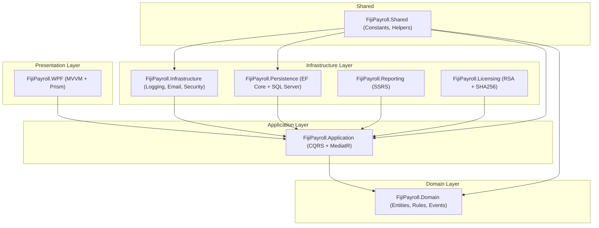
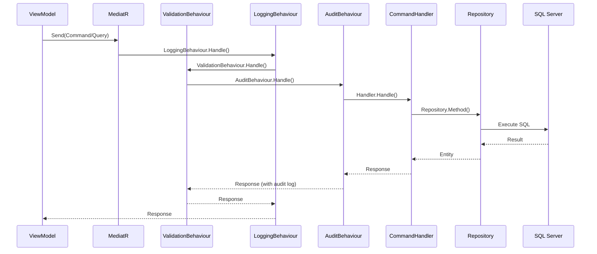
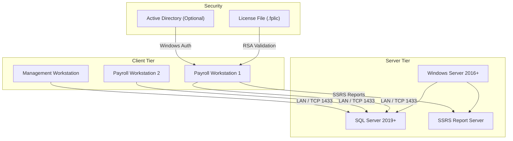
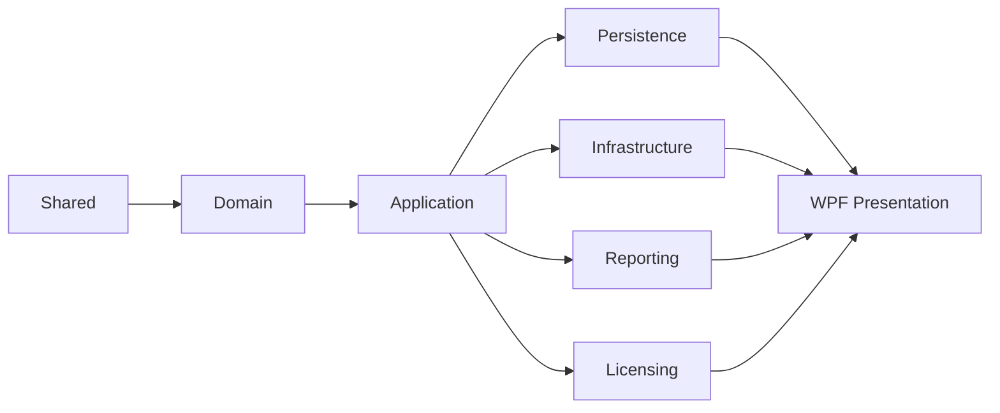

# Fiji Enterprise Payroll System — Architecture Document

**Version:** 1.0.0  
**Date:** June 2026  
**Status:** Approved  
**Owner:** Enterprise Solution Architect  

---

## 1. Architectural Overview

The Fiji Enterprise Payroll System follows **Clean Architecture** (also known as Onion Architecture) with **CQRS** (Command Query Responsibility Segregation) patterns, mediated by **MediatR**. This ensures strict separation of concerns, testability, and long-term maintainability.

### Architecture Principles

1. **Dependency Rule** — Inner layers never reference outer layers
2. **Single Responsibility** — Every class has one reason to change
3. **Open/Closed** — Open for extension, closed for modification
4. **Liskov Substitution** — Abstractions are always honoured
5. **Interface Segregation** — Fine-grained, focused interfaces
6. **Dependency Inversion** — Depend on abstractions, not concretions

---

## 2. Solution Structure

```
FijiPayroll.sln
│
├── src/
│   ├── FijiPayroll.Domain/
│   ├── FijiPayroll.Application/
│   ├── FijiPayroll.Infrastructure/
│   ├── FijiPayroll.Persistence/
│   ├── FijiPayroll.Reporting/
│   ├── FijiPayroll.Licensing/
│   ├── FijiPayroll.Shared/
│   └── FijiPayroll.Presentation/
│       └── FijiPayroll.WPF/
│
├── tests/
│   ├── FijiPayroll.Domain.Tests/
│   ├── FijiPayroll.Application.Tests/
│   ├── FijiPayroll.Infrastructure.Tests/
│   ├── FijiPayroll.Persistence.Tests/
│   └── FijiPayroll.Integration.Tests/
│
├── installer/
│   └── FijiPayroll.Setup/
│
├── tools/
│   └── FijiPayroll.LicenseGenerator/
│
├── docs/
│   ├── Vision.md
│   ├── Architecture.md
│   ├── Database.md
│   ├── CodingStandards.md
│   ├── UIStandards.md
│   ├── PayrollRules.md
│   ├── FRCS.md
│   ├── FNPF.md
│   ├── BankFiles.md
│   └── ReleaseNotes.md
│
├── scripts/
│   ├── deploy.ps1
│   ├── backup.ps1
│   └── migrate.ps1
│
└── .github/
    └── workflows/
        ├── ci.yml
        └── release.yml
```

---

## 3. Layer Definitions

### 3.1 Domain Layer (`FijiPayroll.Domain`)

The innermost layer. Contains pure business logic with no external dependencies.

```
FijiPayroll.Domain/
├── Entities/
│   ├── Common/
│   │   ├── BaseEntity.cs
│   │   ├── AuditableEntity.cs
│   │   └── SoftDeleteEntity.cs
│   ├── Company/
│   ├── Employee/
│   ├── Payroll/
│   ├── Leave/
│   ├── Security/
│   └── Licensing/
├── ValueObjects/
│   ├── Money.cs
│   ├── TaxFileNumber.cs
│   ├── FNPFNumber.cs
│   └── EmployeeCode.cs
├── Enumerations/
│   ├── PayrollFrequency.cs
│   ├── EmploymentType.cs
│   ├── LeaveType.cs
│   ├── PayrollStatus.cs
│   └── UserRole.cs
├── Events/
│   ├── PayrollProcessedEvent.cs
│   ├── EmployeeTerminatedEvent.cs
│   └── LicenseExpiredEvent.cs
├── Exceptions/
│   ├── DomainException.cs
│   ├── PayrollCalculationException.cs
│   └── ValidationException.cs
├── Interfaces/
│   ├── IRepository.cs
│   ├── IUnitOfWork.cs
│   └── IDomainEventDispatcher.cs
└── Rules/
    ├── PayrollRules/
    ├── LeaveRules/
    └── TaxRules/
```

### 3.2 Application Layer (`FijiPayroll.Application`)

Orchestrates domain logic. Contains Commands, Queries, Handlers, DTOs, and Validators.

```
FijiPayroll.Application/
├── Common/
│   ├── Behaviours/
│   │   ├── ValidationBehaviour.cs
│   │   ├── LoggingBehaviour.cs
│   │   ├── AuditBehaviour.cs
│   │   └── TransactionBehaviour.cs
│   ├── Exceptions/
│   │   ├── NotFoundException.cs
│   │   └── ForbiddenAccessException.cs
│   ├── Interfaces/
│   │   ├── IApplicationDbContext.cs
│   │   ├── ICurrentUserService.cs
│   │   ├── IDateTimeService.cs
│   │   └── IEmailService.cs
│   └── Models/
│       ├── Result.cs
│       ├── PaginatedList.cs
│       └── ApiResponse.cs
├── Features/
│   ├── Companies/
│   │   ├── Commands/
│   │   │   ├── CreateCompany/
│   │   │   ├── UpdateCompany/
│   │   │   └── DeleteCompany/
│   │   └── Queries/
│   │       ├── GetAllCompanies/
│   │       └── GetCompanyById/
│   ├── Employees/
│   ├── Payroll/
│   ├── Leave/
│   ├── Reports/
│   ├── Security/
│   └── Licensing/
└── DependencyInjection.cs
```

### 3.3 Infrastructure Layer (`FijiPayroll.Infrastructure`)

Implements cross-cutting concerns: logging, email, file system, licensing, encryption.

```
FijiPayroll.Infrastructure/
├── Logging/
│   ├── SerilogLogger.cs
│   └── LoggingConfiguration.cs
├── Security/
│   ├── EncryptionService.cs
│   ├── HashingService.cs
│   └── RSAKeyService.cs
├── Licensing/
│   ├── LicenseValidator.cs
│   ├── LicenseFileReader.cs
│   └── LicenseReminderService.cs
├── Notifications/
│   ├── EmailService.cs
│   └── InAppNotificationService.cs
├── FileSystem/
│   ├── ExportService.cs
│   └── ImportService.cs
├── ExternalServices/
│   └── BankFileGeneratorService.cs
└── DependencyInjection.cs
```

### 3.4 Persistence Layer (`FijiPayroll.Persistence`)

SQL Server database context, repositories, migrations, and configurations.

```
FijiPayroll.Persistence/
├── Context/
│   ├── ApplicationDbContext.cs
│   └── ApplicationDbContextFactory.cs
├── Configurations/
│   ├── CompanyConfiguration.cs
│   ├── EmployeeConfiguration.cs
│   ├── PayrollConfiguration.cs
│   └── ...
├── Repositories/
│   ├── GenericRepository.cs
│   ├── EmployeeRepository.cs
│   ├── PayrollRepository.cs
│   └── ...
├── Migrations/
├── Interceptors/
│   ├── AuditableEntityInterceptor.cs
│   └── SoftDeleteInterceptor.cs
├── Seeds/
│   ├── SystemSeedData.cs
│   ├── RoleSeedData.cs
│   └── TaxTableSeedData.cs
└── DependencyInjection.cs
```

### 3.5 Reporting Layer (`FijiPayroll.Reporting`)

SSRS report management, rendering, and export.

```
FijiPayroll.Reporting/
├── Services/
│   ├── ReportingService.cs
│   ├── ReportParameterBuilder.cs
│   └── ReportExportService.cs
├── Models/
│   ├── ReportRequest.cs
│   └── ReportResult.cs
├── Reports/
│   └── (SSRS .rdl files organized by module)
└── DependencyInjection.cs
```

### 3.6 Licensing Layer (`FijiPayroll.Licensing`)

Standalone offline licensing engine.

```
FijiPayroll.Licensing/
├── Models/
│   ├── LicenseFile.cs
│   ├── LicenseFeatures.cs
│   └── LicenseStatus.cs
├── Services/
│   ├── LicenseValidationService.cs
│   ├── LicenseGeneratorService.cs
│   └── HardwareIdService.cs
├── Cryptography/
│   ├── RsaSignatureService.cs
│   └── Sha256HashService.cs
└── DependencyInjection.cs
```

### 3.7 Shared Layer (`FijiPayroll.Shared`)

Common utilities, constants, and helpers used across all layers.

```
FijiPayroll.Shared/
├── Constants/
│   ├── AppConstants.cs
│   ├── PermissionConstants.cs
│   └── FijiTaxConstants.cs
├── Extensions/
│   ├── StringExtensions.cs
│   ├── DateTimeExtensions.cs
│   └── DecimalExtensions.cs
├── Guards/
│   └── Guard.cs
└── Helpers/
    ├── CurrencyHelper.cs
    └── FijiDateHelper.cs
```

### 3.8 Presentation Layer (`FijiPayroll.WPF`)

WPF application using MVVM pattern with Prism framework.

```
FijiPayroll.WPF/
├── App.xaml
├── App.xaml.cs
├── MainWindow.xaml
├── MainWindow.xaml.cs
├── ViewModels/
│   ├── Base/
│   │   ├── BaseViewModel.cs
│   │   └── DialogViewModel.cs
│   ├── Shell/
│   ├── Company/
│   ├── Employee/
│   ├── Payroll/
│   ├── Leave/
│   ├── Reports/
│   ├── Settings/
│   └── Dashboard/
├── Views/
│   ├── Shell/
│   ├── Company/
│   ├── Employee/
│   ├── Payroll/
│   ├── Leave/
│   ├── Reports/
│   ├── Settings/
│   └── Dashboard/
├── Controls/
│   ├── DataGrid/
│   ├── DatePicker/
│   ├── SearchBox/
│   └── StatusBar/
├── Converters/
├── Styles/
│   ├── Colors.xaml
│   ├── Typography.xaml
│   ├── Buttons.xaml
│   ├── DataGrid.xaml
│   └── Forms.xaml
├── Resources/
│   ├── Images/
│   └── Icons/
├── Behaviours/
├── Services/
│   ├── NavigationService.cs
│   └── DialogService.cs
└── DependencyInjection.cs
```

---

## 4. Architecture Diagrams

### 4.1 Clean Architecture Layer Diagram



### 4.2 CQRS + MediatR Flow



### 4.3 Deployment Architecture



### 4.4 Module Dependency Graph



---

## 5. Design Patterns

| Pattern | Usage | Location |
|---------|-------|----------|
| CQRS | Separate read/write models | Application Layer |
| MediatR | Command/Query bus | Application Layer |
| Repository | Data access abstraction | Persistence Layer |
| Unit of Work | Transaction management | Persistence Layer |
| MVVM | UI pattern | Presentation Layer |
| Observer | Domain events | Domain Layer |
| Factory | Object creation | Domain / Application |
| Strategy | Payroll calculation rules | Domain Layer |
| State Machine | Payroll run lifecycle | Domain Layer |
| Decorator | Pipeline behaviours | Application Layer |
| Specification | Query predicates | Domain / Application |

---

## 6. Naming Conventions

### Projects
- Format: `FijiPayroll.[LayerName]`
- Example: `FijiPayroll.Application`

### Namespaces
- Format: `FijiPayroll.[Layer].[Feature].[SubFeature]`
- Example: `FijiPayroll.Application.Features.Employees.Commands.CreateEmployee`

### Classes
| Type | Convention | Example |
|------|-----------|---------|
| Entity | PascalCase noun | `Employee`, `PayrollRun` |
| Command | `[Action][Noun]Command` | `CreateEmployeeCommand` |
| Query | `Get[Noun]Query` | `GetEmployeeByIdQuery` |
| Handler | `[Command/Query]Handler` | `CreateEmployeeCommandHandler` |
| DTO | `[Noun]Dto` | `EmployeeDto` |
| ViewModel | `[View]ViewModel` | `EmployeeListViewModel` |
| View | `[Feature]View` | `EmployeeListView` |
| Repository | `I[Entity]Repository` | `IEmployeeRepository` |
| Service | `I[Feature]Service` | `IPayrollCalculationService` |
| Validator | `[Command]Validator` | `CreateEmployeeCommandValidator` |

### Files
- One class per file
- File name matches class name exactly

### Database
| Object | Convention | Example |
|--------|-----------|---------|
| Table | PascalCase plural | `Employees`, `PayrollRuns` |
| Column | PascalCase | `FirstName`, `DateOfBirth` |
| Primary Key | `Id` | `Id INT IDENTITY` |
| Foreign Key | `[Table]Id` | `EmployeeId` |
| Index | `IX_[Table]_[Column]` | `IX_Employees_CompanyId` |
| Stored Proc | `usp_[Action]_[Entity]` | `usp_Get_EmployeePay` |
| View | `v[Description]` | `vPayrollSummary` |

---

## 7. Dependency Injection Strategy

### Registration Pattern
Each layer provides a static extension method `AddLayerServices(IServiceCollection)`:

```
// Composition Root in WPF App.xaml.cs:
services
    .AddSharedServices()
    .AddDomainServices()
    .AddApplicationServices()
    .AddPersistenceServices(configuration)
    .AddInfrastructureServices(configuration)
    .AddReportingServices(configuration)
    .AddLicensingServices()
    .AddPresentationServices();
```

### Service Lifetimes
| Service Type | Lifetime | Reason |
|-------------|---------|--------|
| DbContext | Scoped | Per operation |
| Repositories | Scoped | Per operation |
| MediatR Handlers | Transient | Stateless |
| Validators | Transient | Stateless |
| ViewModels | Transient | Per navigation |
| Singletons | Singleton | AppSettings, Logger |
| CurrentUserService | Scoped | Per session |

---

## 8. Logging Strategy

### Framework: Serilog

### Log Levels
| Level | Usage |
|-------|-------|
| Verbose | Detailed diagnostics (dev only) |
| Debug | Internal state (dev only) |
| Information | Normal application events |
| Warning | Unexpected but handled events |
| Error | Failures that are caught |
| Fatal | Application-crashing failures |

### Sinks Configuration
| Sink | Environment | Purpose |
|------|------------|---------|
| File (rolling daily) | All | Persistent log files |
| SQL Server | Production | Queryable audit log |
| Console | Development | Real-time debugging |
| Debug | Development | VS Output window |

### Log File Location
```
%ProgramData%\FijiPayroll\Logs\
    fpayroll-20260615.log
    fpayroll-20260614.log
    ...
```

### Structured Logging Template
```
[{Timestamp:yyyy-MM-dd HH:mm:ss} {Level:u3}] 
{SourceContext} | User:{UserId} | Company:{CompanyId} | 
{Message:lj}{NewLine}{Exception}
```

---

## 9. Exception Handling Strategy

### Exception Hierarchy
```
Exception
└── FijiPayrollException (base)
    ├── DomainException
    │   ├── PayrollCalculationException
    │   ├── TaxCalculationException
    │   └── FNPFCalculationException
    ├── ApplicationException
    │   ├── NotFoundException
    │   ├── ValidationException
    │   └── ForbiddenAccessException
    ├── InfrastructureException
    │   ├── DatabaseException
    │   └── LicenseException
    └── ReportingException
```

### Global Exception Handler
- WPF `Application.DispatcherUnhandledException` catches all unhandled exceptions
- Logs full stack trace via Serilog
- Displays user-friendly error dialog
- Offers to send error report (log file attachment)
- Never exposes stack traces to end users

### MediatR Pipeline Exception Handling
- `ValidationBehaviour` catches `ValidationException` → returns `Result.Failure`
- `LoggingBehaviour` logs all exceptions before re-throwing
- Handlers return `Result<T>` to avoid exceptions crossing layer boundaries

---

## 10. Validation Strategy

### Framework: FluentValidation

### Validation Levels
1. **UI Validation** — Immediate feedback in ViewModel (binding-based)
2. **Command Validation** — FluentValidation in MediatR pipeline
3. **Domain Validation** — Business rules enforced in entity constructors/methods
4. **Database Validation** — SQL constraints as final safety net

### Validation Behaviour
```
ValidationBehaviour<TRequest, TResponse>
    → Collects all FluentValidation errors
    → Returns Result.Failure(errors) without throwing
    → UI renders error messages inline on form fields
```

---

## 11. Audit Strategy

### Audit Fields (on all auditable entities)
| Field | Type | Description |
|-------|------|-------------|
| CreatedBy | nvarchar(100) | Username |
| CreatedAt | datetime2 | UTC timestamp |
| ModifiedBy | nvarchar(100) | Username |
| ModifiedAt | datetime2 | UTC timestamp |
| DeletedBy | nvarchar(100) | Username (soft delete) |
| DeletedAt | datetime2 | UTC timestamp (soft delete) |
| RowVersion | rowversion | Concurrency token |

### Audit Trail Table
Separate `AuditLogs` table captures:
- EntityName
- EntityId
- Action (Create/Update/Delete)
- OldValues (JSON)
- NewValues (JSON)
- UserId
- Username
- Timestamp
- IPAddress (if applicable)
- CompanyId

### AuditBehaviour (MediatR Pipeline)
- Intercepts all Commands (not Queries)
- Captures before/after state via EF Core change tracker
- Writes to `AuditLogs` in same transaction

---

## 12. Security Strategy

### Authentication Modes
1. **SQL Authentication** — Username/password stored in database (bcrypt hashed)
2. **Windows Authentication** — AD group membership validated against application roles

### Authorization
- RBAC (Role-Based Access Control)
- Fine-grained permission matrix per module/action
- Permissions stored in database (configurable by System Admin)
- Checked in Application layer via `ICurrentUserService`

### Permission Enforcement Points
1. **Navigation** — Menu items hidden if no permission
2. **Button/Control** — UI controls disabled if no permission
3. **Handler** — Permission check in MediatR handler
4. **Repository** — Company-scoped queries (multi-tenancy)

### Data Isolation
- All queries filtered by `CompanyId` automatically via EF Core global query filters
- Users can only access their assigned companies

---

## 13. Repository Pattern

### Generic Repository Interface
```
IRepository<T>
    - GetByIdAsync(int id)
    - GetAllAsync()
    - FindAsync(Expression<Func<T, bool>> predicate)
    - AddAsync(T entity)
    - UpdateAsync(T entity)
    - DeleteAsync(T entity)
    - CountAsync(Expression<Func<T, bool>> predicate)
    - ExistsAsync(Expression<Func<T, bool>> predicate)
```

### Specialised Repositories
Each major entity has a typed repository that extends the generic interface:
```
IEmployeeRepository : IRepository<Employee>
    - GetWithPayrollDetailsAsync(int employeeId)
    - GetByCompanyAsync(int companyId)
    - GetActiveEmployeesForPayrollAsync(int payrollRunId)

IPayrollRunRepository : IRepository<PayrollRun>
    - GetRunsForPeriodAsync(int companyId, DateRange range)
    - GetLatestRunAsync(int companyId, PayrollFrequency frequency)
```

### Unit of Work
```
IUnitOfWork
    - IEmployeeRepository Employees
    - IPayrollRunRepository PayrollRuns
    - ILeaveRepository Leaves
    - SaveChangesAsync()
    - BeginTransactionAsync()
    - CommitTransactionAsync()
    - RollbackTransactionAsync()
```

---

## 14. CQRS Strategy

### Commands (Write Side)
- Represent intent to change state
- Handled by `IRequestHandler<TCommand, Result>`
- Always return `Result` (success/failure) never raw entities
- Validated before execution via MediatR pipeline
- Wrapped in database transactions

### Queries (Read Side)
- Represent requests for data
- Handled by `IRequestHandler<TQuery, Result<TDto>>`
- Return DTOs, never domain entities
- Can bypass repository for performance-critical reads using Dapper
- Not wrapped in transactions

### Example Structure
```
Features/
└── Employees/
    ├── Commands/
    │   ├── CreateEmployee/
    │   │   ├── CreateEmployeeCommand.cs
    │   │   ├── CreateEmployeeCommandHandler.cs
    │   │   └── CreateEmployeeCommandValidator.cs
    │   └── UpdateEmployee/
    │       ├── UpdateEmployeeCommand.cs
    │       ├── UpdateEmployeeCommandHandler.cs
    │       └── UpdateEmployeeCommandValidator.cs
    └── Queries/
        ├── GetEmployeeById/
        │   ├── GetEmployeeByIdQuery.cs
        │   ├── GetEmployeeByIdQueryHandler.cs
        │   └── EmployeeDetailDto.cs
        └── GetEmployeeList/
            ├── GetEmployeeListQuery.cs
            ├── GetEmployeeListQueryHandler.cs
            └── EmployeeSummaryDto.cs
```

---

## 15. Project References

```
FijiPayroll.Shared
    (no internal dependencies)

FijiPayroll.Domain
    → FijiPayroll.Shared

FijiPayroll.Application
    → FijiPayroll.Domain
    → FijiPayroll.Shared

FijiPayroll.Persistence
    → FijiPayroll.Application
    → FijiPayroll.Domain
    → FijiPayroll.Shared

FijiPayroll.Infrastructure
    → FijiPayroll.Application
    → FijiPayroll.Shared

FijiPayroll.Reporting
    → FijiPayroll.Application
    → FijiPayroll.Shared

FijiPayroll.Licensing
    → FijiPayroll.Shared

FijiPayroll.WPF (Presentation)
    → FijiPayroll.Application
    → FijiPayroll.Infrastructure
    → FijiPayroll.Persistence
    → FijiPayroll.Reporting
    → FijiPayroll.Licensing
    → FijiPayroll.Shared
```

---

## 16. Branch Strategy

### Git Flow
```
main            → Production releases only
develop         → Integration branch
feature/*       → Feature branches
bugfix/*        → Bug fixes on develop
hotfix/*        → Emergency fixes on main
release/*       → Release stabilisation
```

### Branch Naming
- `feature/phase-01-architecture`
- `feature/employee-management`
- `bugfix/payroll-calculation-rounding`
- `hotfix/license-validation-crash`
- `release/v1.0.0`

### Commit Message Format
```
[type](scope): subject

body (optional)

footer (optional)
```

Types: `feat`, `fix`, `docs`, `refactor`, `test`, `chore`, `style`

Example:
```
feat(payroll): implement PAYE tax calculation engine

- Added TaxTableService for bracket-based PAYE calculation
- Integrated FRCS 2024 tax tables
- Added unit tests for all tax brackets

Closes #47
```

---

## 17. Documentation Standards

### Code Documentation
- All public APIs require XML doc comments (`///`)
- Complex algorithms require inline comments explaining the *why*
- Avoid comments that restate the code

### Architecture Documentation
- Decisions recorded in Architecture Decision Records (ADR) under `/docs/adr/`
- Format: `ADR-001-use-clean-architecture.md`

### ADR Format
```markdown
# ADR-001: Use Clean Architecture

## Status: Accepted

## Context
[Why this decision was needed]

## Decision
[What was decided]

## Consequences
[What this means going forward]
```

---

## 18. Development Standards

### Code Quality
- 0 compiler warnings policy
- Code coverage target: 80% on Application and Domain layers
- Static analysis: Roslyn analyzers enabled
- EditorConfig enforced across all editors

### PR Standards
- Minimum 1 reviewer approval
- All CI checks must pass
- No merge with failing tests
- Branch must be up to date with `develop`

### Definition of Done
- [ ] Feature implemented per specification
- [ ] Unit tests written and passing
- [ ] Integration tests passing
- [ ] Code reviewed and approved
- [ ] Documentation updated
- [ ] No new compiler warnings
- [ ] Performance tested (if applicable)
- [ ] UX reviewed against UIStandards.md

---

*Document maintained by: Enterprise Solution Architect*  
*Last updated: June 2026*
