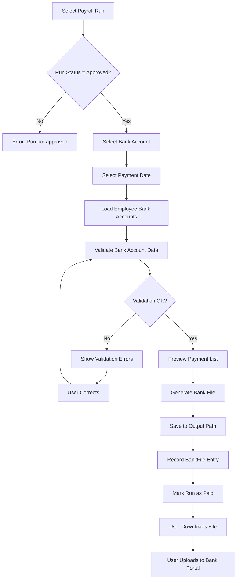

# Fiji Enterprise Payroll System — Bank File Generation

**Version:** 1.0.0  
**Date:** June 2026  
**Status:** Approved  
**Owner:** Senior Payroll Specialist  

---

## 1. Overview

The Bank File Generation module produces electronic payment instruction files for direct credit (payroll) payments to employees. These files are submitted to the employer's bank for processing, eliminating manual payment entry.

---

## 2. Supported Fiji Banks

| Bank | Code | File Format |
|------|------|------------|
| Bank South Pacific (BSP) | BSP | BSP Direct Credit CSV |
| ANZ Bank Fiji | ANZ | ANZ PaySmart CSV |
| Westpac Fiji | WBC | Westpac Direct Entry |
| HFC Bank | HFC | HFC Payment CSV |
| Bred Bank Fiji | BRD | Bred Direct Credit TXT |
| Kontiki Finance | KTK | Kontiki CSV |

---

## 3. Bank File Generation Workflow



---

## 4. Pre-Generation Checks

| Check | Rule | Severity |
|-------|------|----------|
| Run status | Must be `Approved` | Error |
| Employee bank account | Must be set for all employees in run | Error |
| Payment method | Only employees with payment method = `Bank` included | Info |
| Net pay > 0 | Cannot generate payment for $0 net pay | Error |
| BSB / Account format | Must match bank-specific format | Error |
| Payment date | Must be a business day (not public holiday or weekend) | Warning |
| Total matches run | Sum of payments must equal run total net pay | Error |

---

## 5. Bank File Formats

### 5.1 BSP Direct Credit CSV

**File Naming:** `BSP_PAYROLL_[COMPANYCODE]_[YYYYMMDD].csv`

**Format:**
```
Header Record:
Field 1: "HDR" (literal)
Field 2: Employer BSP Account Number (10 digits)
Field 3: Employer Name (max 30 chars)
Field 4: File Date (DDMMYYYY)
Field 5: Total Records (count of detail records)
Field 6: Total Amount (FJD, 2 decimal places, no symbol)

Detail Records:
Field 1: Employee BSP Account Number (10 digits)
Field 2: Employee Name (max 30 chars)
Field 3: Payment Amount (FJD, 2 decimal places)
Field 4: Reference (payslip reference, max 18 chars)
Field 5: Payment Date (DDMMYYYY)

Trailer Record:
Field 1: "TRL" (literal)
Field 2: Total Amount (FJD, 2 decimal places)
Field 3: Total Records
```

**Example:**
```
HDR,1234567890,PACIFIC SUPPLIES LTD,14062026,5,22500.00
1234509876,SMITH JOHN,4500.00,PAY-2026-06-001,14062026
9876501234,JONES MARY,3800.00,PAY-2026-06-001,14062026
...
TRL,22500.00,5
```

---

### 5.2 ANZ PaySmart CSV

**File Naming:** `ANZ_[COMPANYCODE]_[YYYYMMDD].csv`

**Format (comma-separated with header row):**
```
BSB,AccountNumber,AccountName,Amount,Reference,PaymentDescription
```

**Rules:**
- BSB format: `XXX-XXX` (3 digits, dash, 3 digits)
- Account: Up to 10 digits
- Amount: No leading zeros, 2 decimal places
- Reference: Max 18 characters, alphanumeric
- Header row required

**Example:**
```
BSB,AccountNumber,AccountName,Amount,Reference,PaymentDescription
069-001,12345678,SMITH JOHN,4500.00,PAY-2026-06,June 2026 Payroll
069-001,23456789,JONES MARY,3800.00,PAY-2026-06,June 2026 Payroll
```

---

### 5.3 Westpac Direct Entry

**File Naming:** `WBC_[COMPANYCODE]_[YYYYMMDD].txt`

**Format:** Fixed-width text file

```
Record Type  : 1 character  (H=Header, D=Detail, T=Trailer)
BSB          : 7 characters (NNN-NNN padded)
Account      : 9 characters (right-justified, zero-padded)
Account Name : 32 characters (left-justified, space-padded)
Amount       : 10 characters (cents, zero-padded, no decimal)
Reference    : 18 characters (space-padded)
Date         : 8 characters  (DDMMYYYY)
```

**Amount Rule:** Amounts are in **cents** (multiply FJD amount × 100, round to integer)

**Example:**
```
H069-001  12345678  PACIFIC SUPPLIES LTD            14062026
D069-001  98765432  SMITH JOHN                      000000450000PAY-2026-06-001  14062026
T000002250000
```

---

### 5.4 HFC Bank CSV

**File Naming:** `HFC_[COMPANYCODE]_[YYYYMMDD].csv`

**Format:**
```
AccountNumber,AccountName,Amount,Reference
```

**Rules:**
- No header row
- Account number format: 10 digits
- Amount: FJD with 2 decimal places

---

### 5.5 Bred Bank TXT

**File Naming:** `BRED_[COMPANYCODE]_[YYYYMMDD].txt`

**Format (pipe-delimited):**
```
HEADER|EmployerAccount|EmployerName|Date|TotalAmount|RecordCount
DETAIL|EmployeeAccount|EmployeeName|Amount|Reference
FOOTER|TotalAmount|RecordCount
```

---

## 6. Employee Bank Account Validation

| Validation | Rule |
|-----------|------|
| Account number format | Must match bank-specific format |
| BSB code (ANZ/Westpac) | Must be a valid Fiji BSB code |
| Account name | Cannot be blank |
| Net pay > 0 | Zero-pay employees excluded from bank file |
| Split payments | Employee can have up to 3 bank accounts with split percentages |

### Split Payment Rules
- Employee may designate up to 3 accounts
- Splits defined as:
  - Fixed amount to account 1
  - Fixed amount to account 2
  - Remainder to account 3 (primary account)
- Total splits must always equal net pay

---

## 7. Post-Generation Actions

| Action | System Response |
|--------|----------------|
| File generated | Saved to configured output path |
| BankFile record created | `payroll.BankFiles` updated |
| PayrollRun status | Changed to `Paid` |
| Audit log entry | Generated |
| Notification | Sent to Finance Manager (if configured) |

---

## 8. Bank File Records

`payroll.BankFiles` table stores:

| Column | Description |
|--------|-------------|
| Id | Primary key |
| PayrollRunId | Linked payroll run |
| CompanyId | Company |
| BankCode | BSP/ANZ/WBC etc. |
| FilePath | Output file path |
| FileName | Generated file name |
| TotalPayments | Count of payment records |
| TotalAmount | Total FJD amount |
| GeneratedBy | Username |
| GeneratedAt | Timestamp |
| PaymentDate | Bank value date |

---

## 9. Error Handling

| Error | Behaviour |
|-------|-----------|
| Missing bank account | Skip employee, log warning, show in error report |
| Invalid account format | Prevent file generation, list errors |
| File write failure | Rollback status, show detailed error |
| Partial generation | Rollback all, show failure message |

---

## 10. Audit Requirements

| Action | Logged |
|--------|--------|
| Bank file generated | Yes — file name, path, amount, user |
| Bank account added | Yes |
| Bank account changed | Yes |
| PayrollRun marked Paid | Yes |
| Bank file re-generated | Yes — with reason |

---

## 11. Re-Generation Rules

A bank file can be re-generated if:
- Original file was corrupted or lost
- Bank rejected the file (format error)
- Payment date needs to be corrected

Re-generation:
- Requires authorisation by Finance Manager
- Creates a new `BankFiles` record referencing the original
- Audit trail records reason and authoriser

---

*Document maintained by: Senior Payroll Specialist*  
*Last updated: June 2026*
