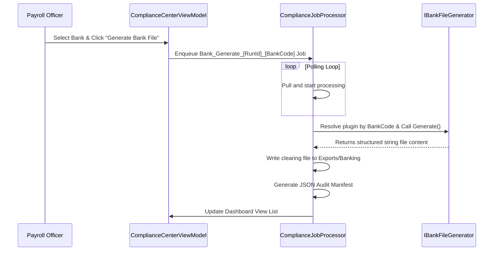

# Fiji Enterprise Payroll System — Banking & Disbursals System

**Version:** 1.0.0  
**Date:** June 2026  
**Status:** Approved  
**Owner:** Integration Engineer  

---

## 1. Overview

Fiji Enterprise Payroll System supports direct credit clearing file exports for all major commercial banks operating in Fiji. The disbursal formats are managed by the `IBankFileGenerator` plugin ecosystem, allowing easy configuration via templates.

---

## 2. Supported Banks & File Layouts

| Bank Code | Bank Name | File Extension | Column Delimiter | Standard Format |
|-----------|-----------|----------------|------------------|-----------------|
| `BSP` | Bank South Pacific | `.txt` | None (Fixed Width) | BSP Direct Credit |
| `ANZ` | ANZ Fiji | `.aba` | None (Fixed Width) | CEMtex ABA Format |
| `WBC` | Westpac Fiji | `.csv` | `,` (Comma) | WBC Clearing CSV |
| `BRED` | BRED Bank Fiji | `.txt` | `,` (Comma) | BRED Direct Pay |
| `HFC` | HFC Bank | `.txt` | `\t` (Tab) | HFC Cleared |
| `KNTK` | Kontiki Finance | `.csv` | `,` (Comma) | Kontiki Payroll |

---

## 3. Template-Based Layout Definitions

To maintain adaptability without altering C# logic, layout structures are defined in the database using header, detail, and footer templates with place-holder tokens.

### 3.1 Template Placeholders

#### Header Placeholders
* `{CompanyName}` — The paying organization's legal name.
* `{CompanyAccount}` — Organization's bank account number.
* `{Bsb}` — Employer bank BSB code.
* `{PaymentDate:yyyyMMdd}` — Processing date.
* `{Reference}` — General transaction description.
* `{TotalAmount:F2}` — Aggregate pay distribution amount.
* `{TotalCount}` — Total count of transaction records.

#### Detail Placeholders
* `{EmployeeName}` — Recipient full name.
* `{BankAccountNumber}` — Recipient account number.
* `{Amount:F2}` — Net amount due.
* `{EmployeeId}` — Employee identifier code.
* `{Reference}` — Individual transaction reference.

---

## 4. Disbursal Process Sequence

---

*Document maintained by: Integration Engineer*  
*Last updated: June 2026*
