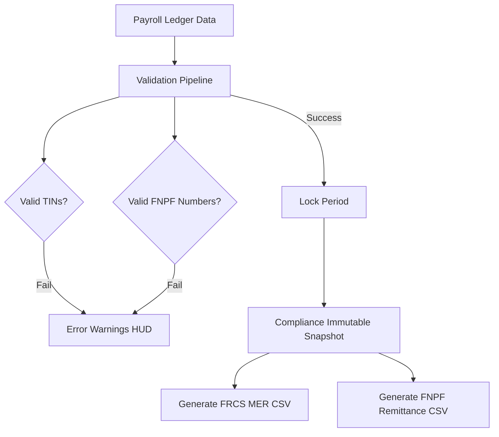

# Fiji Enterprise Payroll System — Compliance Engine Design

**Version:** 1.0.0  
**Date:** June 2026  
**Status:** Approved  
**Owner:** Regulatory Compliance Manager  

---

## 1. Compliance Engine Architecture

The Fiji compliance module validates, aggregates, and exports statutory data. It comprises three main parts:

1. **Statutory Rules Database** — Stores active rates, PAYE brackets, and thresholds, versioned over time.
2. **Composite Validator Pipeline** — Run verification steps before finalized pay period closings.
3. **Regulatory File Generators** — Generates government CSV return formats.

---

## 2. FRCS Monthly Employer Return (MER)

The Fiji Revenue and Customs Service (FRCS) requires monthly reporting of tax deductions for all employees via the MER CSV format.

### 2.1 File Format Specifications
* **Columns:** `EmployerTIN,Month,Year,EmployeeTIN,EmployeeName,GrossPay,PAYEDeducted`
* **File Naming Convention:** `FRCS_MER_[CompanyId]_[Year]_[Month].csv`
* **Format Requirements:** Fields must be comma-delimited. Special characters or names containing commas must be escaped with double quotes.

---

## 3. FNPF Contribution Rules

The Fiji National Provident Fund (FNPF) manages compulsory retirement savings. The system enforces standard minimum contributions and allows company-level overrides.

### 3.1 Contribution Standard Rates
* **Employee Contribution:** Standard 8.0% of Gross Earnings.
* **Employer Contribution:** Standard 10.0% of Gross Earnings.
* **FNPF Exemptions:** Supported for expatriate workers, seasonal contractors, or other legislative exemptions.

### 3.2 File Format Specifications
* **Columns:** `EmployerNumber,EmployerName,Month,Year,FNPFNumber,EmployeeName,EmployeeContribution,EmployerContribution`
* **File Naming Convention:** `FNPF_Remit_[CompanyId]_[Year]_[Month].csv`

---

## 4. Built-in Validation Rules

| Rule Code | Target | Severity | Check Logic | Remediation |
|-----------|--------|----------|-------------|-------------|
| `FRCS_TIN_MISSING` | Employee TIN | **Error** | Field must not be empty. | Add employee tax registration details. |
| `FRCS_TIN_INVALID` | Employee TIN | **Error** | Must be exactly 9 digits. | Update TIN to 9 numerical characters. |
| `FNPF_NUM_MISSING` | Employee FNPF | **Error** | Must not be empty if FNPF deduction > 0. | Fill FNPF registration number. |
| `BANK_ACCT_MISSING` | Direct Credit | **Warning** | Account number is missing for bank clearing. | Provide bank details or switch pay method to Cash/Cheque. |

---

*Document maintained by: Regulatory Compliance Manager*  
*Last updated: June 2026*
