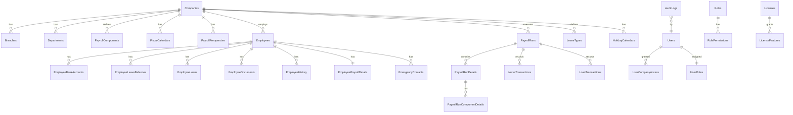

# Fiji Enterprise Payroll System — Database Design

**Version:** 1.0.0  
**Date:** June 2026  
**Status:** Approved  
**Owner:** Senior SQL Server Database Architect  

---

## 1. Database Overview

- **DBMS:** SQL Server 2019+
- **Collation:** `Latin1_General_CI_AS`
- **Compatibility Level:** 150 (SQL Server 2019)
- **Recovery Model:** FULL
- **Normal Form:** Third Normal Form (3NF)
- **Concurrency:** RowVersion optimistic concurrency on all mutable tables
- **Soft Delete:** `IsDeleted` + `DeletedAt` + `DeletedBy` on all tables
- **Audit Fields:** `CreatedBy`, `CreatedAt`, `ModifiedBy`, `ModifiedAt` on all tables

---

## 2. Entity Relationship Diagram



---

## 3. Schema Definitions

### Schema Organisation
| Schema | Purpose |
|--------|---------|
| `system` | System-level tables (users, roles, permissions, licenses) |
| `company` | Company configuration tables |
| `employee` | Employee master data tables |
| `payroll` | Payroll processing tables |
| `leave` | Leave management tables |
| `reporting` | Reporting views and cached data |
| `audit` | Audit trail tables |

---

## 4. Complete Table List

### System Schema

| Table | Description |
|-------|-------------|
| `system.SystemSettings` | Global application settings |
| `system.Users` | Application user accounts |
| `system.Roles` | Security roles |
| `system.Permissions` | Granular permissions |
| `system.RolePermissions` | Role-to-permission mapping |
| `system.UserRoles` | User-to-role mapping |
| `system.UserCompanyAccess` | User-to-company access |
| `system.Licenses` | License information |
| `system.LicenseFeatures` | Features enabled per license |
| `system.NotificationTemplates` | Email/notification templates |

### Company Schema

| Table | Description |
|-------|-------------|
| `company.Companies` | Company master records |
| `company.Branches` | Branch offices |
| `company.Departments` | Departments |
| `company.Positions` | Job positions |
| `company.Banks` | Bank master (BSP, ANZ, Westpac, HFC, etc.) |
| `company.FiscalCalendars` | Fiscal year calendar periods |
| `company.PayrollFrequencies` | Payroll frequency setup |
| `company.PayrollComponents` | Earnings/deduction components |
| `company.LeaveTypes` | Types of leave |
| `company.HolidayCalendars` | Public holidays per company |
| `company.TaxTables` | PAYE tax brackets (from FRCS) |
| `company.FNPFRates` | FNPF contribution rates |

### Employee Schema

| Table | Description |
|-------|-------------|
| `employee.Employees` | Employee master record |
| `employee.EmployeePayrollDetails` | Pay rate and payroll setup |
| `employee.EmployeeBankAccounts` | Bank account information |
| `employee.EmployeeLeaveBalances` | Current leave balances per type |
| `employee.EmployeeLoans` | Loan master records |
| `employee.EmergencyContacts` | Emergency contact persons |
| `employee.EmployeeDocuments` | Document metadata |
| `employee.EmployeeHistory` | Employment history (promotions, transfers) |
| `employee.EmployeeNotes` | Free-text notes |

### Payroll Schema

| Table | Description |
|-------|-------------|
| `payroll.PayrollRuns` | Payroll run header |
| `payroll.PayrollRunDetails` | Employee line in a run |
| `payroll.PayrollRunComponentDetails` | Individual component values per employee per run |
| `payroll.LeaveTransactions` | Leave taken per pay period |
| `payroll.LoanTransactions` | Loan repayments per pay period |
| `payroll.PayrollApprovals` | Approval workflow tracking |
| `payroll.BankFiles` | Generated bank payment file records |
| `payroll.FRCSSubmissions` | FRCS MER submission records |
| `payroll.FNPFSubmissions` | FNPF submission records |

### Audit Schema

| Table | Description |
|-------|-------------|
| `audit.AuditLogs` | Full action audit trail |
| `audit.LoginHistory` | User login/logout events |
| `audit.PayrollAuditLogs` | Payroll-specific audit events |

---

## 5. Table Column Definitions

### 5.1 `company.Companies`

| Column | Data Type | Nullable | Constraint | Description |
|--------|-----------|----------|-----------|-------------|
| Id | INT | NOT NULL | PK, IDENTITY(1,1) | Primary key |
| CompanyCode | NVARCHAR(20) | NOT NULL | UQ | Unique company code |
| CompanyName | NVARCHAR(200) | NOT NULL | | Legal company name |
| TradingName | NVARCHAR(200) | NULL | | Trading name |
| TIN | NVARCHAR(20) | NULL | | FRCS TIN number |
| FNPFEmployerNumber | NVARCHAR(20) | NULL | | FNPF employer number |
| AddressLine1 | NVARCHAR(200) | NULL | | Street address |
| AddressLine2 | NVARCHAR(200) | NULL | | Address line 2 |
| City | NVARCHAR(100) | NULL | | City |
| Phone | NVARCHAR(50) | NULL | | Phone number |
| Email | NVARCHAR(200) | NULL | | Email address |
| LogoPath | NVARCHAR(500) | NULL | | Path to logo file |
| IsActive | BIT | NOT NULL | DEFAULT(1) | Active status |
| IsDeleted | BIT | NOT NULL | DEFAULT(0) | Soft delete |
| DeletedBy | NVARCHAR(100) | NULL | | Who deleted |
| DeletedAt | DATETIME2 | NULL | | When deleted |
| CreatedBy | NVARCHAR(100) | NOT NULL | | Who created |
| CreatedAt | DATETIME2 | NOT NULL | DEFAULT(SYSUTCDATETIME()) | When created |
| ModifiedBy | NVARCHAR(100) | NULL | | Who last modified |
| ModifiedAt | DATETIME2 | NULL | | When last modified |
| RowVersion | ROWVERSION | NOT NULL | | Concurrency token |

### 5.2 `employee.Employees`

| Column | Data Type | Nullable | Constraint | Description |
|--------|-----------|----------|-----------|-------------|
| Id | INT | NOT NULL | PK, IDENTITY(1,1) | Primary key |
| CompanyId | INT | NOT NULL | FK → Companies | Company reference |
| EmployeeCode | NVARCHAR(20) | NOT NULL | UQ per company | Employee number |
| FirstName | NVARCHAR(100) | NOT NULL | | Legal first name |
| MiddleName | NVARCHAR(100) | NULL | | Middle name |
| LastName | NVARCHAR(100) | NOT NULL | | Legal last name |
| PreferredName | NVARCHAR(100) | NULL | | Preferred/display name |
| DateOfBirth | DATE | NULL | | Date of birth |
| Gender | NVARCHAR(10) | NULL | CHECK IN ('Male','Female','Other') | Gender |
| MaritalStatus | NVARCHAR(20) | NULL | | Marital status |
| Nationality | NVARCHAR(100) | NULL | | Nationality |
| FijiTIN | NVARCHAR(20) | NULL | | FRCS TIN |
| FNPFNumber | NVARCHAR(20) | NULL | | FNPF membership number |
| TaxExempt | BIT | NOT NULL | DEFAULT(0) | PAYE exempt flag |
| ResidencyStatus | NVARCHAR(20) | NULL | CHECK IN ('Resident','NonResident') | Tax residency |
| Email | NVARCHAR(200) | NULL | | Work email |
| PersonalEmail | NVARCHAR(200) | NULL | | Personal email |
| Phone | NVARCHAR(50) | NULL | | Work phone |
| MobilePhone | NVARCHAR(50) | NULL | | Mobile phone |
| AddressLine1 | NVARCHAR(200) | NULL | | Residential address |
| AddressLine2 | NVARCHAR(200) | NULL | | Address line 2 |
| City | NVARCHAR(100) | NULL | | City |
| StartDate | DATE | NOT NULL | | Employment start date |
| EndDate | DATE | NULL | | Termination date |
| TerminationReason | NVARCHAR(200) | NULL | | Reason for termination |
| EmploymentStatus | NVARCHAR(20) | NOT NULL | CHECK IN ('Active','Terminated','OnLeave','Suspended') | Current status |
| EmploymentType | NVARCHAR(20) | NOT NULL | CHECK IN ('FullTime','PartTime','Casual','Contract') | Employment type |
| BranchId | INT | NULL | FK → Branches | Branch assignment |
| DepartmentId | INT | NULL | FK → Departments | Department assignment |
| PositionId | INT | NULL | FK → Positions | Position/job title |
| ReportsToEmployeeId | INT | NULL | FK → Employees (self) | Line manager |
| PhotoPath | NVARCHAR(500) | NULL | | Photo file path |
| IsDeleted | BIT | NOT NULL | DEFAULT(0) | Soft delete |
| DeletedBy | NVARCHAR(100) | NULL | | Who deleted |
| DeletedAt | DATETIME2 | NULL | | When deleted |
| CreatedBy | NVARCHAR(100) | NOT NULL | | Who created |
| CreatedAt | DATETIME2 | NOT NULL | DEFAULT(SYSUTCDATETIME()) | When created |
| ModifiedBy | NVARCHAR(100) | NULL | | Last modifier |
| ModifiedAt | DATETIME2 | NULL | | Last modified date |
| RowVersion | ROWVERSION | NOT NULL | | Concurrency token |

### 5.3 `employee.EmployeePayrollDetails`

| Column | Data Type | Nullable | Constraint | Description |
|--------|-----------|----------|-----------|-------------|
| Id | INT | NOT NULL | PK, IDENTITY(1,1) | Primary key |
| EmployeeId | INT | NOT NULL | FK → Employees, UNIQUE | One per employee |
| PaymentMethod | NVARCHAR(20) | NOT NULL | CHECK IN ('Bank','Cash','Cheque') | How paid |
| PayType | NVARCHAR(20) | NOT NULL | CHECK IN ('Salary','Hourly','Daily') | Pay basis |
| PayFrequencyId | INT | NOT NULL | FK → PayrollFrequencies | Pay frequency |
| AnnualSalary | DECIMAL(18,4) | NULL | | Annual salary (if Salary) |
| HourlyRate | DECIMAL(18,4) | NULL | | Hourly rate (if Hourly) |
| DailyRate | DECIMAL(18,4) | NULL | | Daily rate (if Daily) |
| StandardHoursPerWeek | DECIMAL(8,2) | NULL | DEFAULT(40) | Standard working hours |
| StandardDaysPerWeek | DECIMAL(8,2) | NULL | DEFAULT(5) | Standard working days |
| OvertimeRate | DECIMAL(8,4) | NULL | DEFAULT(1.5) | Overtime multiplier |
| FNPFEmployee | DECIMAL(8,4) | NOT NULL | DEFAULT(8.0) | Employee FNPF % |
| FNPFEmployer | DECIMAL(8,4) | NOT NULL | DEFAULT(10.0) | Employer FNPF % |
| FNPFExempt | BIT | NOT NULL | DEFAULT(0) | FNPF exempt flag |
| TaxCode | NVARCHAR(10) | NULL | | FRCS tax code |
| EffectiveDate | DATE | NOT NULL | | Rate effective from |
| ExpiryDate | DATE | NULL | | Rate expiry date |
| CreatedBy | NVARCHAR(100) | NOT NULL | | Who created |
| CreatedAt | DATETIME2 | NOT NULL | DEFAULT(SYSUTCDATETIME()) | When created |
| ModifiedBy | NVARCHAR(100) | NULL | | Last modifier |
| ModifiedAt | DATETIME2 | NULL | | Last modified date |
| RowVersion | ROWVERSION | NOT NULL | | Concurrency token |

### 5.4 `payroll.PayrollRuns`

| Column | Data Type | Nullable | Constraint | Description |
|--------|-----------|----------|-----------|-------------|
| Id | INT | NOT NULL | PK, IDENTITY(1,1) | Primary key |
| CompanyId | INT | NOT NULL | FK → Companies | Company |
| PayrollFrequencyId | INT | NOT NULL | FK → PayrollFrequencies | Frequency |
| FiscalPeriodId | INT | NOT NULL | FK → FiscalCalendars | Fiscal period |
| RunNumber | INT | NOT NULL | | Sequential run number |
| RunName | NVARCHAR(100) | NOT NULL | | e.g., "Weekly Run - 14 Jun 2026" |
| PeriodStartDate | DATE | NOT NULL | | Pay period start |
| PeriodEndDate | DATE | NOT NULL | | Pay period end |
| PaymentDate | DATE | NOT NULL | | Date of payment |
| Status | NVARCHAR(20) | NOT NULL | CHECK IN ('Draft','Calculated','Approved','Paid','Reversed') | Run status |
| TotalGross | DECIMAL(18,4) | NOT NULL | DEFAULT(0) | Total gross pay |
| TotalPAYE | DECIMAL(18,4) | NOT NULL | DEFAULT(0) | Total PAYE deducted |
| TotalFNPFEmployee | DECIMAL(18,4) | NOT NULL | DEFAULT(0) | Total FNPF employee |
| TotalFNPFEmployer | DECIMAL(18,4) | NOT NULL | DEFAULT(0) | Total FNPF employer |
| TotalDeductions | DECIMAL(18,4) | NOT NULL | DEFAULT(0) | Total other deductions |
| TotalNet | DECIMAL(18,4) | NOT NULL | DEFAULT(0) | Total net pay |
| EmployeeCount | INT | NOT NULL | DEFAULT(0) | Number of employees |
| Notes | NVARCHAR(MAX) | NULL | | Run notes |
| ApprovedBy | NVARCHAR(100) | NULL | | Approver username |
| ApprovedAt | DATETIME2 | NULL | | Approval timestamp |
| CreatedBy | NVARCHAR(100) | NOT NULL | | Who created |
| CreatedAt | DATETIME2 | NOT NULL | DEFAULT(SYSUTCDATETIME()) | When created |
| ModifiedBy | NVARCHAR(100) | NULL | | Last modifier |
| ModifiedAt | DATETIME2 | NULL | | Last modified |
| RowVersion | ROWVERSION | NOT NULL | | Concurrency token |

### 5.5 `payroll.PayrollRunDetails`

| Column | Data Type | Nullable | Constraint | Description |
|--------|-----------|----------|-----------|-------------|
| Id | INT | NOT NULL | PK, IDENTITY(1,1) | Primary key |
| PayrollRunId | INT | NOT NULL | FK → PayrollRuns | Parent run |
| EmployeeId | INT | NOT NULL | FK → Employees | Employee |
| GrossPay | DECIMAL(18,4) | NOT NULL | | Gross earnings |
| TotalAllowances | DECIMAL(18,4) | NOT NULL | DEFAULT(0) | Total allowances |
| TaxableIncome | DECIMAL(18,4) | NOT NULL | | Taxable income |
| PAYEAmount | DECIMAL(18,4) | NOT NULL | DEFAULT(0) | PAYE tax amount |
| FNPFEmployeeAmount | DECIMAL(18,4) | NOT NULL | DEFAULT(0) | FNPF employee contribution |
| FNPFEmployerAmount | DECIMAL(18,4) | NOT NULL | DEFAULT(0) | FNPF employer contribution |
| TotalDeductions | DECIMAL(18,4) | NOT NULL | DEFAULT(0) | Total deductions |
| NetPay | DECIMAL(18,4) | NOT NULL | | Net take-home pay |
| LeaveDays | DECIMAL(8,2) | NOT NULL | DEFAULT(0) | Leave days in period |
| OvertimeHours | DECIMAL(8,2) | NOT NULL | DEFAULT(0) | Overtime hours |
| Status | NVARCHAR(20) | NOT NULL | CHECK IN ('Included','Excluded','OnLeave') | Employee status in run |
| CreatedBy | NVARCHAR(100) | NOT NULL | | Who created |
| CreatedAt | DATETIME2 | NOT NULL | DEFAULT(SYSUTCDATETIME()) | When created |
| RowVersion | ROWVERSION | NOT NULL | | Concurrency token |

### 5.6 `company.PayrollComponents`

| Column | Data Type | Nullable | Constraint | Description |
|--------|-----------|----------|-----------|-------------|
| Id | INT | NOT NULL | PK, IDENTITY(1,1) | Primary key |
| CompanyId | INT | NOT NULL | FK → Companies | Company |
| ComponentCode | NVARCHAR(20) | NOT NULL | | e.g., "BASIC", "HRA", "PAYE" |
| ComponentName | NVARCHAR(200) | NOT NULL | | Display name |
| ComponentType | NVARCHAR(20) | NOT NULL | CHECK IN ('Earning','Deduction','Allowance','Benefit','Statutory') | Type |
| CalculationMethod | NVARCHAR(20) | NOT NULL | CHECK IN ('Fixed','Percentage','Formula','Manual') | Calculation method |
| CalculationValue | DECIMAL(18,4) | NULL | | Fixed amount or % |
| Formula | NVARCHAR(MAX) | NULL | | If formula-based |
| IsSystemComponent | BIT | NOT NULL | DEFAULT(0) | Cannot be deleted |
| IsTaxable | BIT | NOT NULL | DEFAULT(1) | Subject to PAYE |
| IsFNPFable | BIT | NOT NULL | DEFAULT(1) | Subject to FNPF |
| DisplayOrder | INT | NOT NULL | DEFAULT(0) | Sort order on payslip |
| IsActive | BIT | NOT NULL | DEFAULT(1) | Active flag |
| IsDeleted | BIT | NOT NULL | DEFAULT(0) | Soft delete |
| CreatedBy | NVARCHAR(100) | NOT NULL | | Who created |
| CreatedAt | DATETIME2 | NOT NULL | DEFAULT(SYSUTCDATETIME()) | When created |
| ModifiedBy | NVARCHAR(100) | NULL | | Last modifier |
| ModifiedAt | DATETIME2 | NULL | | Last modified |
| RowVersion | ROWVERSION | NOT NULL | | Concurrency token |

### 5.7 `system.Users`

| Column | Data Type | Nullable | Constraint | Description |
|--------|-----------|----------|-----------|-------------|
| Id | INT | NOT NULL | PK, IDENTITY(1,1) | Primary key |
| Username | NVARCHAR(100) | NOT NULL | UQ | Login username |
| PasswordHash | NVARCHAR(500) | NULL | | BCrypt hash |
| WindowsUsername | NVARCHAR(200) | NULL | | AD username |
| AuthType | NVARCHAR(20) | NOT NULL | CHECK IN ('SQL','Windows') | Auth method |
| FirstName | NVARCHAR(100) | NOT NULL | | First name |
| LastName | NVARCHAR(100) | NOT NULL | | Last name |
| Email | NVARCHAR(200) | NULL | | Email address |
| IsActive | BIT | NOT NULL | DEFAULT(1) | Active flag |
| MustChangePassword | BIT | NOT NULL | DEFAULT(1) | Force password change |
| LastLoginAt | DATETIME2 | NULL | | Last successful login |
| FailedLoginCount | INT | NOT NULL | DEFAULT(0) | Consecutive failures |
| LockedUntil | DATETIME2 | NULL | | Lockout expiry |
| IsDeleted | BIT | NOT NULL | DEFAULT(0) | Soft delete |
| CreatedBy | NVARCHAR(100) | NOT NULL | | Who created |
| CreatedAt | DATETIME2 | NOT NULL | DEFAULT(SYSUTCDATETIME()) | When created |
| ModifiedBy | NVARCHAR(100) | NULL | | Last modifier |
| ModifiedAt | DATETIME2 | NULL | | Last modified |
| RowVersion | ROWVERSION | NOT NULL | | Concurrency token |

### 5.8 `audit.AuditLogs`

| Column | Data Type | Nullable | Constraint | Description |
|--------|-----------|----------|-----------|-------------|
| Id | BIGINT | NOT NULL | PK, IDENTITY(1,1) | Primary key |
| CompanyId | INT | NULL | FK → Companies | Company context |
| EntityName | NVARCHAR(100) | NOT NULL | | Table/entity name |
| EntityId | NVARCHAR(50) | NOT NULL | | Primary key value |
| Action | NVARCHAR(20) | NOT NULL | CHECK IN ('Create','Update','Delete','Login','Logout','PayrollRun','Export') | Action type |
| OldValues | NVARCHAR(MAX) | NULL | | JSON of old state |
| NewValues | NVARCHAR(MAX) | NULL | | JSON of new state |
| ChangedColumns | NVARCHAR(MAX) | NULL | | JSON array of changed column names |
| UserId | INT | NOT NULL | FK → Users | Who performed action |
| Username | NVARCHAR(100) | NOT NULL | | Username snapshot |
| IPAddress | NVARCHAR(50) | NULL | | Client IP |
| Timestamp | DATETIME2 | NOT NULL | DEFAULT(SYSUTCDATETIME()) | When it happened |
| AdditionalInfo | NVARCHAR(MAX) | NULL | | Extra context |

### 5.9 `system.Licenses`

| Column | Data Type | Nullable | Constraint | Description |
|--------|-----------|----------|-----------|-------------|
| Id | INT | NOT NULL | PK, IDENTITY(1,1) | Primary key |
| LicenseKey | NVARCHAR(100) | NOT NULL | UQ | License identifier |
| LicenseType | NVARCHAR(50) | NOT NULL | CHECK IN ('Trial','Standard','Professional','Enterprise') | License tier |
| CompanyName | NVARCHAR(200) | NOT NULL | | Licensed company name |
| HardwareId | NVARCHAR(500) | NOT NULL | | Machine fingerprint |
| IssueDate | DATE | NOT NULL | | Issue date |
| ExpiryDate | DATE | NULL | | Null = perpetual |
| MaxCompanies | INT | NOT NULL | DEFAULT(1) | Companies allowed |
| MaxEmployees | INT | NOT NULL | DEFAULT(50) | Employees allowed (−1 = unlimited) |
| Signature | NVARCHAR(MAX) | NOT NULL | | RSA signature |
| IsActive | BIT | NOT NULL | DEFAULT(1) | Active flag |
| CreatedAt | DATETIME2 | NOT NULL | DEFAULT(SYSUTCDATETIME()) | When issued |

---

## 6. Index Recommendations

| Table | Index Name | Columns | Type | Reason |
|-------|-----------|---------|------|--------|
| `employee.Employees` | `IX_Employees_CompanyId` | CompanyId | NONCLUSTERED | Multi-tenancy filter |
| `employee.Employees` | `IX_Employees_EmployeeCode` | CompanyId, EmployeeCode | NONCLUSTERED UNIQUE | Employee lookup |
| `employee.Employees` | `IX_Employees_Name` | LastName, FirstName | NONCLUSTERED | Name search |
| `employee.Employees` | `IX_Employees_Status` | CompanyId, EmploymentStatus | NONCLUSTERED | Active employee queries |
| `payroll.PayrollRuns` | `IX_PayrollRuns_CompanyId` | CompanyId, Status | NONCLUSTERED | Run list queries |
| `payroll.PayrollRuns` | `IX_PayrollRuns_Period` | CompanyId, PeriodStartDate, PeriodEndDate | NONCLUSTERED | Period-based queries |
| `payroll.PayrollRunDetails` | `IX_PayrollRunDetails_RunId` | PayrollRunId | NONCLUSTERED | Run detail join |
| `payroll.PayrollRunDetails` | `IX_PayrollRunDetails_EmployeeId` | EmployeeId | NONCLUSTERED | Employee history |
| `audit.AuditLogs` | `IX_AuditLogs_EntityName` | EntityName, EntityId | NONCLUSTERED | Entity audit lookup |
| `audit.AuditLogs` | `IX_AuditLogs_UserId` | UserId, Timestamp | NONCLUSTERED | User activity |
| `audit.AuditLogs` | `IX_AuditLogs_Timestamp` | Timestamp | NONCLUSTERED | Time-range queries |
| `system.Users` | `IX_Users_Username` | Username | NONCLUSTERED UNIQUE | Login lookup |

---

## 7. Reporting Views

### `reporting.vPayrollSummary`
Aggregates payroll run totals by company, period, and frequency.

**Joins:** `PayrollRuns` + `Companies` + `PayrollFrequencies` + `FiscalCalendars`

### `reporting.vEmployeePaySummary`
Employee payslip view joining run details with component breakdowns.

**Joins:** `PayrollRunDetails` + `Employees` + `PayrollRunComponentDetails` + `PayrollComponents`

### `reporting.vLeaveBalanceSummary`
Current leave balances with entitlements vs. taken.

**Joins:** `EmployeeLeaveBalances` + `Employees` + `LeaveTypes`

### `reporting.vFRCSSummary`
FRCS MER data — employee TIN, gross, PAYE per period.

**Joins:** `PayrollRunDetails` + `Employees` + `PayrollRuns`

### `reporting.vFNPFSummary`
FNPF submission data — employee FNPF numbers, contributions.

**Joins:** `PayrollRunDetails` + `Employees` + `PayrollRuns`

### `reporting.vLoanSummary`
Active loans with balance, repayments, and projected payoff.

**Joins:** `EmployeeLoans` + `LoanTransactions` + `Employees`

---

## 8. Seed Data Strategy

### Seed Execution Order (Dependency Aware)
1. `system.Roles` — System roles (SysAdmin, PayrollAdmin, HRManager, etc.)
2. `system.Permissions` — Permission matrix
3. `system.RolePermissions` — Default role-permission assignments
4. `company.Banks` — Fiji banks (BSP, ANZ, Westpac, HFC, Bred, Kontiki)
5. `company.TaxTables` — FRCS PAYE tax brackets for current year
6. `company.FNPFRates` — FNPF contribution rates
7. `system.NotificationTemplates` — Default email/notification templates
8. `system.SystemSettings` — Default application settings

### Seed Data Philosophy
- Seeds are **idempotent** (safe to re-run)
- System data (tax tables, FNPF rates) updated via versioned migration scripts
- Company-specific data is never seeded — entered via Setup Wizard

---

## 9. Migration Strategy

### Tool: Entity Framework Core Migrations

### Migration Naming Convention
`YYYYMMDD_HHMM_[Description]`

Example: `20260615_1200_InitialCreate`

### Migration Workflow
```
1. Developer makes model change
2. Run: dotnet ef migrations add [Name]
3. Review generated migration file
4. Peer review migration
5. Apply to dev: dotnet ef database update
6. Test thoroughly
7. Include in release branch
8. Applied to production via deploy.ps1 script
```

### Migration Safety Rules
1. **Never** drop a column without a deprecation phase
2. **Never** rename a column (add new + copy data + drop old)
3. **Always** use non-null defaults when adding NOT NULL columns
4. **Always** test rollback script before applying to production

---

## 10. Backup Strategy

### Backup Schedule
| Type | Frequency | Retention | Time |
|------|-----------|---------|------|
| Full Backup | Weekly (Sunday) | 4 weeks | 01:00 AM |
| Differential | Daily | 7 days | 02:00 AM |
| Transaction Log | Every 15 min | 48 hours | Rolling |

### Backup Location
- Primary: `D:\Backups\FijiPayroll\`
- Secondary (optional): Network share `\\fileserver\payroll-backups\`

### Backup File Naming
```
FijiPayroll_FULL_20260615_0100.bak
FijiPayroll_DIFF_20260615_0200.bak
FijiPayroll_LOG_20260615_1400.bak
```

### Recovery Objectives
- **RTO (Recovery Time Objective):** < 2 hours
- **RPO (Recovery Point Objective):** < 15 minutes

### Restore Procedure
1. Stop application services
2. Restore FULL backup
3. Apply latest DIFF backup
4. Apply all LOG backups since DIFF
5. Run post-restore validation script
6. Restart application services

---

## 11. Stored Procedures (Key Examples)

| Procedure | Purpose |
|-----------|---------|
| `usp_Calculate_EmployeePAYE` | Calculate PAYE for an employee for a given gross |
| `usp_Calculate_EmployeeFNPF` | Calculate FNPF contributions |
| `usp_Process_PayrollRun` | Orchestrate full payroll run calculation |
| `usp_Generate_FRCSReport` | Extract FRCS MER data for a period |
| `usp_Generate_FNPFFile` | Extract FNPF contribution data |
| `usp_Generate_BankFile` | Extract bank payment records |
| `usp_Reverse_PayrollRun` | Reverse/rollback a completed run |
| `usp_Archive_OldAuditLogs` | Archive audit logs older than N years |
| `usp_Purge_SoftDeleted` | Permanently delete soft-deleted records after N days |

---

*Document maintained by: Senior SQL Server Database Architect*  
*Last updated: June 2026*
