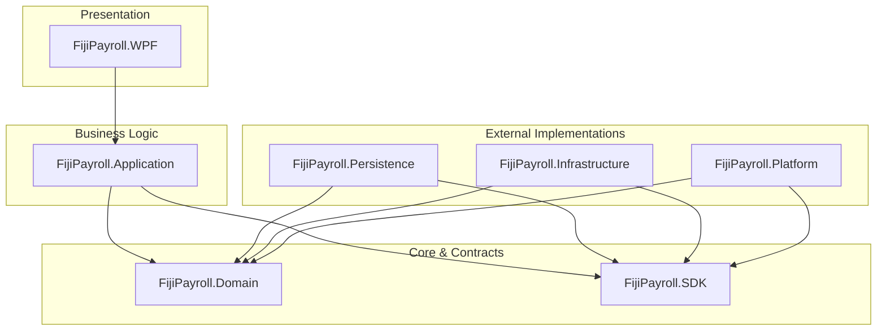
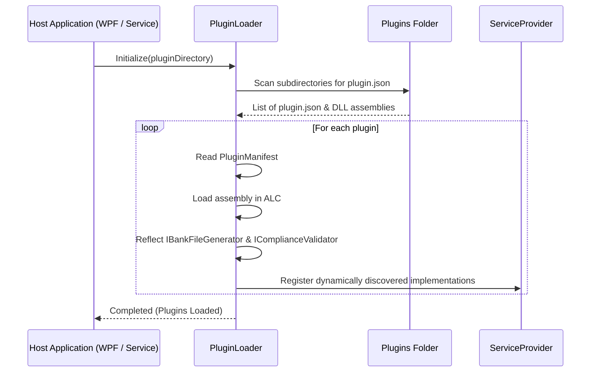

# Fiji Enterprise Payroll System — Developer & Technical Contribution Guide

**Version:** 1.0.0  
**Date:** June 2026  
**Status:** Approved  
**Owner:** Core Platform Architect  

---

## 1. Introduction & Architecture Overview

The Fiji Enterprise Payroll System is built on **Clean Architecture** principles, separating concerns into distinct layers. It relies heavily on **CQRS** via MediatR and strict interface-based decoupling through a dedicated Platform SDK.



### Architectural Constraints

1. **Dependency Inversion**: Outer layers (such as [FijiPayroll.Persistence](file:///c:/Users/jayshil.singh/Desktop/Payroll/src/FijiPayroll.Persistence) or [FijiPayroll.Infrastructure](file:///c:/Users/jayshil.singh/Desktop/Payroll/src/FijiPayroll.Infrastructure)) depend on inner layers ([FijiPayroll.Domain](file:///c:/Users/jayshil.singh/Desktop/Payroll/src/FijiPayroll.Domain) and [FijiPayroll.SDK](file:///c:/Users/jayshil.singh/Desktop/Payroll/src/FijiPayroll.SDK)). Inner layers **must never** reference outer layers.
2. **No Direct DbContext**: The [FijiPayroll.Application](file:///c:/Users/jayshil.singh/Desktop/Payroll/src/FijiPayroll.Application) layer must not reference the database context `ApplicationDbContext` directly. Data operations must traverse repository abstractions exposed by `IUnitOfWork` inside [FijiPayroll.Domain](file:///c:/Users/jayshil.singh/Desktop/Payroll/src/FijiPayroll.Domain).
3. **Additive-Only Design**: To ensure 100% backward compatibility, never delete database columns, rename public classes, or modify existing repository interface contracts. Instead, subclass, extend, or introduce new tables and interfaces.

---

## 2. Solution Structure & Directories

The solution is divided into the following projects:

* **[FijiPayroll.SDK](file:///c:/Users/jayshil.singh/Desktop/Payroll/src/FijiPayroll.SDK)**: Public contracts, Interfaces, and shared DTOs used to load plugins and communicate with the core engine.
* **[FijiPayroll.Platform](file:///c:/Users/jayshil.singh/Desktop/Payroll/src/FijiPayroll.Platform)**: Extensibility engines, plugin loaders, backup managers, recovery agents, configuration handlers, scheduling engines, and notification dispatchers.
* **[FijiPayroll.Domain](file:///c:/Users/jayshil.singh/Desktop/Payroll/src/FijiPayroll.Domain)**: Core domain models, specifications, aggregates, value objects, domain exceptions, and repository interfaces.
* **[FijiPayroll.Application](file:///c:/Users/jayshil.singh/Desktop/Payroll/src/FijiPayroll.Application)**: CQRS commands/queries, MediatR pipeline behaviors (validation, logging, transactions), workflow engines, and simulation modules.
* **[FijiPayroll.Persistence](file:///c:/Users/jayshil.singh/Desktop/Payroll/src/FijiPayroll.Persistence)**: Entity Framework Core mappings, migrations, DbContext definitions, unit of work, and repository implementations.
* **[FijiPayroll.Infrastructure](file:///c:/Users/jayshil.singh/Desktop/Payroll/src/FijiPayroll.Infrastructure)**: Concrete bank generators, background queues, and mail providers.
* **[FijiPayroll.WPF](file:///c:/Users/jayshil.singh/Desktop/Payroll/src/FijiPayroll.WPF)**: Presentation shell containing MVVM views, view models, navigation controls, and UI styles.

---

## 3. Developing Plugins via the SDK

The platform supports runtime extensibility for custom banking formats and statutory reporting logic. Developers can build external DLLs to support new compliance rules or custom direct-credit layouts.

### 3.1 Creating a Bank File Generator Plugin

To build a custom direct-credit layout (e.g., BRED Bank or Westpac Bank file):

1. Reference [FijiPayroll.SDK.csproj](file:///c:/Users/jayshil.singh/Desktop/Payroll/src/FijiPayroll.SDK/FijiPayroll.SDK.csproj).
2. Implement [IBankFileGenerator.cs](file:///c:/Users/jayshil.singh/Desktop/Payroll/src/FijiPayroll.SDK/Interfaces/IBankFileGenerator.cs).
3. Specify your unique `BankCode` (e.g. `BRED`, `WESTPAC`).
4. Generate formatted text using the templates, substitution tokens, and payments array.

#### Example Implementation
```csharp
using FijiPayroll.SDK.Interfaces;
using FijiPayroll.SDK.Contracts;

namespace FijiPayroll.Plugins.CustomBank;

public class CustomBankGenerator : IBankFileGenerator
{
    public string BankCode => "CUSTOM";
    public string BankName => "Custom Clearing Bank";

    public string Generate(
        string companyName,
        string companyAccount,
        string bsb,
        DateTime paymentDate,
        string reference,
        IEnumerable<PaymentDetail> payments,
        string headerTemplate,
        string detailTemplate,
        string footerTemplate,
        char delimiter)
    {
        var sb = new System.Text.StringBuilder();

        // 1. Process Header
        var header = headerTemplate
            .Replace("{CompanyName}", companyName)
            .Replace("{CompanyAccount}", companyAccount)
            .Replace("{BSB}", bsb)
            .Replace("{PaymentDate}", paymentDate.ToString("yyyyMMdd"))
            .Replace("{Reference}", reference);
        sb.AppendLine(header);

        // 2. Process Details
        foreach (var payment in payments)
        {
            var detail = detailTemplate
                .Replace("{EmployeeName}", payment.EmployeeName)
                .Replace("{EmployeeAccount}", payment.AccountNumber)
                .Replace("{Amount}", payment.Amount.ToString("F2"))
                .Replace("{Reference}", payment.Reference);
            sb.AppendLine(detail);
        }

        // 3. Process Footer
        var footer = footerTemplate
            .Replace("{TotalCount}", payments.Count().ToString())
            .Replace("{TotalAmount}", payments.Sum(p => p.Amount).ToString("F2"));
        sb.AppendLine(footer);

        return sb.ToString();
    }
}
```

### 3.2 Dynamic Assembly Discovery

Plugins are discovered at runtime by the [PluginLoader.cs](file:///c:/Users/jayshil.singh/Desktop/Payroll/src/FijiPayroll.Platform/Plugins/PluginLoader.cs) engine.
At application startup, the loader:
1. Scans the `/Plugins` folder.
2. Reads the `plugin.json` containing the [PluginManifest.cs](file:///c:/Users/jayshil.singh/Desktop/Payroll/src/FijiPayroll.SDK/Contracts/PluginManifest.cs).
3. Dynamically loads matching assemblies into a custom `AssemblyLoadContext`.
4. Registers types implementing SDK interfaces in the dependency injection container.



---

## 4. Platform Core Infrastructure Managers

The platform core implements central management classes in [FijiPayroll.Platform](file:///c:/Users/jayshil.singh/Desktop/Payroll/src/FijiPayroll.Platform):

* **[BackgroundScheduler.cs](file:///c:/Users/jayshil.singh/Desktop/Payroll/src/FijiPayroll.Platform/Scheduler/BackgroundScheduler.cs)**: Employs `System.Threading.Channels` to queue and execute background tasks (e.g. exporting reports, compiling backups) asynchronously.
* **[ConfigurationManager.cs](file:///c:/Users/jayshil.singh/Desktop/Payroll/src/FijiPayroll.Platform/Configuration/ConfigurationManager.cs)**: Serializes tenant profiles, tax preferences, bank definitions, and rules metadata into encrypted `.companyconfig` configurations.
* **[NotificationEngine.cs](file:///c:/Users/jayshil.singh/Desktop/Payroll/src/FijiPayroll.Platform/Notifications/NotificationEngine.cs)**: Coordinates notification dispatches across multiple channels (Email, Desktop, Teams) with automated batch queues.
* **[RecoveryManager.cs](file:///c:/Users/jayshil.singh/Desktop/Payroll/src/FijiPayroll.Platform/Recovery/RecoveryManager.cs)**: Manages database backups. It serializes data tables, generates a recovery checksum, and bundles files into a compressed, encrypted `.drpack` archive.
* **[PackageManager.cs](file:///c:/Users/jayshil.singh/Desktop/Payroll/src/FijiPayroll.Platform/Packages/PackageManager.cs)**: Authenticates rule version manifest signatures and checks package version constraints.
* **[VersionManager.cs](file:///c:/Users/jayshil.singh/Desktop/Payroll/src/FijiPayroll.Platform/Versions/VersionManager.cs)**: Pins the exact computational engine versions (`CalculationEngineVersion`, `FormulaEngineVersion`) used to lock final pay runs, safeguarding calculations from future engine upgrades.
* **[StateManager.cs](file:///c:/Users/jayshil.singh/Desktop/Payroll/src/FijiPayroll.Platform/State/StateManager.cs)**: Manages critical, system-wide state transactions to prevent split-brain execution.

---

## 5. Development Workflow & Commands

### 5.1 Restoring and Building the Solution

To clean, restore dependencies, and build the solution in Debug mode:

```powershell
# Restore NuGet packages
dotnet restore

# Build the entire solution
dotnet build
```

### 5.2 Running the Test Suite

The test suite is structured to isolate domain aggregates, application handlers, and infrastructure configurations.

* **Domain Tests** ([FijiPayroll.Domain.Tests](file:///c:/Users/jayshil.singh/Desktop/Payroll/tests/FijiPayroll.Domain.Tests)): Tests pure entities, state machines, and invariants (e.g., FNPF age exceptions or TIN structural validations).
* **Application Tests** ([FijiPayroll.Application.Tests](file:///c:/Users/jayshil.singh/Desktop/Payroll/tests/FijiPayroll.Application.Tests)): Evaluates CQRS logic, rule simulations, and validation pipelines.
* **Integration Tests** ([FijiPayroll.Integration.Tests](file:///c:/Users/jayshil.singh/Desktop/Payroll/tests/FijiPayroll.Integration.Tests)): Exercises persistence handlers, transaction rollbacks, and concurrent batch processing.

To execute all tests:

```powershell
dotnet test
```

---

## 6. Coding Standards & Review Checklists

1. **Keep Invariant Rules in the Domain**: Do not write computational validations in query view models. Use domain guard clauses in entity constructors.
2. **Preserve Database Compatibility**: Never execute raw `ALTER TABLE DROP COLUMN` queries. When refactoring database models, mark fields as obsolete and introduce nullable columns to preserve legacy data.
3. **Use the Result Pattern**: Return `Result<T>` instead of throwing business flow exceptions in CQRS handlers.
4. **Clean Architecture Isolation**: The presentation layer ([FijiPayroll.WPF](file:///c:/Users/jayshil.singh/Desktop/Payroll/src/FijiPayroll.WPF)) must never call repositories or context instances. Ensure all interactions traverse MediatR commands and queries.
5. **Always Use XML Comments**: Ensure public interfaces, SDK contracts, and shared domain models contain complete XML documentation headers.

---
*Document maintained by: Platform Architecture Team*  
*Last updated: June 2026*
