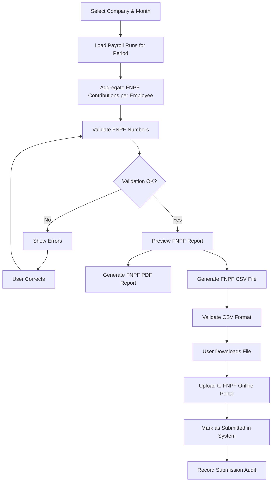

# Fiji Enterprise Payroll System — FNPF Module

**Version:** 1.0.0  
**Date:** June 2026  
**Status:** Approved  
**Owner:** Senior Payroll Specialist  

---

## 1. Overview

The FNPF (Fiji National Provident Fund) module manages all obligations under the **FNPF Act (Cap 219)**. Employers are required to deduct employee contributions and add employer contributions, then remit to FNPF on a monthly basis.

---

## 2. Contribution Rules

### 2.1 Mandatory Rates

| Party | Rate | Notes |
|-------|------|-------|
| Employee | 8% | Deducted from gross pay |
| Employer | 10% | Employer bears this cost |
| Total | 18% | Remitted to FNPF |

### 2.2 FNPF Eligibility

An employee is **subject to FNPF** if they are:
- A Fiji citizen or permanent resident
- Employed under a contract of service
- Between 15 and 55 years of age (FNPF retirement age)

An employee is **FNPF Exempt** if:
- They hold a valid FNPF exemption certificate
- They are a non-resident contractor
- They are over retirement age (55+) — contributions become voluntary
- They have already withdrawn their FNPF balance on retirement

### 2.3 FNPF Applicable Earnings

| Earnings Type | FNPF Applicable |
|--------------|----------------|
| Basic Salary / Wages | Yes |
| Overtime | Yes |
| Housing Allowance (cash) | Yes |
| Transport Allowance (cash) | Yes |
| Meal Allowance (cash) | Yes |
| Performance Bonus | Yes |
| Annual Leave Pay | Yes |
| Sick Leave Pay | Yes |
| Reimbursements (actual cost) | No |
| Tools/Equipment Allowance | No |
| Redundancy Pay | No (verify with FNPF) |
| Retirement Gratuity | No |

---

## 3. FNPF Remittance Workflow



---

## 4. FNPF Filing Deadline

Contributions must be remitted to FNPF by the **last working day of the following month**.

| Contribution Period | Due Date |
|--------------------|----------|
| January | Last working day of February |
| February | Last working day of March |
| ... | ... |
| December | Last working day of January |

The system automatically calculates and displays the due date and shows a countdown banner.

---

## 5. FNPF Submission File Format

### 5.1 CSV Specification

FNPF prescribes a specific CSV format for bulk contribution uploads.

```
File Encoding: UTF-8 without BOM
Delimiter: Comma
Line Endings: CRLF
Header Row: Required (see below)
Date Format: DD/MM/YYYY
Amount Format: #.00 (two decimal places, no currency symbol)
```

**Header Row:**
```
EmployerNumber,EmployerName,Period,EmployeeNumber,EmployeeName,EmployeeContribution,EmployerContribution,TotalContribution
```

**Data Row Example:**
```
E001234,PACIFIC SUPPLIES LTD,06/2026,F123456789,SMITH JOHN,360.00,450.00,810.00
```

### 5.2 Field Specifications

| Field | Type | Max Length | Rules |
|-------|------|-----------|-------|
| EmployerNumber | Text | 20 | FNPF employer registration number |
| EmployerName | Text | 200 | Must match FNPF registration |
| Period | Text | 7 | Format: MM/YYYY |
| EmployeeNumber | Text | 20 | FNPF membership number |
| EmployeeName | Text | 200 | SURNAME FIRSTNAME (uppercase) |
| EmployeeContribution | Decimal | — | 8% of FNPF-applicable gross |
| EmployerContribution | Decimal | — | 10% of FNPF-applicable gross |
| TotalContribution | Decimal | — | Employee + Employer |

---

## 6. FNPF Validation Rules

| Rule | Severity | Message |
|------|----------|---------|
| FNPF membership number format | Error | Must be 9 or 10 digits |
| Missing FNPF number | Warning | "FNPF number not set for [Employee Name]" |
| Negative contribution | Error | "Negative FNPF contribution for [Employee]" |
| Employer contribution < Employee | Warning | "Employer contribution less than Employee — verify rates" |
| Employee under 15 years | Warning | "Employee [Name] may not be eligible for FNPF" |
| Contribution total mismatch | Error | "Employee + Employer ≠ Total for [Employee Name]" |

---

## 7. FNPF PDF Report

The PDF report for FNPF submission contains:
- Company letterhead
- Period (Month / Year)
- Employer FNPF number
- Table: Employee FNPF # | Name | Gross | Employee 8% | Employer 10% | Total
- Summary totals
- Director/authorised signatory section
- Generation timestamp

---

## 8. FNPF Reconciliation

### 8.1 Monthly Reconciliation
| Check | Rule |
|-------|------|
| Employee contributions | Sum of all 8% deductions in payroll runs |
| Employer contributions | Sum of all 10% additions in payroll runs |
| Submitted to FNPF | Must equal reconciled total |
| Variance | Must be $0.00 to close the month |

### 8.2 Annual Reconciliation
- Total contributions for the year vs. FNPF statements
- Any discrepancies must be corrected via an amended submission

---

## 9. FNPF Submission Records

Each submission is recorded in `payroll.FNPFSubmissions`:

| Column | Description |
|--------|-------------|
| Id | Primary key |
| CompanyId | Company |
| Period | MM/YYYY |
| SubmittedBy | Username |
| SubmittedAt | Timestamp |
| TotalEmployees | Count |
| TotalEmployeeContribution | Sum 8% |
| TotalEmployerContribution | Sum 10% |
| TotalContribution | Grand total |
| FilePath | Path to CSV file |
| Status | Draft / Submitted / Amended |

---

## 10. FNPF Amended Submissions

If contributions were underpaid:
1. Create a supplementary FNPF file for the difference
2. Contact FNPF for instructions on late payment processing
3. Record the amended submission with reference to original

If contributions were overpaid:
1. Offset against next month's contribution (with FNPF approval)
2. Record the credit note

---

## 11. FNPF Employee Statements

The system generates individual FNPF Contribution Statements per employee:
- For each fiscal year
- Shows monthly contributions (employee + employer)
- Annual total
- Can be exported as PDF for employee records

---

## 12. Audit Requirements

| Action | Logged |
|--------|--------|
| FNPF file generation | Yes |
| FNPF submission recorded | Yes |
| FNPF rate changes | Yes |
| Employee FNPF exempt flag change | Yes |
| FNPF number update | Yes |

---

*Document maintained by: Senior Payroll Specialist*  
*Last updated: June 2026*
