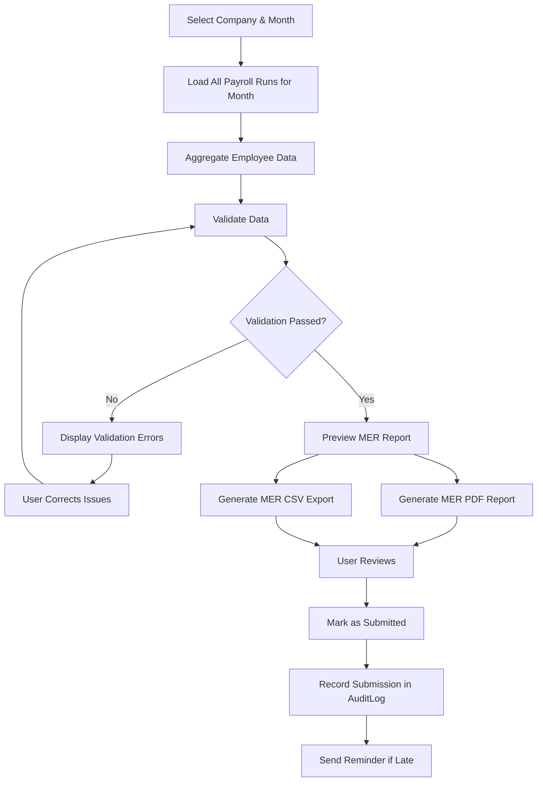

# Fiji Enterprise Payroll System — FRCS Module

**Version:** 1.0.0  
**Date:** June 2026  
**Status:** Approved  
**Owner:** Senior Payroll Specialist  

---

## 1. Overview

The FRCS (Fiji Revenue and Customs Service) module handles all compliance reporting obligations with FRCS for payroll withholding tax (PAYE). The primary obligation is the **Monthly Employer Return (MER)**.

> **Legal Basis:** Income Tax Act (Cap 201), Employment Tax Regulations

---

## 2. Monthly Employer Return (MER)

### 2.1 What is the MER?
The MER is a monthly declaration submitted by every registered employer to FRCS by the **15th of the following month**. It declares:
- Total gross wages paid
- Total PAYE deducted
- Individual employee details

### 2.2 MER Filing Deadline
| Period | Due Date |
|--------|----------|
| January | 15 February |
| February | 15 March |
| March | 15 April |
| ... | ... |
| December | 15 January |

### 2.3 MER Data Requirements Per Employee

| Field | Source | Notes |
|-------|--------|-------|
| Employee TIN | `Employees.FijiTIN` | FRCS-issued TIN |
| Employee Name | `Employees.LastName + FirstName` | Full legal name |
| Gross Earnings | Sum of all taxable earnings | All pay periods in month |
| PAYE Deducted | Sum of PAYE amounts | All pay periods in month |
| Allowances | Sum of taxable allowances | Itemised per FRCS guidance |
| Gross Salary | Basic pay + allowances | |

---

## 3. MER Workflow



---

## 4. MER Validation Rules

| Rule | Severity | Message |
|------|----------|---------|
| At least one payroll run in the month | Error | "No payroll runs found for [Month Year]" |
| All payroll runs must be in Paid status | Warning | "[N] runs are not marked as Paid" |
| Employee TIN missing | Warning | "TIN missing for [N] employees" |
| Negative PAYE amounts | Error | "Employee [Name] has negative PAYE" |
| PAYE sum must equal sum of all run details | Error | "PAYE totals do not reconcile" |
| Employee name contains special characters | Warning | "Special characters found in employee names — may cause FRCS upload failure" |

---

## 5. MER Output Formats

### 5.1 PDF Report
- Company letterhead with logo
- Period: Month and Year
- Table: Employee TIN | Name | Gross | Allowances | PAYE
- Total row
- Authorised signature line
- Page numbers and generation timestamp

### 5.2 CSV Export Format
Standard FRCS-specified CSV format:

```
Field 1:  Employer TIN (NVARCHAR 12)
Field 2:  Employee TIN (NVARCHAR 12)
Field 3:  Employee Surname (NVARCHAR 50)
Field 4:  Employee First Name (NVARCHAR 50)
Field 5:  Gross Salary (DECIMAL 18,2 — no currency symbol)
Field 6:  Total Allowances (DECIMAL 18,2)
Field 7:  PAYE Deducted (DECIMAL 18,2)
Field 8:  Period Month (MM)
Field 9:  Period Year (YYYY)
```

**CSV Rules:**
- Comma-delimited
- No header row (FRCS specification)
- No quotes on numeric fields
- All monetary amounts in FJD with 2 decimal places
- Encoding: UTF-8 without BOM
- Line ending: CRLF (Windows)

### 5.3 Example CSV Row
```
1234567890,9876543210,SMITH,JOHN,4500.00,500.00,450.00,06,2026
```

---

## 6. Tax Table Management

### 6.1 Tax Table Structure
Tax tables are stored in `company.TaxTables` and applied per fiscal year.

| Column | Description |
|--------|-------------|
| FiscalYear | e.g., 2026 |
| ResidencyStatus | Resident / NonResident |
| BracketFrom | Lower bound of bracket |
| BracketTo | Upper bound (NULL = no ceiling) |
| BaseAmount | Tax on income up to BracketFrom |
| Rate | Marginal rate (%) for this bracket |

### 6.2 Tax Table Update Process
1. FRCS announces new rates (typically with annual budget)
2. DBA/Admin creates new records for new fiscal year
3. System applies new rates to payroll runs with PeriodStartDate in new year
4. Historical runs always use the tax table from their period

---

## 7. PAYE Reconciliation

### 7.1 Monthly Reconciliation Report
The system generates a reconciliation that shows:
- PAYE per payroll run
- Accumulated PAYE for the month
- MER declared amount
- Variance (must be $0.00)

### 7.2 Year-End Reconciliation
Annual reconciliation report comparing:
- Sum of all monthly MER declarations
- Sum of all PAYE in payroll run details
- Any variances must be investigated before year-end submission

---

## 8. Submission History

Each MER submission is recorded in `payroll.FRCSSubmissions`:

| Column | Description |
|--------|-------------|
| Id | Primary key |
| CompanyId | Company |
| Period | Month/Year |
| SubmittedBy | Username |
| SubmittedAt | Timestamp |
| TotalEmployees | Count |
| TotalGross | Total gross FJD |
| TotalPAYE | Total PAYE FJD |
| FilePath | Path to generated file |
| Status | Draft / Submitted / Amended |

---

## 9. Amended Returns

If an error is discovered after submission:
1. Mark original submission as `Amended`
2. Correct the underlying payroll data (via reversal or adjustment)
3. Generate amended MER report
4. Record as a new submission with `AmendedReturnFor` reference

---

## 10. Audit Requirements

All FRCS-related actions are logged:
- MER generation
- MER submission
- Tax table updates
- PAYE amendments
- Submission history exports

---

## 11. FRCS Late Filing Penalties (Reference)

| Scenario | Penalty |
|----------|---------|
| MER filed after 15th | $50 per day (FRCS discretion) |
| Incorrect TIN | FRCS may reject return |
| PAYE shortfall | Penalty + interest at FRCS rates |

> **Note:** The system displays a warning when the submission date is within 5 days of the due date, and an alert when it is past the due date.

---

*Document maintained by: Senior Payroll Specialist*  
*Last updated: June 2026*
