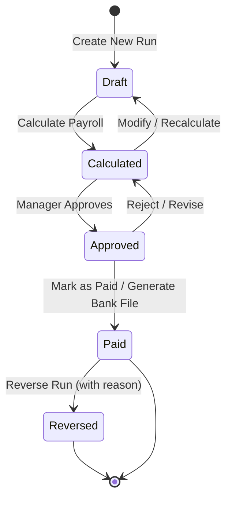

# Fiji Enterprise Payroll System — Payroll Rules

**Version:** 1.0.0  
**Date:** June 2026  
**Status:** Approved  
**Owner:** Senior Payroll Specialist  

---

## 1. Overview

This document defines the business rules, calculation logic, and regulatory requirements for the Fiji Enterprise Payroll System payroll engine. All calculations must comply with the **Fiji Revenue and Customs Service (FRCS)** tax regulations and the **Fiji National Provident Fund (FNPF)** Act.

> **Reference:** FRCS Employer Guide to PAYE (current edition) and FNPF Act (Cap 219)

---

## 2. Payroll Frequency Definitions

| Frequency | Pay Periods Per Year | Standard Period Days |
|-----------|---------------------|---------------------|
| Weekly | 52 | 7 |
| Fortnightly | 26 | 14 |
| Bi-Monthly (Semi-monthly) | 24 | 15/16 |
| Monthly | 12 | 28–31 |

### Rules
- Each company assigns a default frequency per employee group
- An employee can only belong to one frequency at a time
- Frequency changes require a new employment detail record (history preserved)
- The payroll period is always aligned to the fiscal calendar

---

## 3. Employment Types

| Type | Description | Pay Basis |
|------|-------------|----------|
| Salary | Fixed annual salary | Annual ÷ periods per year |
| Hourly | Paid per hour worked | Hours × hourly rate |
| Daily | Paid per day worked | Days × daily rate |

### Salary Calculation
```
Gross Pay per Period = Annual Salary / Pay Periods Per Year

Weekly:       Annual / 52
Fortnightly:  Annual / 26
Bi-Monthly:   Annual / 24
Monthly:      Annual / 12
```

### Hourly Calculation
```
Gross Pay = Regular Hours × Hourly Rate
          + Overtime Hours × (Hourly Rate × Overtime Multiplier)
```

Standard overtime multiplier: **1.5×** (time and a half)
Double time: **2.0×** (applies to Fiji public holidays and specific conditions)

### Daily Calculation
```
Gross Pay = Days Worked × Daily Rate
```

---

## 4. Standard Working Hours

| Parameter | Default | Configurable |
|-----------|---------|-------------|
| Hours per day | 8 | Yes |
| Days per week | 5 | Yes |
| Hours per week | 40 | Derived |

---

## 5. Overtime Rules

Overtime applies to **hourly** and **daily** employees only. Salary employees receive no overtime unless explicitly configured.

### Overtime Triggers
| Scenario | Rate |
|---------|------|
| Hours > 40 per week | 1.5× |
| Public holiday work | 2.0× |
| Weekend work (if configured) | 1.5× |
| Night shift (if configured) | 1.25× |

---

## 6. Earnings Components

### 6.1 Basic Pay
- Core wage/salary
- Always taxable (PAYE)
- Always FNPF-applicable (unless employee is FNPF exempt)

### 6.2 Allowances
Allowances are additional payments on top of base pay.

| Allowance Type | Taxable | FNPF Applicable | Common Examples |
|---------------|---------|----------------|-----------------|
| Housing Allowance | Yes | Yes | Provided accommodation supplement |
| Transport Allowance | Partial | No | Up to threshold defined by FRCS |
| Meal Allowance | Partial | No | Up to FRCS threshold |
| Overtime Allowance | Yes | Yes | OT pay |
| Shift Allowance | Yes | Yes | Night shift premium |
| Tools Allowance | No | No | Tool reimbursement |

> **FRCS Rule:** All allowances are taxable unless specifically exempted by FRCS regulations. Refer to current FRCS Employer Guide.

### 6.3 Bonuses
- Performance bonuses: Fully taxable, FNPF applicable
- Redundancy pay: Special tax treatment (lump sum rates apply)
- Annual leave payout on termination: Taxable

### 6.4 Commissions
- Fully taxable
- FNPF applicable
- Included in gross pay for PAYE calculation in the period paid

---

## 7. Deductions

### 7.1 Statutory Deductions
These are mandatory and always applied before voluntary deductions:

| Deduction | Rule |
|-----------|------|
| PAYE Tax | Calculated per FRCS tax tables |
| FNPF Employee Contribution | 8% of FNPF-applicable earnings |

### 7.2 Voluntary Deductions
Applied after statutory deductions, in priority order set by payroll admin:

| Deduction | Rule |
|-----------|------|
| Loan Repayment | Fixed instalment per period |
| Union Fees | Fixed or percentage |
| Health Insurance | Fixed per period |
| Other Deductions | As configured |

### 7.3 Deduction Priority Order
```
1. PAYE Tax (statutory)
2. FNPF Employee (statutory)
3. Court-ordered deductions
4. Loan repayments
5. Insurance premiums
6. Union fees
7. Other voluntary deductions
```

### 7.4 Net Pay Floor Rule
Net pay must never be negative. If deductions exceed gross pay:
1. Apply statutory deductions first (these always apply)
2. Reduce voluntary deductions proportionally
3. Flag the payslip with a warning
4. Carry forward any unpaid voluntary deductions to next period (if configured)

---

## 8. PAYE Tax Calculation

### 8.1 Calculation Method
PAYE uses the **annualised method**:

```
Step 1: Annualise the gross pay
    Annual Equivalent = Gross Pay × Pay Periods Per Year

Step 2: Subtract FNPF employee contribution
    Taxable Annual = Annual Equivalent − (Annual Equivalent × FNPF Employee %)
    (Note: FNPF employee contribution is tax-deductible in Fiji)

Step 3: Apply FRCS tax bracket
    Annual Tax = Apply progressive tax rate on Taxable Annual

Step 4: De-annualise
    PAYE Per Period = Annual Tax / Pay Periods Per Year

Step 5: Round to 2 decimal places (round half up)
```

### 8.2 FRCS Tax Brackets (2025–2026 — Update Annually)

**Resident Individuals:**

| Taxable Annual Income (FJD) | Tax Rate | Notes |
|-----------------------------|----------|-------|
| 0 – 30,000 | 0% | Tax-free threshold |
| 30,001 – 50,000 | 18% | On excess over 30,000 |
| 50,001 – 270,000 | 20% | On excess over 50,000 |
| 270,001 – 300,000 | 20% | Graduated relief applies |
| 300,001 + | 20% | Standard rate |

> ⚠️ **Important:** Tax tables must be updated at the start of each fiscal year. The system stores historical brackets to support amended payroll runs in prior periods.

**Non-Resident Individuals:**
- Flat 20% on all Fiji-sourced income (no tax-free threshold)

**Tax-Exempt Employees:**
- PAYE = $0.00 (requires valid FRCS exemption certificate)

### 8.3 PAYE Rounding
- Round to the nearest cent (2 decimal places)
- Use standard rounding: 0.005 rounds up

---

## 9. FNPF Calculation

### 9.1 Contribution Rates (Current)

| Party | Rate |
|-------|------|
| Employee | 8% of FNPF-applicable gross |
| Employer | 10% of FNPF-applicable gross |

### 9.2 FNPF-Applicable Earnings
All earnings are FNPF-applicable **unless**:
- Employee is FNPF exempt (confirmed by FNPF)
- The component is flagged as non-FNPF (e.g., reimbursements)
- Employee is a non-resident contractor

### 9.3 FNPF Calculation
```
FNPF Employee = FNPF-Applicable Gross × 8%
FNPF Employer = FNPF-Applicable Gross × 10%
```

### 9.4 FNPF Rounding
- Round to the nearest cent (2 decimal places)
- Round half up

---

## 10. Leave in Payroll

### 10.1 Annual Leave
| Parameter | Rule |
|-----------|------|
| Entitlement | Minimum 10 working days per year (Employment Relations Act) |
| Accrual | Daily or per period (configured per company) |
| Accrual rate | 10 days / 260 working days = 0.03846 days per working day |
| Loading | 25% leave loading applies when leave is taken (if configured) |

### 10.2 Sick Leave
| Parameter | Rule |
|-----------|------|
| Entitlement | 10 days per year |
| Accrual | Annual (granted at start of each year) |
| Pay during sick leave | Full pay |
| Documentation | Medical certificate required for > 2 consecutive days |

### 10.3 Paid Leave (Other)
- Bereavement leave: 3 days paid (immediate family)
- Jury duty: Full pay
- Maternity leave: 84 days paid (primary carer)
- Paternity leave: 5 days paid

### 10.4 Unpaid Leave
- Net pay = 0 for the period (or deducted days for partial period)
- FNPF and PAYE are still calculated on any paid components in the period

### 10.5 Leave Pay Calculation
```
Daily Rate from Annual Salary = Annual Salary / 260 working days
Leave Pay per Day = Daily Rate × Leave Days
```

---

## 11. Loan Deductions

### 11.1 Loan Setup
| Parameter | Rule |
|-----------|------|
| Loan amount | Full amount recorded |
| Instalment | Fixed per period or % of gross |
| Interest | Simple or reducing balance (configured per loan) |
| Priority | Configured by payroll admin |

### 11.2 Loan Deduction Calculation
```
If fixed instalment:
    Deduction = Fixed Instalment Amount (or outstanding balance if less)

If percentage:
    Deduction = Gross Pay × Loan Deduction Percentage
```

### 11.3 Loan Outstanding Balance Update
```
After each pay run:
    Outstanding Balance = Previous Balance − Instalment Paid + Interest (if applicable)
```

---

## 12. Payroll Run Lifecycle



### State Descriptions
| State | Description |
|-------|-------------|
| Draft | Run created, not yet calculated |
| Calculated | Payroll calculated, pending review |
| Approved | Approved by authorised manager |
| Paid | Bank files generated, marked as paid |
| Reversed | Run reversed (creates negative run) |

---

## 13. Payroll Calculation Order

```
For each employee in the run:

1. Load employee payroll details (rate, type, frequency)
2. Calculate base pay for period
3. Calculate overtime (if hourly/daily)
4. Apply earnings components (allowances, bonuses)
5. Calculate FNPF-applicable gross
6. Calculate FNPF employee contribution
7. Calculate taxable income (gross minus FNPF employee)
8. Calculate PAYE using annualised method
9. Process leave transactions for the period
10. Process loan deductions
11. Apply other voluntary deductions
12. Calculate net pay
13. Apply net pay floor check
14. Write PayrollRunDetail record
15. Write PayrollRunComponentDetail records (one per component)
16. Update leave balances
17. Update loan balances
```

---

## 14. Payroll Reversal Rules

A payroll run can only be reversed if:
- Status is `Paid`
- Reversal is performed by an authorised user
- A reversal reason is provided
- Reversal creates an equal and opposite payroll run (negative amounts)
- FNPF and PAYE obligations are reversed in the respective submissions
- Audit log records the full reversal details

---

## 15. Recalculation Rules

Recalculation is permitted when status is `Draft` or `Calculated`.
- Any change to an employee's pay details, components, or leave during the period triggers a recalculation warning
- User must explicitly confirm recalculation
- Previous calculation is preserved in history

---

## 16. Rounding Policy

| Item | Rounding | Precision |
|------|---------|-----------|
| Gross Pay | Round half up | 4 decimal places (stored), 2 decimal places (displayed) |
| PAYE | Round half up | 2 decimal places |
| FNPF Employee | Round half up | 2 decimal places |
| FNPF Employer | Round half up | 2 decimal places |
| Net Pay | Round half up | 2 decimal places |
| Leave Accrual | Round to 4 decimal places | 4 decimal places (stored) |

---

## 17. Validation Rules

| Rule | Enforcement |
|------|-------------|
| Employee must be Active | Cannot include terminated or suspended employees |
| Duplicate period check | Cannot run payroll for same period twice (same frequency) |
| Rate must be positive | Hourly/daily/salary must be > 0 |
| Bank account required | If payment method is Bank, account must be configured |
| FNPF number required | For FNPF-applicable employees |
| TIN required for FRCS | Warning if TIN is missing |
| Pay period dates | Period must fall within the fiscal calendar |

---

*Document maintained by: Senior Payroll Specialist*  
*Last updated: June 2026*
