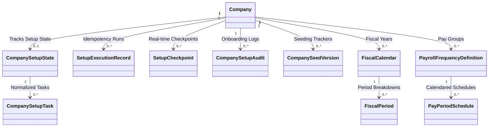

# Phase 10 — Domain Setup Entities Specification

This document outlines the Domain entities introduced to support **Phase 10: Company Setup Wizard** configurations, setups tracking, and calendars/periods generation.

---

## 1. Domain Object Model Overview

The following diagram illustrates the relationship between the newly introduced domain entities:

---

## 2. Entities Specification

### 2.1 Company (Extended Profile)
*   **Properties**:
    *   `TradingName` (string): The commercial trading name.
    *   `TIN` (string): 9-digit Taxpayer Identification Number.
    *   `FnpfEmployerNumber` (string): Registration number for FNPF remittance.
    *   `AddressLine1` / `AddressLine2` / `City` (string): Primary business location fields.
    *   `Phone` / `Email` / `Website` (string): Contact vectors.
    *   `Country` (string): Registration country (defaults to "Fiji").
    *   `Locale` (string): Standard language format (defaults to "en-FJ").
    *   `LogoPath` (string): Secure upload pathway.
    *   `IsActive` (bool): Active indicator.
    *   `IsSetupComplete` (bool): True if onboarding is finished.
    *   `SetupCompletedUtc` (DateTime?): Setup finalization timestamp.

### 2.2 CompanySetupState
*   **Purpose**: Stores the active step and setup settings of the guided onboarding process. Implements a unique constraint on `CompanyId` to allow only one active setup state.
*   **Properties**:
    *   `CurrentStep` (WizardStep): Welcome, CompanyDetails, etc.
    *   `IsCompleted` (bool): True when wizard has completed.
    *   `WizardVersion` (string): Version code of onboarding.

### 2.3 CompanySetupTask
*   **Purpose**: Normalized setup task log representing step completion metadata.
*   **Properties**:
    *   `Step` (WizardStep): Task step reference.
    *   `Completed` (bool): Completion indicator.
    *   `CompletedUtc` (DateTime?): Finished timestamp.
    *   `CompletedBy` (string): Administrator username.

### 2.4 SetupExecutionRecord
*   **Purpose**: Transaction execution log mapping setup session request IDs. Prevents duplicate wizard execution.
*   **Properties**:
    *   `ExecutionId` (Guid): Idempotency request identifier.
    *   `StartedUtc` (DateTime) / `CompletedUtc` (DateTime?): Execution duration markers.
    *   `Status` (ExecutionStatus): Running, Completed, Failed, RolledBack.
    *   `MachineName` / `ApplicationVersion` (string): Execution environment tracking.

### 2.5 SetupCheckpoint
*   **Purpose**: Real-time checkpoints logging step transitions during execution runs.
*   **Properties**:
    *   `ExecutionId` (Guid): Execution run link.
    *   `Step` (WizardStep): Checkpoint step.
    *   `Status` (string) / `Message` (string): Progress description.

### 2.6 CompanySetupAudit
*   **Purpose**: Auditor audit trail records tracking setup onboarding steps.
*   **Properties**:
    *   `Step` (string) / `Action` (string): Audit details.
    *   `Status` (SetupAuditStatus): Success, Warning, Failed.
    *   `IPAddress` / `MachineName` / `ApplicationVersion` (string): System context.
    *   `CorrelationId` / `ExecutionId` (Guid): Trace links.

### 2.7 CompanySeedVersion
*   **Purpose**: Tracks seed migrations applied per tenant.
*   **Properties**:
    *   `SeedVersion` (string) / `Description` (string): Version details.
    *   `SeedCategory` (SeedCategory): Banks, Roles, LeaveTypes, etc.

### 2.8 FiscalCalendar & FiscalPeriod
*   **Purpose**: Controls financial year intervals and period divisions. Prevents regeneration when locked.
*   **Properties (Calendar)**:
    *   `FiscalYear` (int) / `StartDate` / `EndDate` (DateTime).
    *   `CalendarType` (CalendarType): Weekly, Monthly, etc.
    *   `IsLocked` (bool): True if locked.

### 2.9 PayrollFrequencyDefinition & PayPeriodSchedule
*   **Purpose**: Configuration mapping pay groups frequencies and schedule cutoffs/paydates.
*   **Properties (Definition)**:
    *   `FrequencyName` (string) / `PayDay` (string) / `PeriodsPerYear` (int).
    *   `FrequencyType` (PayrollFrequencyType) / `FrequencyCode` (FrequencyCode).
*   **Properties (Schedule)**:
    *   `StartDate` / `EndDate` (DateTime) / `CutoffDate` (DateTime) / `PaymentDate` (DateTime).
    *   `IsProcessed` (bool): True if run completed.
