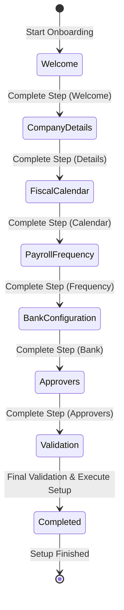
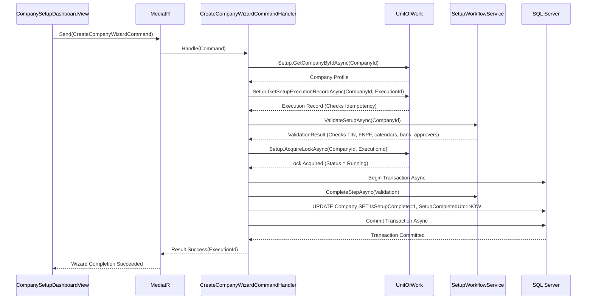

# Fiji Enterprise Payroll System — Phase 10 Setup Wizard Specification & Documentation

**Version:** 1.0.0  
**Date:** June 2026  
**Status:** Released  
**Owner:** Senior Solution Architect + Senior C# Developer

---

## 1. Architectural Design & Mermaid Diagrams

The **Company Setup Wizard** operates as a state transition machine orchestrated by the `SetupWorkflowService`. It validates and transitions onboarding setups through a series of sequential checkpoints.

### 1.1 Wizard Step State Machine Transition Flow
The following state diagram illustrates the sequential steps and boundaries enforced during the guided company setup:

### 1.2 Setup Execution & Idempotency Sequence Diagram
When finalization is triggered, the transaction orchestrator runs validations, ensures idempotency, locks the setup, and commits state:

---

## 2. Architecture Documentation

### 2.1 Core Services
1. **`SetupWorkflowService`**: Implements the workflow state engine.
   - Manages transitions (`Start`, `Resume`, `Skip`, `Complete`, `Restart`).
   - Ensures steps are completed in order.
   - Restores the administrator's onboarding session upon login.
2. **`LicenseValidationService`**: Protects the core system.
   - Performs offline RSA validation of license files using the public key.
   - Calls `LicenseFingerprintProvider` to extract machine-specific hardware IDs (CPU, BIOS, Motherboard, VM status).
   - Implements a thread-safe 15-minute sliding / 1-hour absolute memory cache with auto-invalidation on license file mutation.

---

## 3. API Documentation

### 3.1 Queries

#### `ValidateCompanyWizardQuery`
- **Request**:
  - `CompanyId` (int)
- **Response**: `Result<ValidationResultDto>`
  - `IsSuccess` (bool): True if dry-run validation checks pass.
  - `ValidationErrors` (List<string>): List of blocking issues (e.g. missing TIN, missing bank accounts).
  - `ValidationWarnings` (List<string>): Non-blocking suggestions.

### 3.2 Commands

#### `CreateCompanyWizardCommand`
- **Request**:
  - `CompanyId` (int)
  - `SetupExecutionId` (Guid): Unique request ID for database idempotency.
- **Response**: `Result<Guid>`
  - Returns the execution transaction ID on success. Enforces transactional commit/rollback bounds on database failure.

---

## 4. Database Documentation

The setup configurations utilize six tables in the `company` schema to manage execution records, checkpoints, and seeds:

### 4.1 Schema Tables

#### `company.CompanySetupStates`
Tracks the current wizard step status per company.
- `CompanyId` (int, Primary Key)
- `CurrentStep` (int/enum WizardStep)
- `IsCompleted` (bit)
- `WizardVersion` (nvarchar(20))
- Unique index: `CompanyId`

#### `company.CompanySetupTasks`
Tracks step-by-step completion checks per company.
- `Id` (int, IDENTITY)
- `CompanyId` (int, FK)
- `Step` (int/enum WizardStep)
- `Completed` (bit)
- `CompletedUtc` (datetime2)
- `CompletedBy` (nvarchar(100))

#### `company.SetupExecutionRecords`
Guarantees transaction idempotency.
- `Id` (int, IDENTITY)
- `CompanyId` (int, FK)
- `ExecutionId` (uniqueidentifier)
- `StartedUtc` (datetime2)
- `CompletedUtc` (datetime2, nullable)
- `Status` (int/enum ExecutionStatus)
- `MachineName` (nvarchar(100))
- `ApplicationVersion` (nvarchar(20))
- Unique index: `CompanyId` + `ExecutionId`

#### `company.SetupCheckpoints`
Logs progress checkpoints during wizard execution.
- `Id` (int, IDENTITY)
- `ExecutionId` (uniqueidentifier)
- `CompanyId` (int, FK)
- `Step` (int/enum WizardStep)
- `StartedUtc` (datetime2)
- `CompletedUtc` (datetime2, nullable)
- `Status` (nvarchar(50))
- `Message` (nvarchar(max))

#### `company.CompanySetupAudits`
Onboarding audit trail.
- `Id` (int, IDENTITY)
- `CompanyId` (int, FK)
- `Step` (nvarchar(50))
- `Action` (nvarchar(100))
- `Status` (int/enum SetupAuditStatus)
- `IPAddress` (nvarchar(50))
- `MachineName` (nvarchar(100))
- `ApplicationVersion` (nvarchar(20))
- `CorrelationId` (uniqueidentifier)
- `ExecutionId` (uniqueidentifier)

#### `company.CompanySeedVersions`
Tracks applied seed versions.
- `Id` (int, IDENTITY)
- `CompanyId` (int, FK)
- `SeedVersion` (nvarchar(20))
- `SeedCategory` (int/enum SeedCategory)
- `AppliedUtc` (datetime2)

---

## 5. Release Notes

### Refactoring & Enhancements
1. **Payroll Frequency Collision Refactor**:
   - Replaced duplicate `PayrollFrequency` model namespace with `PayrollFrequencyType` enum.
   - Added `PayrollFrequencyDefinition` entity representing tenant-specific pay frequencies.
   - Re-routed all calculations, domains, CQRS, and viewmodels safely.
2. **Hardened Licensing Architecture**:
   - Integrated hardware-tolerant fingerprint providers and VM status tracking.
   - Added validation caching to avoid heavy decryption overhead.
3. **guided wizard workflow dashboard**:
   - Implemented `CompanySetupDashboardView.xaml` rendering step cards with visual validation overlays in dark theme.

---

## 6. Upgrade Guide

### Database Schema Updates
Ensure database schemas are updated prior to application startup:
1. Re-run SQL migrations to apply new `company.CompanySetupStates`, `company.CompanySetupTasks`, `company.SetupExecutionRecords`, `company.SetupCheckpoints`, `company.CompanySetupAudits`, and `company.CompanySeedVersions` tables.
2. Seed baseline reference directories using the JSON seeding files in `/Seeds/` (Banks, LeaveTypes, Roles, etc.).
3. Migrate existing `company.Companies` tables to add columns `TradingName`, `TIN`, `FnpfEmployerNumber`, `AddressLine1`, `AddressLine2`, `City`, `Phone`, `Email`, `Website`, `Country`, `Locale`, `LogoPath`, `IsActive`, `IsSetupComplete`, and `SetupCompletedUtc`.

---
*Maintained by: Solution Architect Team*  
*Last updated: June 2026*
