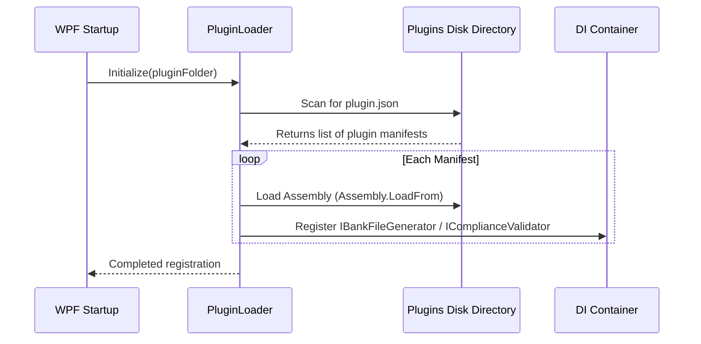

# Fiji Enterprise Payroll System — Plugin Development Guide

**Version:** 1.0.0  
**Date:** June 2026  
**Status:** Approved  
**Owner:** Core Platform Architect  

---

## 1. Introduction

The Fiji Enterprise Payroll System platform supports dynamic extension through a modular plugin architecture. Plugins allow localization, custom bank export formats, and tailored compliance rules without modifying the core system.

All plugins must target the **Platform SDK** (`FijiPayroll.SDK`).

---

## 2. Implementing a Bank File Generator

To add support for a new banking layout (e.g. a new localized credit format for Barter Bank of Fiji), implement the `IBankFileGenerator` interface.

### Step-by-Step Implementation

1. Create a new class library project targeting `.NET 9.0`.
2. Add a project/assembly reference to `FijiPayroll.SDK.dll`.
3. Implement the `IBankFileGenerator` interface:

```csharp
using System;
using System.Collections.Generic;
using FijiPayroll.SDK.Contracts;
using FijiPayroll.SDK.Interfaces;

namespace FijiPayroll.Plugins.BarterBank;

public sealed class BarterBankGenerator : IBankFileGenerator
{
    public string BankCode => "BBF";
    public string BankName => "Barter Bank of Fiji";

    public string Generate(
        string companyName,
        string companyAccount,
        string bsb,
        DateTime paymentDate,
        string reference,
        IEnumerable<PaymentDetail> payments,
        string headerTemplate,
        string detailTemplate,
        string footerTemplate,
        char delimiter)
    {
        // Custom formatting logic
        var lines = new List<string>();
        
        // Header
        lines.Add($"HEADER{delimiter}{companyName}{delimiter}{companyAccount}{delimiter}{paymentDate:yyyyMMdd}");

        // Details
        foreach (var p in payments)
        {
            lines.Add($"DETAIL{delimiter}{p.EmployeeName}{delimiter}{p.Bsb}{delimiter}{p.AccountNumber}{delimiter}{p.Amount:F2}");
        }

        // Footer
        return string.Join(Environment.NewLine, lines);
    }
}
```

---

## 3. Packaging and Deployment

Plugins are packaged as dynamic link libraries (DLLs) accompanied by a `plugin.json` manifest.

### 3.1 Plugin Manifest (`plugin.json`)

```json
{
  "PluginId": "FijiPayroll.Plugins.BarterBank",
  "Name": "Barter Bank of Fiji Disbursals Extension",
  "Version": "1.0.0",
  "Author": "Fiji Dev Team",
  "AssemblyName": "FijiPayroll.Plugins.BarterBank.dll",
  "Description": "Provides Direct Credit clearing layouts matching Barter Bank Fiji formats."
}
```

### 3.2 Directory Structure

For the host system to find and load plugins, place all assemblies and manifests in the `Plugins` subfolder within the application base directory:

```
[AppPath]/
│
├── Plugins/
│   └── BarterBank/
│       ├── plugin.json
│       └── FijiPayroll.Plugins.BarterBank.dll
```

---

## 4. How the Host Loads Plugins

During startup, the WPF Shell invokes `FijiPayroll.Platform.Plugins.PluginLoader` which scans the `Plugins` directory for `plugin.json` files, verifies signatures or compatibility parameters, and loads assemblies dynamically.



---

*Document maintained by: Core Platform Architect*  
*Last updated: June 2026*
