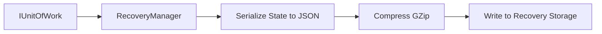

# Fiji Enterprise Payroll System — Disaster Recovery & System Health Watchdog

**Version:** 1.0.0  
**Date:** June 2026  
**Status:** Approved  
**Owner:** Systems Infrastructure Lead  

---

## 1. Disaster Recovery Packages

The system automatically generates a **Disaster Recovery Package** on completion of every successful compliance file generation.

### 1.1 Package Contents
Each DR package is a secured, self-contained archive containing:
1. **The Primary Export File** — The CSV/TXT compliance file (FRCS MER, FNPF Contribution, or Bank Direct Credit file).
2. **Metadata Manifest (`_manifest.json`)** — Details the SHA256 integrity hash, record counts, monetary sums, timestamp, and audit trail of the user who triggered the generation.
3. **Database State Serialization** — A compressed JSON copy of the relevant database records (e.g. Ledgers, Periods, and Submissions) required to rebuild the state.

### 1.2 Storage Location
DR packages are written to the directory specified in `appsettings.json` under `FileStorage:RootDirectory`, organized by CompanyId:
`[StorageRoot]/exports/company_[CompanyId]/recovery/`

---

## 2. Database Backup & Serialization Strategy

To prevent metadata loss, the `RecoveryManager` service provides programmatic backup utilities.



### 2.1 Full Database Backups
While the application provides serialized domain backups, IT departments must execute standard SQL Server differential and transactional log backup schedules:
* **Full Backup:** Weekly (Sunday, 01:00 AM)
* **Differential:** Daily (02:00 AM)
* **Transactional Logs:** Every 15 minutes

---

## 3. System Health Diagnostics Watchdog

The application hosts a **Diagnostics HUD Dashboard** enabling real-time performance tracking and system health monitoring.

```
+-------------------------------------------------------+
|  SYSTEM PERFORMANCE & DIAGNOSTICS HUD               |
+-------------------------------------------------------+
| Health Score: 100/100                                 |
| Database Latency: 4 ms                                |
| Memory Usage: 142.5 MB                                |
| Active Threads: 14                                    |
| Busy Worker Threads: 2                                |
| Pending Compliance Jobs: 0                            |
| Pending Outbound Alerts: 0                            |
+-------------------------------------------------------+
```

### 3.1 Health Score Calculation Logic
The Diagnostics query evaluates overall system health based on the following criteria:
* **Base Score:** 100
* **Database Query Latency Penalty:** -10 points if query responsiveness latency exceeds 200ms.
* **Pending Job Queue Depth Penalty:** -5 points if pending compliance jobs exceed 10.
* **Thread Pool Starvation Penalty:** -5 points if busy worker threads exceed 20.

---

*Document maintained by: Systems Infrastructure Lead*  
*Last updated: June 2026*
