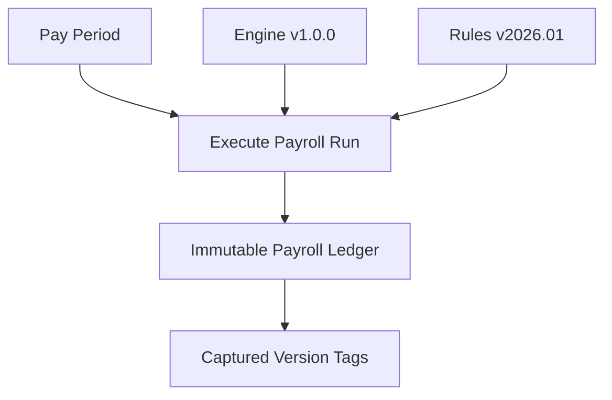
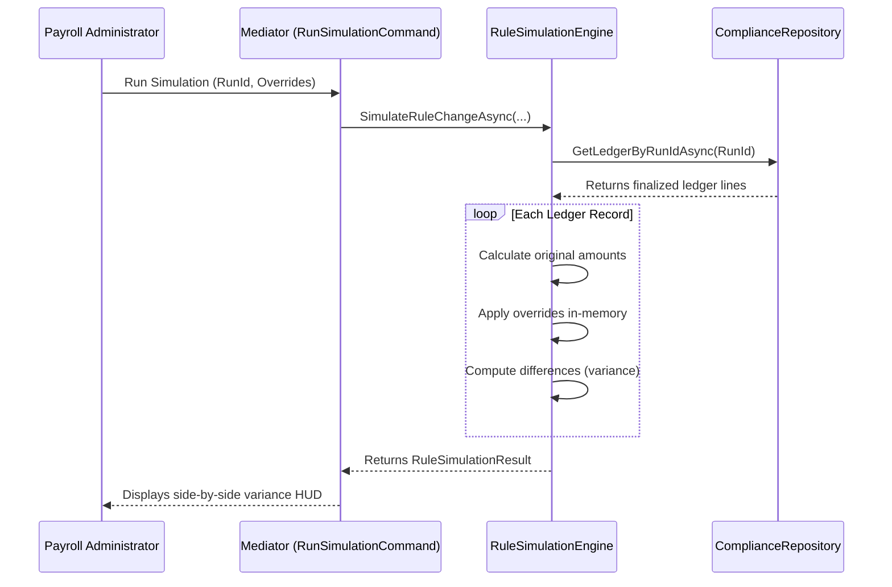

# Fiji Enterprise Payroll System — Statutory Rule Engine Design

**Version:** 1.0.0  
**Date:** June 2026  
**Status:** Approved  
**Owner:** Senior Solutions Architect  

---

## 1. Introduction

The **Statutory Rule Engine** handles legislative parameter evaluation (such as FNPF rates and PAYE tax brackets) to avoid recompilation when legislation changes.

It includes **Rule Version Pinning**, **Calculations Versioning**, and **Dry Run Simulation** capabilities.

---

## 2. Rule Version Pinning & Engine Versioning

Every payroll ledger record, FRCS submission, and FNPF file generated by the system stores two version identifiers:

1. **Calculation Engine Version** (e.g. `Payroll Engine 1.0.0`, `Formula Engine 2.1.0`) — Ensures that if the calculation algorithms are modified in later updates, historical runs are marked with their original engine version.
2. **Statutory Rules Version** (e.g. `Statutory Rules v2026.01`, `PAYE Rules v2026.02`) — Pins the legislative parameters active at the time of calculation. If compliance files are regenerated or audited, the system retrieves the historical parameters matching that rules version.

---

## 3. In-Memory Rule Simulation (Dry Runs)

The simulation engine allows payroll administrators to test legislative changes (e.g. "What happens if the government changes FNPF employer contribution rate to 12%?") using historical payroll ledger runs.

### 3.1 Simulated Overrides Support
* **`FNPF_EE_RATE`** — Employee contribution percentage override.
* **`FNPF_ER_RATE`** — Employer contribution percentage override.
* **`PAYE_TAX_FREE_THRESHOLD`** — Primary PAYE tax exemption threshold.
* **`PAYE_BRACKET_1_RATE`** — First tier tax rate.
* **`PAYE_BRACKET_2_RATE`** — Upper tier tax rate.

---

*Document maintained by: Senior Solutions Architect*  
*Last updated: June 2026*
