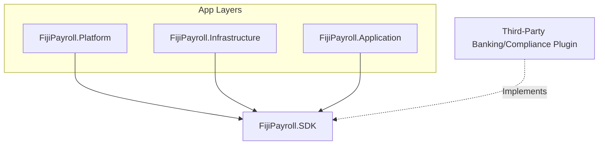

# Fiji Enterprise Payroll System — Platform SDK Specification

**Version:** 1.0.0  
**Date:** June 2026  
**Status:** Approved  
**Owner:** Core Platform Architect  

---

## 1. Overview

The Platform SDK (`FijiPayroll.SDK`) contains the contracts, interfaces, and shared entities that enable third-party plugins, localized banking components, and regulatory modules to integrate with the Fiji Enterprise Payroll System core.



---

## 2. Core Interfaces

### 2.1 Banking and Disbursals

#### `IBankFileGenerator`
Enables the generation of direct-credit clearing files for specific banks operating in Fiji (e.g. BSP, ANZ, Westpac, BRED, HFC, Kontiki).

```csharp
namespace FijiPayroll.SDK.Interfaces;

public interface IBankFileGenerator
{
    string BankCode { get; }
    string BankName { get; }
    
    string Generate(
        string companyName,
        string companyAccount,
        string bsb,
        DateTime paymentDate,
        string reference,
        IEnumerable<PaymentDetail> payments,
        string headerTemplate,
        string detailTemplate,
        string footerTemplate,
        char delimiter);
}
```

---

### 2.2 Compliance and Validation

#### `IComplianceValidator`
Defines standard interfaces for executing statutory rule checks prior to closing period reporting.

```csharp
namespace FijiPayroll.SDK.Interfaces;

public interface IComplianceValidator
{
    string RuleCode { get; }
    string Description { get; }
    
    IEnumerable<ValidationIssue> Validate(int companyId, object payload);
}
```

#### `IComplianceFileService`
Generates government submission files like FRCS MER and FNPF portal files.

```csharp
namespace FijiPayroll.SDK.Interfaces;

public interface IComplianceFileService
{
    string GenerateFrcsCsv(string employerTin, IEnumerable<PaymentDetail> payments, int month, int year);
    string GenerateFnpfCsv(string employerNumber, string employerName, int month, int year, IEnumerable<PaymentDetail> payments);
}
```

---

### 2.3 System Services

#### `INotificationService`
Provides notification delivery contracts across Email, SMS, or internal system channels.

```csharp
namespace FijiPayroll.SDK.Interfaces;

public interface INotificationService
{
    Task SendNotificationAsync(
        string recipient,
        string subject,
        string message,
        string channel,
        CancellationToken cancellationToken = default);
}
```

#### `ILicenseProvider`
Defines the verification parameters for software entitlement keys.

```csharp
namespace FijiPayroll.SDK.Interfaces;

public interface ILicenseProvider
{
    bool ValidateLicense(string licenseKey, string machineFingerprint);
}
```

---

## 3. Shared Contracts

### 3.1 `PaymentDetail`
Encapsulates transaction summaries used for bank disbursements and statutory CSV generators.

```csharp
public sealed record PaymentDetail(
    int EmployeeId,
    string EmployeeName,
    string Bsb = "",
    string AccountNumber = "",
    decimal Amount = 0,
    string Reference = "",
    string Tin = "",
    decimal Gross = 0,
    decimal Paye = 0,
    string FnpfNumber = "",
    decimal FnpfEmployee = 0,
    decimal FnpfEmployer = 0,
    string BankAccountNumber = "",
    string EmployeeCode = ""
);
```

### 3.2 `ValidationIssue`
Represents compliance check results.

```csharp
public sealed record ValidationIssue(
    string Severity,
    string Message,
    string AffectedEmployee,
    string RuleCode,
    string RecommendedAction
);
```

### 3.3 `PluginManifest`
Metadata descriptors used by the `PluginLoader` to verify package compatibility.

```csharp
public sealed class PluginManifest
{
    public string PluginId { get; set; } = string.Empty;
    public string Name { get; set; } = string.Empty;
    public string Version { get; set; } = string.Empty;
    public string Author { get; set; } = string.Empty;
    public string AssemblyName { get; set; } = string.Empty;
    public string Description { get; set; } = string.Empty;
}
```

---

*Document maintained by: Core Platform Architect*  
*Last updated: June 2026*
