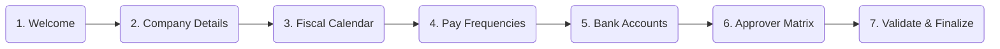
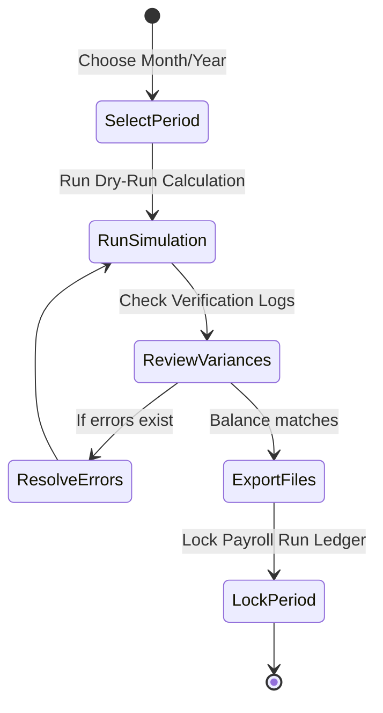

# Fiji Enterprise Payroll System — Platform User Guide

**Version:** 1.0.0  
**Date:** June 2026  
**Status:** Approved  
**Owner:** Core Platform Architect  

---

## 1. Company Onboarding & Setup Wizard

The onboarding flow provides a step-by-step setup interface using the [CompanySetupDashboardView.xaml](file:///c:/Users/jayshil.singh/Desktop/Payroll/src/FijiPayroll.WPF/Views/CompanySetupDashboardView.xaml) interface. It is managed by the [SetupWorkflowService.cs](file:///c:/Users/jayshil.singh/Desktop/Payroll/src/FijiPayroll.Application/Services/SetupWorkflowService.cs) to ensure that setup procedures are completed in order.

### Steps in the Setup Wizard:

1. **Welcome**: Introduces the onboarding process and scans for system updates.
2. **Company Details**: Allows configuration of official business names, TAX (TIN) registrations, and FNPF Employer numbers.
3. **Fiscal Calendar**: Sets up the company calendar, starting months, and tax periods.
4. **Payroll Frequencies**: Registers specific calendars for Weekly, Fortnightly, and Monthly payments.
5. **Bank Accounts**: configures corporate bank details for automatic bank credit exports (BSP, ANZ, Westpac, HFC, BRED, Kontiki).
6. **Approver Matrix**: Maps roles, supervisors, threshold limits, and compliance override permissions.
7. **Validate & Finalize**: Conducts a system-wide data integrity dry run. Once validated, clicking **Finalize Setup** locks changes, runs seeding scripts, and marks the company profile as active.

> [!NOTE]
> Progress checkpoints are saved directly to the database in `company.CompanySetupStates` and `company.SetupCheckpoints` tables. If you log out or close the wizard, you can resume from your last step.

---

## 2. Compliance Dashboard (Compliance Center)

The Compliance Center ([ComplianceCenterView.xaml](file:///c:/Users/jayshil.singh/Desktop/Payroll/src/FijiPayroll.WPF/Views/ComplianceCenterView.xaml)) provides a consolidated workspace for generating and verifying monthly regulatory returns.

### 2.1 FRCS Monthly Employer Return (MER)
Fiji Revenue and Customs Service (FRCS) rules require a monthly report detailing tax code details, gross pays, tax deductions (PAYE), and benefit allocations.
- **Validation**: Select a month, click **Validate**. The system runs the validation rules and reports missing tax numbers, negative calculations, or invalid codes.
- **Generation**: Click **Generate CSV**. The files are formatted to match current FRCS standards.

### 2.2 FNPF Monthly Contributions File
FNPF submissions generate the contribution summary file required for uploading to the FNPF Employer Portal.
- **Invariants**: Matches mandatory 8% employee and 10% employer contributions (or temporary adjusted rates).
- **Validation**: Enforces checks such as validating FNPF numbers are 9-digit formats and that employees over retirement age are flagged or handled under appropriate rule overrides.

### 2.3 Bank Clearing File Generations
Direct credit export files generate regional clearance records (e.g., BSP direct formats or Westpac clearing files).
- Supported banks include BSP, ANZ, Westpac, BRED, HFC, and Kontiki.
- Templates use dynamic placeholder substitutions (e.g., replacement tokens for `{EmployeeName}`, `{Amount}`, `{BSB}`, and `{AccountNumber}`).

### 2.4 Calculation Rule Dry-Run Simulations
Before locking a period, administrators can use the **Rule Simulation Engine** to test calculation sets. This clones calculation engines, runs a complete payroll cycle mock test, and highlights variances between standard policies and actual payroll records.

---

## 3. Operations Diagnostics HUD

The Diagnostics Dashboard ([DiagnosticsDashboardView.xaml](file:///c:/Users/jayshil.singh/Desktop/Payroll/src/FijiPayroll.WPF/Views/DiagnosticsDashboardView.xaml)) offers real-time visualization of core platform activities.

### Key Metrics to Monitor:

* **System Health Score**: A composite score based on memory headroom, background task queue depths, database request latency, and thread availability.
* **Calculation Engine Speed**: Shows latency details for calculating payroll runs. Typical benchmark is under 1.5ms per employee record.
* **Active Background Worker Threads**: Monitors running worker threads. Displays thread counts (utilizing `ThreadPool.ThreadCount`).
* **Active Background Task Queues**: Displays pending files, database recovery jobs, and queued notification tasks.
* **Database & File I/O Latency**: Measures SQL server connection delays and file generation speeds to detect system disk performance bottlenecks.

---

## 4. Disaster Recovery & Configurations

The platform includes local utility tools in the Diagnostics HUD to secure and preserve historical configuration packages.

### 4.1 Exporting Company Settings (`.companyconfig`)
To export company tax scales, payment frequencies, bank configurations, and approver policies:
1. Navigate to the **Disaster Recovery** tab in the diagnostics panel.
2. Click **Export Configurations**.
3. The configuration pack is encrypted and saved as a `.companyconfig` file.

### 4.2 Generating Disaster Recovery Packages (`.drpack`)
For complete system backups:
1. Under the **Disaster Recovery** tab, select **Create Recovery Package**.
2. The system backs up system schemas, exports the compliance snapshots event logs, signs the manifest, and zips the bundle into an encrypted archive with a `.drpack` extension.
3. This package can be restored onto staging or disaster recovery environments in case of hardware failures.

---

## 5. Security Policies & Audit Logs

* **Immutable Payroll Ledgers**: Once a payroll run is finalized, calculation metrics are saved to the immutable ledger. Subsequent bank clearings or compliance exports read directly from this ledger, safeguarding data against modification.
* **Approval Overrides**: If a compliance warning occurs (such as a missing TIN for a new temporary employee), the run cannot be locked without an approved override. Overrides must be authenticated by a supervisor through a digital signature.
* **Compliance Event Log**: Every compliance transition (generation, signing, submission, amendment) is recorded as a JSON block in the database audit log.

---
*Document maintained by: Platform Operations Team*  
*Last updated: June 2026*
