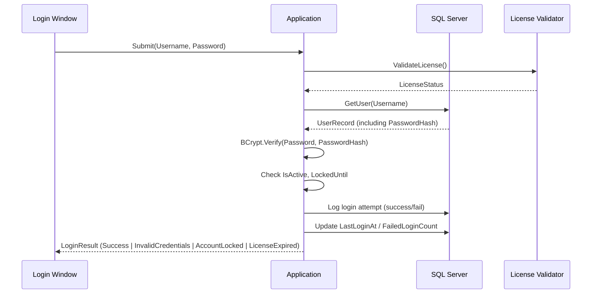
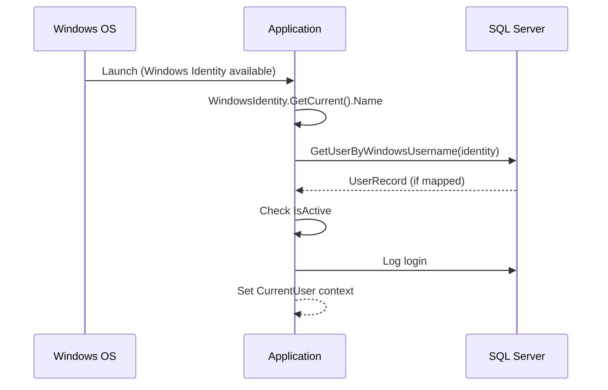
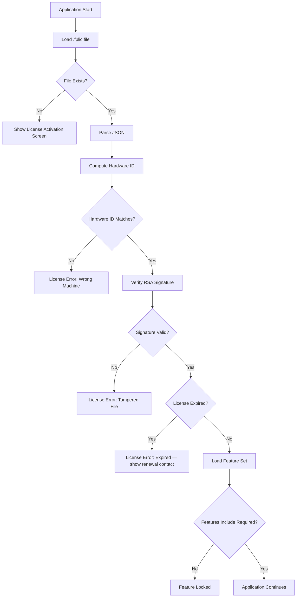
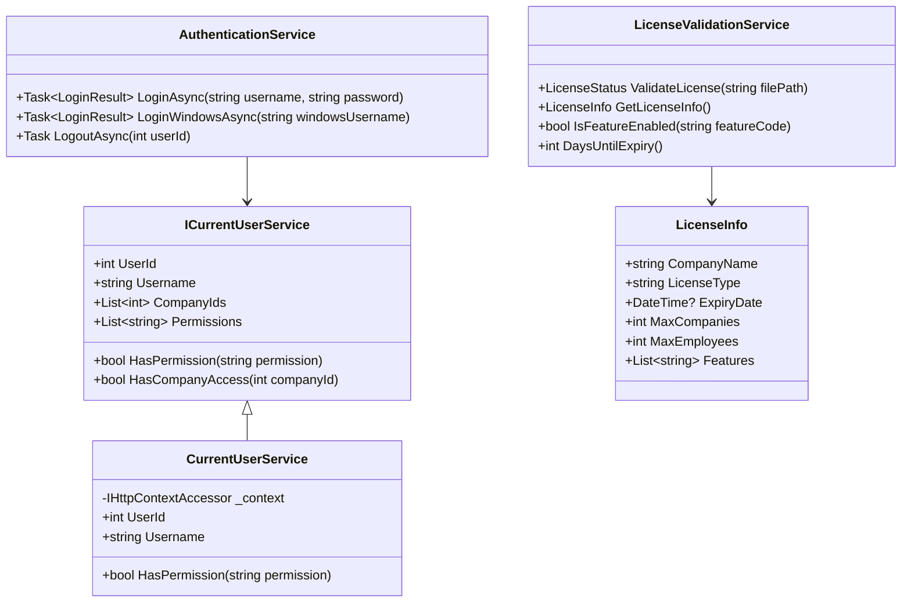

# Phase 04 — Authentication & Licensing Specification

**Version:** 1.0.0  
**Date:** June 2026  
**Owner:** Enterprise Solution Architect + Senior C# Developer  

---

## 1. Authentication Architecture

### 1.1 Supported Authentication Modes

| Mode | Description | Use Case |
|------|-------------|---------|
| SQL Authentication | Username + Password stored in database | Most deployments |
| Windows Authentication | Active Directory / domain login | Enterprise AD environments |

The user selects the authentication mode during initial login. The mode can be restricted by system policy (System Admin can disable SQL auth to force Windows auth).

---

## 2. Authentication Flow

### 2.1 SQL Authentication Login Flow



### 2.2 Windows Authentication Login Flow



---

## 3. Account Lockout Policy

| Parameter | Default | Configurable |
|-----------|---------|-------------|
| Max failed attempts | 5 | Yes (System Admin) |
| Lockout duration | 30 minutes | Yes (System Admin) |
| Lockout type | Automatic (timed) | Not overrideable |
| Admin unlock | System Admin can unlock manually | — |

**Lockout process:**
- After N failed attempts: Set `LockedUntil = UTC + 30 minutes`
- On login attempt while locked: Show "Account locked. Try again after [time]."
- After lockout expires: Reset `FailedLoginCount = 0`, `LockedUntil = null`
- System Admin override: Set `LockedUntil = null` manually

---

## 4. Password Policy

| Rule | Requirement |
|------|------------|
| Minimum length | 8 characters |
| Uppercase | At least 1 |
| Lowercase | At least 1 |
| Number | At least 1 |
| Special character | At least 1 (!@#$%^&*) |
| Password history | Cannot reuse last 5 passwords |
| Expiry | Configurable (default: never for enterprise) |
| First login | Must change password |

---

## 5. Session Management

- Session is stored in memory only (no persistent token)
- Session is tied to the current application process
- `CurrentUserService` provides: UserId, Username, CompanyIds, Roles, Permissions
- Session expires when application window closes
- No concurrent login check for same user (allowed — different workstations)

---

## 6. Role-Based Access Control (RBAC)

### 6.1 System Roles (Built-In, Cannot Be Deleted)

| Role | Description |
|------|-------------|
| System Administrator | Full access to all modules, all companies |
| Payroll Administrator | Full payroll processing, employee management |
| HR Manager | Employee management, leave, read-only payroll |
| Finance Manager | Reporting, bank files, payroll approval |
| Data Entry | Create/edit employees only |
| Auditor | Read-only across all modules and audit trail |

### 6.2 Custom Roles
- System Admin can create unlimited custom roles
- Each role is a named collection of permissions
- Permissions are additive (no deny rules)

---

## 7. Permission Matrix

### Module Permissions Structure
Each module has standard actions:

| Action | Code |
|--------|------|
| View | `[Module].View` |
| Create | `[Module].Create` |
| Edit | `[Module].Edit` |
| Delete | `[Module].Delete` |
| Export | `[Module].Export` |
| Import | `[Module].Import` |
| Approve | `[Module].Approve` |
| Print | `[Module].Print` |

### Full Permission Matrix

| Permission | SysAdmin | PayrollAdmin | HRManager | FinanceManager | DataEntry | Auditor |
|-----------|:--------:|:------------:|:---------:|:--------------:|:---------:|:-------:|
| **Company** | | | | | | |
| Company.View | ✅ | ✅ | ✅ | ✅ | ✅ | ✅ |
| Company.Edit | ✅ | ✅ | ❌ | ❌ | ❌ | ❌ |
| **Employees** | | | | | | |
| Employees.View | ✅ | ✅ | ✅ | ✅ | ✅ | ✅ |
| Employees.Create | ✅ | ✅ | ✅ | ❌ | ✅ | ❌ |
| Employees.Edit | ✅ | ✅ | ✅ | ❌ | ✅ | ❌ |
| Employees.Delete | ✅ | ✅ | ❌ | ❌ | ❌ | ❌ |
| Employees.Terminate | ✅ | ✅ | ✅ | ❌ | ❌ | ❌ |
| Employees.Export | ✅ | ✅ | ✅ | ✅ | ❌ | ✅ |
| **Payroll** | | | | | | |
| Payroll.View | ✅ | ✅ | ✅ | ✅ | ❌ | ✅ |
| Payroll.Create | ✅ | ✅ | ❌ | ❌ | ❌ | ❌ |
| Payroll.Calculate | ✅ | ✅ | ❌ | ❌ | ❌ | ❌ |
| Payroll.Approve | ✅ | ❌ | ❌ | ✅ | ❌ | ❌ |
| Payroll.Reverse | ✅ | ✅ | ❌ | ❌ | ❌ | ❌ |
| Payroll.Export | ✅ | ✅ | ❌ | ✅ | ❌ | ✅ |
| **Leave** | | | | | | |
| Leave.View | ✅ | ✅ | ✅ | ✅ | ✅ | ✅ |
| Leave.Approve | ✅ | ✅ | ✅ | ❌ | ❌ | ❌ |
| **Compliance** | | | | | | |
| FRCS.View | ✅ | ✅ | ❌ | ✅ | ❌ | ✅ |
| FRCS.Generate | ✅ | ✅ | ❌ | ✅ | ❌ | ❌ |
| FNPF.Generate | ✅ | ✅ | ❌ | ✅ | ❌ | ❌ |
| BankFiles.Generate | ✅ | ❌ | ❌ | ✅ | ❌ | ❌ |
| **Settings** | | | | | | |
| Settings.Users | ✅ | ❌ | ❌ | ❌ | ❌ | ❌ |
| Settings.Roles | ✅ | ❌ | ❌ | ❌ | ❌ | ❌ |
| Settings.Backup | ✅ | ❌ | ❌ | ❌ | ❌ | ❌ |
| **Audit** | | | | | | |
| Audit.View | ✅ | ❌ | ❌ | ❌ | ❌ | ✅ |

---

## 8. Licensing Architecture

### 8.1 License Model

```
FijiPayroll License (.fplic file)
├── Header
│   ├── LicenseKey        (GUID)
│   ├── LicenseType       (Trial/Standard/Professional/Enterprise)
│   ├── CompanyName       (Licensed to)
│   ├── IssuedDate        (UTC)
│   └── ExpiryDate        (UTC or null for perpetual)
├── Restrictions
│   ├── MaxCompanies      (int, -1 = unlimited)
│   ├── MaxEmployees      (int, -1 = unlimited)
│   └── Features[]        (array of enabled feature codes)
├── Hardware
│   └── HardwareId        (SHA256 of machine fingerprint)
└── Signature
    └── RSASignature      (Base64 RSA-2048 signature of all above fields)
```

### 8.2 Hardware Fingerprint

The `HardwareId` is a SHA-256 hash of:
```
Motherboard Serial Number
CPU ID
Primary Network Adapter MAC Address (first physical, non-virtual)
```

If any single component changes (hardware replacement), the license must be reissued.

### 8.3 License File Format

```json
{
  "LicenseKey": "550e8400-e29b-41d4-a716-446655440000",
  "LicenseType": "Professional",
  "CompanyName": "Pacific Supplies Ltd",
  "IssuedDate": "2026-06-15T00:00:00Z",
  "ExpiryDate": "2027-06-15T00:00:00Z",
  "MaxCompanies": 5,
  "MaxEmployees": -1,
  "Features": ["Payroll", "FRCS", "FNPF", "BankFiles", "Reporting", "Import", "Audit"],
  "HardwareId": "a3f5b2c4d6e7f8a9b0c1d2e3f4a5b6c7d8e9f0a1b2c3d4e5f6a7b8c9d0e1f2a3",
  "Signature": "BASE64ENCODEDRSASIGNATURE..."
}
```

---

## 9. License Validation Flow



**On validation failure:**
- Display specific, friendly error message
- Show contact details for support/renewal
- Allow limited trial mode (if Trial type) or full block (if Standard+)

---

## 10. License Reminder Schedule

| Days Until Expiry | Reminder Type | Frequency |
|------------------|--------------|-----------|
| 90 days | Information banner in app | Once only |
| 60 days | Information banner + status bar | Daily |
| 30 days | Warning banner + status bar | Daily |
| 15 days | Warning modal on startup | Daily |
| 7 days | Warning modal on startup + email (if configured) | Daily |
| 3 days | Critical modal on startup | Daily |
| Expired | Blocking modal — cannot proceed | Every login |

### Reminder Message Templates

**90 days:**
```
Your Fiji Payroll license expires in 90 days (15 Sep 2026).
Contact your vendor to renew: support@vendor.fj
[Remind me later]
```

**7 days:**
```
⚠️ Your Fiji Payroll license expires in 7 days!
You will lose access to the system on 15 Sep 2026.
Please renew immediately.
Phone: +679 XXX XXXX  Email: support@vendor.fj
[OK]
```

**Expired:**
```
❌ Your Fiji Payroll license has expired.
Please contact your vendor to renew your license.
System access is suspended until a valid license is activated.
[Activate License]  [Exit]
```

---

## 11. License Generator Tool (Internal)

The `FijiPayroll.LicenseGenerator` is a standalone internal tool (not distributed to customers) used to:
1. Enter customer details and hardware ID
2. Select license type and features
3. Set expiry date
4. Generate and sign the `.fplic` file using the private RSA key
5. Output the `.fplic` file for delivery to customer

### RSA Key Management
- Private key: Held securely by the software vendor (never leaves the office)
- Public key: Embedded in the application binary (used for validation)
- Key size: RSA-2048 minimum
- Key format: PEM
- Key rotation: New keys generate new license file version; old licenses remain valid on old key

---

## 12. Database Design (Auth & Licensing)

### `system.Users` — (Defined in Database.md)

### `system.Roles`

| Column | Type | Description |
|--------|------|-------------|
| Id | INT PK | Primary key |
| RoleName | NVARCHAR(100) | Unique role name |
| Description | NVARCHAR(500) | Role description |
| IsSystemRole | BIT | Cannot be deleted |
| IsActive | BIT | Active flag |
| [Audit fields] | | |

### `system.Permissions`

| Column | Type | Description |
|--------|------|-------------|
| Id | INT PK | Primary key |
| PermissionCode | NVARCHAR(100) | e.g., `Payroll.Approve` |
| DisplayName | NVARCHAR(200) | Human-readable name |
| Module | NVARCHAR(100) | Module group |
| Description | NVARCHAR(500) | What this permission allows |

### `system.RolePermissions`

| Column | Type | Description |
|--------|------|-------------|
| RoleId | INT FK | Role |
| PermissionId | INT FK | Permission |
| PK: (RoleId, PermissionId) | | Composite primary key |

### `system.UserRoles`

| Column | Type | Description |
|--------|------|-------------|
| UserId | INT FK | User |
| RoleId | INT FK | Role |
| PK: (UserId, RoleId) | | Composite primary key |

### `system.UserCompanyAccess`

| Column | Type | Description |
|--------|------|-------------|
| UserId | INT FK | User |
| CompanyId | INT FK | Company |
| PK: (UserId, CompanyId) | | Composite primary key |

### `audit.LoginHistory`

| Column | Type | Description |
|--------|------|-------------|
| Id | BIGINT PK | Primary key |
| UserId | INT FK | User |
| Username | NVARCHAR(100) | Snapshot |
| LoginAt | DATETIME2 | Login time |
| LogoutAt | DATETIME2 | Logout time (null if forced exit) |
| IPAddress | NVARCHAR(50) | Client machine IP |
| AuthType | NVARCHAR(20) | SQL or Windows |
| Success | BIT | Login succeeded |
| FailureReason | NVARCHAR(200) | Why it failed |

---

## 13. Class Diagram (Authentication)



---

*Document maintained by: Enterprise Solution Architect*  
*Last updated: June 2026*
