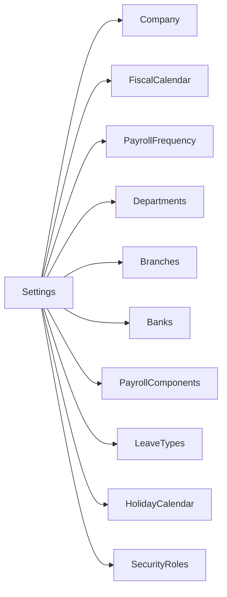

# Phase 05 — Core Configuration Module Specification

**Version:** 1.0.0  
**Date:** June 2026  
**Owner:** Senior UI/UX Designer + Senior C# Developer  

---

## 1. Overview

The Core Configuration module allows System Administrators to set up all foundational reference data required before any payroll can be processed. All configuration screens follow the **Standard CRUD UX Pattern** defined in UIStandards.md.

---

## 2. Standard Screen Pattern

Every configuration screen in this module supports:

| Feature | Description |
|---------|-------------|
| **List View** | Searchable, filterable, paginated grid of records |
| **Add** | New record form in a right-side panel or dialog |
| **Edit** | Edit existing record in panel/dialog |
| **Delete** | Soft delete with confirmation |
| **Duplicate** | Clone record with "(Copy)" suffix |
| **Search** | Real-time search on key fields |
| **Filter** | Multi-field filter bar |
| **Import** | Excel/CSV import with template |
| **Export** | Export visible data to Excel/CSV |
| **Download Template** | Download blank import template |
| **Print** | Print current list (formatted) |
| **History** | View audit history for a record |

---

## 3. Module: Company

### 3.1 Company List

**Columns:**
| Column | Width | Type |
|--------|-------|------|
| Logo | 40px | Image thumbnail |
| Company Code | 100px | Text |
| Company Name | 250px | Text |
| TIN | 120px | Text |
| FNPF # | 120px | Text |
| Active | 80px | Badge |
| Actions | 80px | Edit / History |

**Search:** Company Name, Company Code  
**Filter:** Active (Yes/No)

### 3.2 Company Detail Form

**Tabs:** General | Contact | Registration | Defaults

**General Tab:**
| Field | Type | Required | Validation |
|-------|------|----------|-----------|
| Company Code | Text | Yes | Unique, 2–20 chars, uppercase, no spaces |
| Company Name | Text | Yes | Max 200 chars |
| Trading Name | Text | No | Max 200 chars |
| Industry | Dropdown | No | Industry list |
| Active | Toggle | Yes | Default: Yes |

**Contact Tab:**
| Field | Type | Required | Validation |
|-------|------|----------|-----------|
| Address Line 1 | Text | No | Max 200 |
| Address Line 2 | Text | No | Max 200 |
| City | Text | No | Max 100 |
| Phone | Text | No | Fiji phone format |
| Email | Text | No | Valid email |
| Website | Text | No | Valid URL |

**Registration Tab:**
| Field | Type | Required | Validation |
|-------|------|----------|-----------|
| FRCS TIN | Text | Recommended | TIN format validation |
| FNPF Employer Number | Text | Recommended | FNPF format validation |
| Company Registration # | Text | No | |
| VAT Registration # | Text | No | |

**Defaults Tab:**
| Field | Type | Required | Description |
|-------|------|----------|-------------|
| Default Currency | Text (read-only) | — | FJD |
| Default Leave Accrual Method | Dropdown | Yes | Per period / Annual |
| Payslip Email Setting | Toggle | No | Auto-email payslips |

**Validation Rules:**
- Company Code: Cannot be changed after the first payroll run
- TIN: Warning if not set (required for FRCS compliance)
- FNPF Number: Warning if not set (required for FNPF compliance)

---

## 4. Module: Fiscal Calendar

### 4.1 Fiscal Calendar List

Shows fiscal years for the selected company.

**Columns:**
| Column | Description |
|--------|-------------|
| Fiscal Year | e.g., "2026" |
| Start Date | First day of fiscal year |
| End Date | Last day of fiscal year |
| Periods | Number of periods |
| Status | Active / Closed |
| Actions | View Periods / Close Year |

### 4.2 Fiscal Period Grid (within a year)

Shows all periods in a fiscal year:

| # | Period Name | Start Date | End Date | Status |
|---|------------|-----------|---------|--------|
| 1 | January 2026 | 01/01/2026 | 31/01/2026 | Closed |
| 2 | February 2026 | 01/02/2026 | 28/02/2026 | Closed |
| 3 | March 2026 | 01/03/2026 | 31/03/2026 | Active |
| ... | | | | |

### 4.3 Year-End Close Process
1. Confirm all payroll runs for the year are `Paid`
2. Confirm all FRCS MER submitted
3. Confirm all FNPF submissions done
4. Generate year-end reports
5. Close fiscal year (status → Closed)
6. Generate new fiscal year periods

---

## 5. Module: Payroll Frequency

### 5.1 Frequency List

**Columns:**
| Column | Description |
|--------|-------------|
| Frequency Name | e.g., "Weekly", "Monthly" |
| Type | Weekly / Fortnightly / Bi-Monthly / Monthly |
| Pay Day | e.g., "Friday", "15th and last day" |
| Periods Per Year | 52 / 26 / 24 / 12 |
| Active | Badge |
| Employee Count | Number of employees on this frequency |

### 5.2 Frequency Form

| Field | Type | Required | Validation |
|-------|------|----------|-----------|
| Frequency Name | Text | Yes | Max 100, unique per company |
| Frequency Type | Dropdown | Yes | Weekly/Fortnightly/BiMonthly/Monthly |
| Pay Day | Dropdown | Yes | Day-of-week or date-of-month |
| Description | Text | No | Max 500 |
| Active | Toggle | Yes | |

**Business Rule:** A frequency cannot be deleted or set to inactive if employees are assigned to it.

---

## 6. Module: Departments

### 6.1 Department List

**Columns:**
| Column | Description |
|--------|-------------|
| Code | Department code |
| Name | Department name |
| Parent Department | For hierarchical structures |
| Manager | Department manager (employee) |
| Branch | Associated branch |
| Employee Count | Active employees in dept |
| Active | Badge |

### 6.2 Department Form

| Field | Type | Required | Validation |
|-------|------|----------|-----------|
| Department Code | Text | Yes | Unique per company, max 20 |
| Department Name | Text | Yes | Max 200 |
| Parent Department | Dropdown | No | Cannot be self |
| Manager | Employee Picker | No | Must be active employee |
| Branch | Dropdown | No | Company branch |
| Active | Toggle | Yes | |

---

## 7. Module: Branches

### 7.1 Branch List

**Columns:**
| Column | Description |
|--------|-------------|
| Code | Branch code |
| Name | Branch name |
| City | City/location |
| Phone | Branch phone |
| Active | Badge |
| Employee Count | Employees at branch |

### 7.2 Branch Form

| Field | Type | Required | Validation |
|-------|------|----------|-----------|
| Branch Code | Text | Yes | Unique per company, max 20 |
| Branch Name | Text | Yes | Max 200 |
| Address Line 1 | Text | No | Max 200 |
| City | Text | No | Max 100 |
| Phone | Text | No | Fiji phone format |
| Active | Toggle | Yes | |

---

## 8. Module: Banks

### 8.1 Bank List

**Columns:**
| Column | Description |
|--------|-------------|
| Code | BSP, ANZ, WBC etc. |
| Name | Full bank name |
| Branch Name | Default branch |
| BSB | Bank BSB code |
| Active | Badge |

**Note:** Standard Fiji banks are pre-seeded. Additional banks can be added for specialised cases.

### 8.2 Bank Form

| Field | Type | Required | Validation |
|-------|------|----------|-----------|
| Bank Code | Text | Yes | Uppercase, max 10, unique |
| Bank Name | Text | Yes | Max 200 |
| BSB / Sort Code | Text | No | Format varies by bank |
| Swift Code | Text | No | 8 or 11 characters |
| File Format | Dropdown | Yes | BSP/ANZ/Westpac/HFC/Bred/Kontiki/Generic |
| Active | Toggle | Yes | |

---

## 9. Module: Payroll Components

### 9.1 Component List

**Columns:**
| Column | Description |
|--------|-------------|
| Code | e.g., BASIC, PAYE, HRA |
| Name | Full component name |
| Type | Earning / Deduction / Allowance / Statutory |
| Calc Method | Fixed / Percentage / Formula / Manual |
| Taxable | Yes/No |
| FNPF | Yes/No |
| Order | Display order |
| Active | Badge |

**Filter:** Component Type

### 9.2 Component Form

| Field | Type | Required | Validation |
|-------|------|----------|-----------|
| Component Code | Text | Yes | Uppercase, max 20, unique per company |
| Component Name | Text | Yes | Max 200 |
| Component Type | Dropdown | Yes | Earning/Deduction/Allowance/Benefit/Statutory |
| Calculation Method | Dropdown | Yes | Fixed/Percentage/Formula/Manual |
| Calculation Value | Decimal | If Fixed/% | > 0 if required |
| Formula | Multi-line Text | If Formula | Validated formula expression |
| Taxable (PAYE) | Toggle | Yes | Default: Yes |
| FNPF Applicable | Toggle | Yes | Default: Yes |
| Display Order | Number | Yes | Integer >= 0 |
| Description | Text | No | Max 500 |
| Active | Toggle | Yes | |

**Business Rules:**
- System Components (PAYE, FNPF Employee, FNPF Employer) cannot be deleted or inactivated
- Formula components use a predefined variable set: `{GrossPay}`, `{AnnualSalary}`, `{HoursWorked}`, `{DailyRate}`, `{OvertimeHours}`

---

## 10. Module: Leave Types

### 10.1 Leave Type List

**Columns:**
| Column | Description |
|--------|-------------|
| Code | e.g., AL, SL, ML |
| Name | e.g., Annual Leave |
| Days Per Year | Entitlement |
| Paid | Yes/No |
| Accrual | Per Period / Annual Grant / Per Event |
| Active | Badge |

### 10.2 Leave Type Form

| Field | Type | Required | Validation |
|-------|------|----------|-----------|
| Leave Code | Text | Yes | Unique per company, max 10 |
| Leave Name | Text | Yes | Max 200 |
| Days Per Year | Decimal | No | >= 0 |
| Is Paid | Toggle | Yes | |
| Accrual Method | Dropdown | Yes | PerPeriod/AnnualGrant/PerEvent/NoAccrual |
| Carry Forward | Toggle | No | Can unused leave carry to next year |
| Max Carry Forward Days | Decimal | If Carry Forward | |
| Requires Approval | Toggle | Yes | Default: Yes |
| Requires Documentation | Toggle | No | e.g., medical certificate |
| Minimum Days Per Request | Decimal | No | Default: 0 |
| Maximum Days Per Request | Decimal | No | |
| Active | Toggle | Yes | |

---

## 11. Module: Holiday Calendar

### 11.1 Holiday List

**Columns:**
| Column | Description |
|--------|-------------|
| Date | Holiday date |
| Name | e.g., "Fiji Day" |
| Type | National / Regional / Company |
| Annual | Repeats annually |
| Active | Badge |

**Pre-seeded Fiji Public Holidays:**
- New Year's Day — 1 January
- Prophet Mohammed's Birthday — Variable
- Easter — Good Friday, Holy Saturday, Easter Monday
- National Sports Day — Variable Friday in June
- Ratu Sir Lala Sukuna Day — Last Monday of May
- Fiji Day — 10 October
- Diwali — Variable
- Christmas Day — 25 December
- Boxing Day — 26 December

### 11.2 Holiday Form

| Field | Type | Required | Validation |
|-------|------|----------|-----------|
| Holiday Name | Text | Yes | Max 200 |
| Date | Date Picker | Yes | Valid future or past date |
| Holiday Type | Dropdown | Yes | National/Regional/Company |
| Repeats Annually | Toggle | No | |
| Description | Text | No | Max 500 |

---

## 12. Module: Security Roles (Configuration)

### 12.1 Role List

**Columns:**
| Column | Description |
|--------|-------------|
| Role Name | Role identifier |
| Description | Role purpose |
| Users Assigned | Count |
| System Role | Badge (cannot be deleted) |
| Active | Badge |

### 12.2 Role Form

| Field | Type | Required | Validation |
|-------|------|----------|-----------|
| Role Name | Text | Yes | Unique, max 100 |
| Description | Text | No | Max 500 |
| Active | Toggle | Yes | |

### 12.3 Permission Assignment (within Role form)

Matrix view showing all permissions grouped by module. Checkboxes for each permission. Changes saved immediately or on "Save Role" button.

---

## 13. Navigation Map

---

*Document maintained by: Senior UI/UX Designer*  
*Last updated: June 2026*
