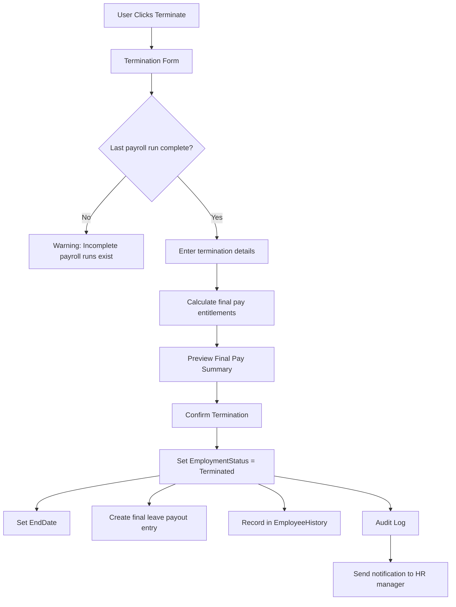

# Phase 06 — Employee Management Module Specification

**Version:** 1.0.0  
**Date:** June 2026  
**Owner:** Senior UI/UX Designer + Senior HR Specialist  

---

## 1. Overview

The Employee Management module handles the complete employee lifecycle from onboarding to termination, with full audit trail, history tracking, and multi-tab detail views.

---

## 2. Employee List View

### 2.1 Screen Layout

```
[Employee List]                    [+ New Employee] [Import] [Export]
─────────────────────────────────────────────────────────────────
[Search by name/code...]  [Status ▾] [Department ▾] [Branch ▾] [Type ▾] [Clear]
─────────────────────────────────────────────────────────────────
☐ | Photo | Code  | Full Name      | Dept   | Branch | Type     | Status | Actions
  | 👤   | E001  | Smith, John    | IT     | HQ     | FullTime | Active | ✏ ⋮
  | 👤   | E002  | Jones, Mary    | Finance| HQ     | FullTime | Active | ✏ ⋮
  | 👤   | E003  | Kumar, Raj     | Sales  | Suva   | Casual   | Active | ✏ ⋮

Showing 1–25 of 142 employees     [< Prev]  [1] [2] [3] ... [6] [Next >]
```

### 2.2 Columns

| Column | Width | Sortable | Description |
|--------|-------|---------|-------------|
| Checkbox | 40px | No | Multi-select |
| Photo | 40px | No | Thumbnail |
| Code | 80px | Yes | Employee code |
| Full Name | 200px | Yes | Last, First format |
| Department | 150px | Yes | Department name |
| Branch | 120px | Yes | Branch name |
| Employment Type | 100px | Yes | Full-time/Part-time/Casual/Contract |
| Status | 100px | Yes | Active/Terminated/OnLeave |
| Start Date | 100px | Yes | Employment start |
| Actions | 80px | No | Edit + Overflow menu |

### 2.3 Filter Options

| Filter | Options |
|--------|---------|
| Status | All / Active / Terminated / On Leave / Suspended |
| Department | Dropdown of all departments |
| Branch | Dropdown of all branches |
| Employment Type | All / Full-Time / Part-Time / Casual / Contract |
| Pay Frequency | All / Weekly / Fortnightly / Bi-Monthly / Monthly |

### 2.4 Overflow Actions (⋮ menu)

- Edit
- View History
- Terminate
- Transfer
- Promote
- Print Payslips
- View Leave Balance
- Duplicate

---

## 3. Employee Detail View (Tabs)

### Tab Structure

```
[← Employees]  John Smith (E001)  [Active]  [Print] [History] [Terminate]
────────────────────────────────────────────────────────────────────────
[Personal] [Employment] [Payroll] [Leave] [Bank] [Emergency] [Documents] [Notes]
```

---

### 3.1 Tab: Personal Details

| Section | Fields |
|---------|--------|
| **Identity** | First Name*, Middle Name, Last Name*, Preferred Name |
| **Demographics** | Date of Birth, Gender, Marital Status, Nationality |
| **Tax IDs** | FRCS TIN, FNPF Membership Number, Tax Exempt (toggle), Residency Status |
| **Contact** | Work Email, Personal Email, Work Phone, Mobile Phone |
| **Address** | Address Line 1, Address Line 2, City, District, Country |
| **Photo** | Photo upload (max 2MB, JPG/PNG only, cropped to 150×150) |

**Validation Rules:**
| Rule | Field |
|------|-------|
| First Name: 2–100 chars | FirstName |
| Last Name: 2–100 chars | LastName |
| Date of Birth: Must be > 15 years ago | DateOfBirth |
| Date of Birth: Must be < 100 years ago | DateOfBirth |
| FRCS TIN: 9-digit format (if entered) | FijiTIN |
| FNPF Number: 9-10 digit format (if entered) | FNPFNumber |
| Email: Valid format (if entered) | Email |
| Cannot clear TIN after payroll runs completed | FijiTIN |

---

### 3.2 Tab: Employment Details

| Section | Fields |
|---------|--------|
| **Employment** | Employee Code*, Department*, Branch, Position, Employment Type*, Reports To (manager) |
| **Dates** | Start Date*, End Date (if terminated), Probation End Date |
| **Status** | Employment Status (read-only — changes via workflow) |
| **Contract** | Contract Type, Contract End Date (if contract) |
| **Work Schedule** | Standard Hours/Week, Standard Days/Week |

**Employment Type Options:**
- Full Time
- Part Time
- Casual
- Contract

**Validation:**
- Employee Code: Unique per company, max 20 chars
- Start Date: Cannot be in future more than 3 months
- Position: Must be from Positions master table

---

### 3.3 Tab: Payroll Details

| Section | Fields |
|---------|--------|
| **Pay Setup** | Pay Type (Salary/Hourly/Daily), Pay Frequency |
| **Rate** | Annual Salary (if Salary), Hourly Rate (if Hourly), Daily Rate (if Daily) |
| **Overtime** | Overtime Rate Multiplier (default: 1.5) |
| **FNPF** | FNPF Employee % (8%), FNPF Employer % (10%), FNPF Exempt (toggle) |
| **Tax** | Tax Code, Tax Exempt (inherited from Personal tab — read-only here) |
| **Payment Method** | Bank / Cash / Cheque |
| **Effective Date** | Date from which this rate applies |

**Notes:**
- Rate changes create a new record (history is preserved)
- A history grid shows all past rates with effective dates
- Only the latest active record is editable; past records are read-only

**Validation:**
- Annual Salary: > 0 if Pay Type = Salary
- Hourly Rate: > 0 if Pay Type = Hourly
- Daily Rate: > 0 if Pay Type = Daily
- FNPF %: 0–100 (standard: Employee 8%, Employer 10%)
- Effective Date: Cannot overlap with existing rate records

---

### 3.4 Tab: Leave

#### Leave Balances Sub-tab

| Leave Type | Entitlement | Accrued | Taken | Balance |
|-----------|------------|---------|-------|---------|
| Annual Leave | 10.00 | 8.46 | 5.00 | 3.46 |
| Sick Leave | 10.00 | 10.00 | 2.00 | 8.00 |

**Actions:**
- `[Adjust Balance]` — Manual adjustment with reason (Payroll Admin only)
- `[View Leave History]` — All leave transactions

#### Leave Requests Sub-tab

| Date Requested | Type | Start | End | Days | Status | Approved By |
|---------------|------|-------|-----|------|--------|------------|
| 12/06/2026 | Annual | 22/06/2026 | 26/06/2026 | 5 | Approved | J. Manager |

**Actions:**
- `[New Leave Request]`
- `[Approve]` / `[Reject]` (if pending)

---

### 3.5 Tab: Bank Accounts

| # | Bank | Account Number | Account Name | Type | Primary | Split % / Amount |
|---|------|---------------|-------------|------|---------|-----------------|
| 1 | BSP | XXXXXXXXXX | John Smith | Cheque | ✅ | Remainder |
| 2 | ANZ | XXXXXXXXXX | John Smith | Savings | — | $500 fixed |

**Rules:**
- Maximum 3 bank accounts per employee
- Exactly one must be marked as Primary (receives remainder)
- Split can be Fixed Amount or Percentage
- Splits must sum to 100% / total net pay

**Bank Account Form:**
| Field | Type | Required | Validation |
|-------|------|----------|-----------|
| Bank | Dropdown | Yes | From Banks master |
| Account Number | Text | Yes | Bank-specific format |
| Account Name | Text | Yes | Max 100 |
| Account Type | Dropdown | Yes | Cheque/Savings |
| Is Primary | Toggle | — | Only one primary allowed |
| Split Type | Dropdown | If not primary | Fixed/Percentage |
| Split Amount/% | Decimal | If split type set | > 0 |

---

### 3.6 Tab: Emergency Contacts

| Name | Relationship | Phone | Mobile | Email |
|------|-------------|-------|--------|-------|
| Jane Smith | Spouse | +679 XXX XXXX | +679 9XX XXXX | jane@email.com |

**Form:**
| Field | Type | Required | Validation |
|-------|------|----------|-----------|
| Full Name | Text | Yes | Max 200 |
| Relationship | Dropdown | Yes | Spouse/Parent/Sibling/Child/Friend/Other |
| Phone | Text | No | Fiji phone format |
| Mobile | Text | No | Fiji mobile format |
| Email | Text | No | Valid email |
| Is Primary Contact | Toggle | — | One primary allowed |

**Minimum:** 1 emergency contact recommended (warning if none).

---

### 3.7 Tab: Documents

| Document Name | Type | Upload Date | Uploaded By | Expiry | Actions |
|--------------|------|------------|------------|--------|---------|
| Offer Letter | Contract | 01/01/2020 | Admin | — | View / Delete |
| Medical Certificate | Medical | 10/06/2026 | HRMgr | — | View / Delete |
| Work Permit | Legal | 15/03/2025 | Admin | 14/03/2027 | View / Delete |

**Upload Rules:**
- Max file size: 10MB per file
- Allowed types: PDF, DOC, DOCX, JPG, PNG
- Virus scanning: Files scanned on upload (if AV available)
- Files stored in: `[DataPath]\Documents\[CompanyId]\[EmployeeId]\`
- File name in DB: original filename + timestamp suffix

**Document Types (pre-defined):**
- Employment Contract
- Offer Letter
- Medical Certificate
- Work Permit
- ID Document
- Tax Declaration
- FNPF Form
- Other

---

### 3.8 Tab: Notes

Free-text note entries per employee.

| Date | Added By | Note | Private |
|------|----------|------|---------|
| 15/06/2026 | HR Manager | "Performance review scheduled for Q3" | No |

**Note Form:**
| Field | Type | Required |
|-------|------|---------|
| Note Text | Multi-line text | Yes |
| Is Private | Toggle | No |

**Private Notes:** Visible only to Payroll Admin and System Admin roles.

---

## 4. Employee History

All changes to an employee record are tracked in `employee.EmployeeHistory`.

**History Record Types:**
- Rate Change (pay rate updated)
- Transfer (department/branch change)
- Promotion (position change)
- Status Change (active/on leave/suspended)
- Termination

**History View:**

| Date | Type | From | To | Changed By |
|------|------|------|----|-----------|
| 01/03/2025 | Promotion | Junior Developer | Senior Developer | Admin |
| 15/01/2024 | Transfer | Suva Branch | HQ | HR Manager |
| 01/06/2023 | Rate Change | $45,000 | $52,000 | Payroll Admin |

---

## 5. Termination Workflow

### 5.1 Termination Flow



### 5.2 Termination Form Fields

| Field | Type | Required |
|-------|------|---------|
| Termination Date | Date | Yes |
| Termination Reason | Dropdown | Yes |
| Termination Notes | Text | No |
| Pay Out Annual Leave Balance | Toggle | Yes |
| Pay Out Other Leave Balances | Toggle | No |

**Termination Reasons:**
- Resignation
- Redundancy
- Dismissal
- Contract Expiry
- Retirement
- Death
- Other (specify)

---

## 6. Transfer Workflow

| Field | Description |
|-------|-------------|
| Effective Date | Date of transfer |
| From Department | Current department (read-only) |
| To Department | Target department |
| From Branch | Current branch (read-only) |
| To Branch | Target branch |
| Reason | Transfer reason |
| Notes | Optional notes |

---

## 7. Promotion Workflow

| Field | Description |
|-------|-------------|
| Effective Date | Date of promotion |
| From Position | Current position (read-only) |
| To Position | New position |
| Pay Rate Change | Updated rate (triggers new payroll detail record) |
| Reason | Promotion reason |
| Notes | Optional notes |

---

## 8. Import Template

### Employee Import Template (Excel)

**Sheets:**
1. `Employees` — Main import data
2. `Instructions` — Field-by-field guide
3. `LookupValues` — Valid dropdown values (departments, branches, etc.)

**Columns on Employees sheet:**
| Column | Required | Format | Example |
|--------|----------|--------|---------|
| EmployeeCode | Yes | Text | E001 |
| FirstName | Yes | Text | John |
| MiddleName | No | Text | |
| LastName | Yes | Text | Smith |
| DateOfBirth | No | DD/MM/YYYY | 15/03/1985 |
| Gender | No | Male/Female/Other | Male |
| StartDate | Yes | DD/MM/YYYY | 01/01/2020 |
| EmploymentType | Yes | FullTime/PartTime/Casual/Contract | FullTime |
| PayType | Yes | Salary/Hourly/Daily | Salary |
| AnnualSalary | If Salary | Decimal | 52000.00 |
| HourlyRate | If Hourly | Decimal | |
| DailyRate | If Daily | Decimal | |
| PayFrequency | Yes | Weekly/Fortnightly/BiMonthly/Monthly | Monthly |
| Department | No | Department code | IT |
| Branch | No | Branch code | HQ |
| FijiTIN | No | Text | 123456789 |
| FNPFNumber | No | Text | 987654321 |
| Email | No | Email | john@company.fj |
| Phone | No | Text | +679 330 1234 |

**Import Process:**
1. User downloads template
2. User fills in employee data
3. User uploads file
4. System previews all rows with column mapping
5. System validates each row (shows errors inline)
6. User reviews and corrects errors
7. User confirms import
8. System creates employees + payroll detail records
9. Import result report shows: Created / Updated / Failed / Skipped counts

---

## 9. Export Formats

| Format | Contents |
|--------|---------|
| Excel (.xlsx) | All visible columns from current filter |
| CSV (.csv) | All visible columns, no formatting |
| PDF | Formatted employee listing report |
| Payslip PDF | Individual or bulk payslips |

---

## 10. Search Behaviour

- Search is real-time (after 300ms debounce)
- Search targets: Employee Code, First Name, Last Name, Email, Phone, FNPF Number, TIN
- Results ranked: Code match > Name match > Other field match

---

## 11. Performance Considerations

| Scenario | Approach |
|----------|---------|
| Company with 5,000+ employees | Pagination (25/50/100 per page) |
| Search on large dataset | Full-text index on SQL Server |
| Loading employee detail | Lazy-load each tab (only load when tab is clicked) |
| Document thumbnails | Generate thumbnail on upload; serve thumbnail for grid |
| Bulk operations | Process in background task with progress bar |

---

## 12. Audit Requirements

All changes to employee records generate audit log entries including:
- Which field changed
- Old value
- New value
- Who changed it
- When it changed

High-importance actions also send in-app notifications to HR Manager:
- Employee created
- Employee terminated
- Salary change > 20%
- Bank account changed

---

*Document maintained by: Senior UI/UX Designer*  
*Last updated: June 2026*
