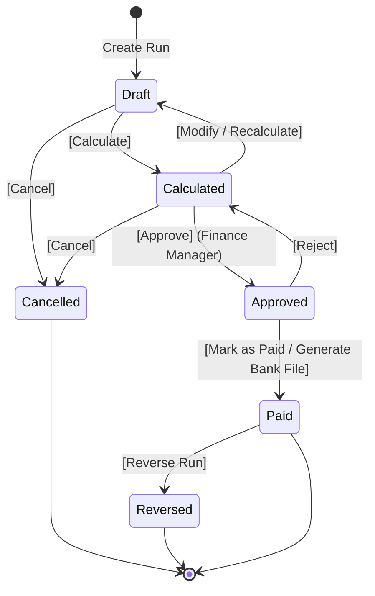
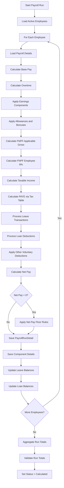
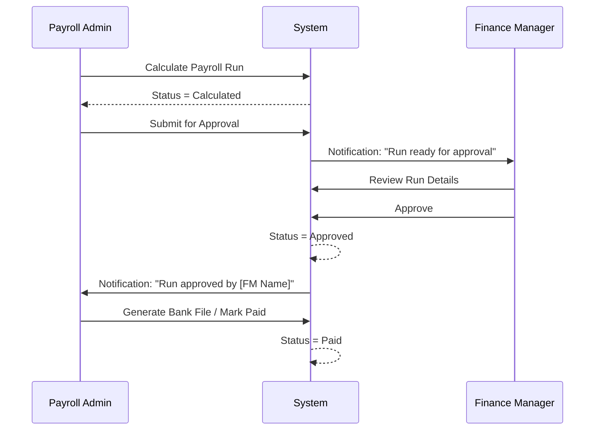
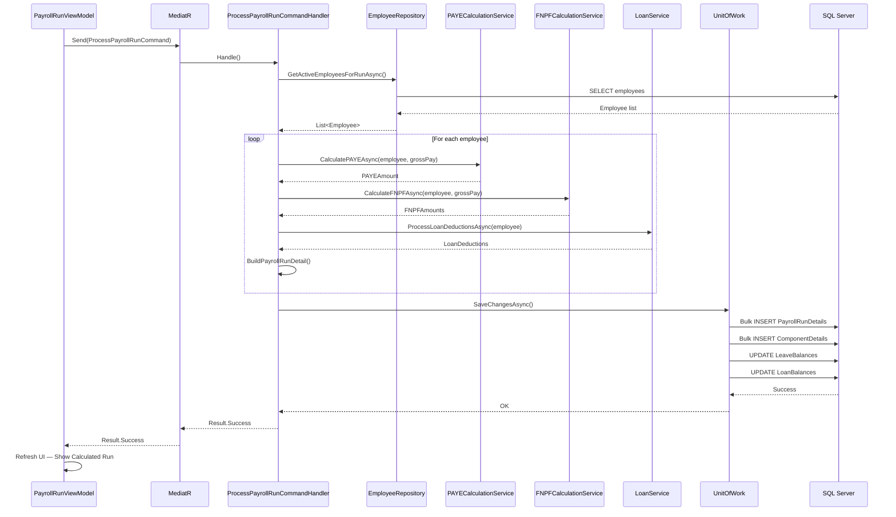

# Phase 07 — Payroll Calculation Engine Specification

**Version:** 1.0.0  
**Date:** June 2026  
**Owner:** Senior Payroll Specialist + Senior C# Developer  

---

## 1. Overview

The Payroll Engine is the core of the system. It processes payroll for all active employees in a selected company and pay frequency, applying Fiji tax law (PAYE) and FNPF rules correctly for every scenario.

---

## 2. Payroll Run Lifecycle — State Machine



### State Transition Rules

| Transition | Required Permission | Pre-conditions |
|-----------|--------------------|-----------     |
| Create → Draft | Payroll.Create | No existing run for same period + frequency |
| Draft → Calculated | Payroll.Calculate | At least 1 active employee |
| Calculated → Draft | Payroll.Calculate | ← triggers recalculation required flag |
| Calculated → Approved | Payroll.Approve | Different user from calculator (4-eyes) |
| Approved → Calculated | Payroll.Approve | Rejection requires reason |
| Approved → Paid | Payroll.Approve | Bank file generated OR payment method confirmed |
| Paid → Reversed | Payroll.Reverse | Requires reversal reason + double confirmation |

---

## 3. Payroll Run Creation

### 3.1 New Run Form

| Field | Type | Required | Notes |
|-------|------|----------|-------|
| Payroll Run Name | Text | Yes | Auto-generated, editable |
| Pay Frequency | Dropdown | Yes | From company's frequencies |
| Fiscal Period | Dropdown | Yes | Current open period |
| Period Start Date | Date | Yes | Auto-set from period, editable |
| Period End Date | Date | Yes | Auto-set from period, editable |
| Payment Date | Date | Yes | Must be business day |
| Notes | Text | No | Internal notes |

**Auto-generated run name example:** `Monthly Run — June 2026`

**Validation:**
- Period dates cannot overlap with an existing `Paid` or `Approved` run for same frequency
- Payment date cannot be before period end date
- Cannot create a run for a closed fiscal period

---

## 4. Employee Selection

Before calculation, the system determines which employees to include:

### 4.1 Inclusion Rules

An employee is included in a payroll run if:
1. `EmploymentStatus = Active`
2. `StartDate <= PeriodEndDate` (started on or before end of period)
3. `EndDate IS NULL OR EndDate >= PeriodStartDate` (not yet terminated before period started)
4. `PayFrequencyId = Run's FrequencyId`

### 4.2 Exclusion Handling

| Scenario | Action |
|----------|--------|
| Employee on unpaid leave for entire period | Included with $0 gross (leave transaction recorded) |
| Employee terminated mid-period | Included; pay calculated to termination date only |
| Employee started mid-period | Included; pay calculated from start date only |
| Employee manually excluded | Payroll Admin can exclude individual employees |

---

## 5. Calculation Engine — Step by Step

### 5.1 Top-Level Calculation Flow



---

### 5.2 Base Pay Calculation

#### Salary Employees
```
Gross Per Period = Annual Salary / Periods Per Year

Partial Period Handling:
If employee started or terminated mid-period:
    Working Days in Period = (PeriodEnd - PeriodStart + 1) × (StandardDaysPerWeek / 7)
    Actual Days Worked = Working Days in Period - Days Not Worked
    Gross = (Annual Salary / 260) × Actual Days Worked
```

#### Hourly Employees
```
Gross = (Regular Hours × Hourly Rate)
      + (Overtime Hours × Hourly Rate × OvertimeMultiplier)
      + (Double Time Hours × Hourly Rate × 2.0)
```

#### Daily Employees
```
Gross = Days Worked × Daily Rate
```

---

### 5.3 Earnings Component Calculation

For each **active** payroll component assigned to the employee:

| Calculation Method | Formula |
|-------------------|---------|
| Fixed | Use component's fixed value |
| Percentage | `BasePay × Component.CalculationValue / 100` |
| Formula | Evaluate formula expression using runtime variables |
| Manual | Use manually entered value from this run |

**Component Processing Order:**
1. Earnings (ascending by DisplayOrder)
2. Allowances (ascending by DisplayOrder)
3. Benefits (ascending by DisplayOrder)

---

### 5.4 FNPF Calculation

```
FNPF-Applicable Gross = Sum of all components where IsFNPFable = true

FNPF Employee = FNPF-Applicable Gross × (FNPFEmployee% / 100)
FNPF Employer = FNPF-Applicable Gross × (FNPFEmployer% / 100)

Round each to 2 decimal places (round half up)

If employee.FNPFExempt = true:
    FNPF Employee = 0
    FNPF Employer = 0
```

---

### 5.5 PAYE Calculation

```
Step 1: Calculate total taxable components
    Taxable Gross = Sum of all components where IsTaxable = true

Step 2: Annualise
    Annual Equivalent = Taxable Gross × Periods Per Year

Step 3: Deduct FNPF (tax deductible)
    Taxable Annual = Annual Equivalent - (FNPF Employee × Periods Per Year)

Step 4: Apply tax brackets (from TaxTables for current fiscal year)

    If ResidencyStatus = NonResident:
        Annual Tax = Taxable Annual × 0.20
    
    If ResidencyStatus = Resident:
        Annual Tax = 0
        For each tax bracket from lowest to highest:
            If Taxable Annual > Bracket.BracketFrom:
                Applicable Amount = MIN(Taxable Annual, Bracket.BracketTo) - Bracket.BracketFrom
                Annual Tax += Applicable Amount × (Bracket.Rate / 100)

    If TaxExempt = true:
        Annual Tax = 0

Step 5: De-annualise
    PAYE Per Period = Annual Tax / Periods Per Year

Step 6: Round to 2 decimal places (round half up)
    PAYE = ROUND(PAYE Per Period, 2, MidpointRounding.AwayFromZero)
```

---

### 5.6 Deduction Processing Order

```
Deductions applied in this priority:

1. PAYE Tax (statutory — always first)
2. FNPF Employee (statutory — always second)
3. Court Orders (if any — flagged as priority)
4. Loan Repayments (ordered by loan priority number)
5. Voluntary Deductions (ordered by component DisplayOrder)
```

---

### 5.7 Net Pay Floor Rule

```
Net Pay = Total Gross - Total Deductions

If Net Pay < 0:
    1. Statutory deductions (PAYE + FNPF) are always paid in full
    2. Reduce voluntary deductions proportionally until Net Pay >= 0
    3. If still negative after removing all voluntary deductions:
        → Flag payslip with Critical Warning
        → Log to payroll audit
        → Notify Payroll Admin
        → Net Pay set to 0 (cannot be negative)
    4. Carry forward unpaid voluntary deductions to next period (if configured)
```

---

## 6. Partial Period Calculation

### 6.1 Joined Mid-Period

```
Example: Monthly salary employee, started on 16 June
Period: 1–30 June = 30 days
Working days: 22 (Mon-Fri)

Days worked from 16th: count Mon-Fri between 16 Jun and 30 Jun = 11 days

Gross = (Annual Salary / 260) × 11
```

### 6.2 Terminated Mid-Period

```
Same logic as joined mid-period.
Final pay includes:
- Pro-rated base pay to termination date
- All accrued leave balance (if pay-out configured)
- Loan balance outstanding (may continue or be written off)
```

### 6.3 Public Holidays

Public holidays within the period:
- Salaried employees: paid as normal (holidays included in salary)
- Hourly employees: if they worked the holiday, pay at 2.0× rate
- If they did not work the holiday: pay at 1.0× rate (standard day)

---

## 7. Overtime Processing

Overtime is submitted to the payroll run as:
- Hours at 1.5× (standard overtime)
- Hours at 2.0× (public holiday, double time)

Overtime amounts are calculated:
```
OT1.5 Pay = OT1.5 Hours × Hourly Rate × 1.5
OT2.0 Pay = OT2.0 Hours × Hourly Rate × 2.0
```

Both are taxable and FNPF applicable.

---

## 8. Leave in Payroll

For each employee in the run, check `LeaveTransactions` for the period:

```
For each leave transaction in period:
    If leave is Paid:
        Leave Pay = Leave Days × Daily Rate
        (Daily Rate = Annual Salary / 260 for salary employees)
        Included in Gross Pay
    
    If leave is Unpaid:
        Deduction = Leave Days × Daily Rate
        Gross = Gross - Deduction
    
    If leave is Annual with Loading:
        Leave Loading = Leave Pay × 25%
        Leave Loading is taxable and FNPF applicable
```

---

## 9. Loan Processing

```
For each active loan for the employee:
    If loan is active and not yet paid off:
        If instalment type = Fixed:
            Deduction = MIN(FixedInstalment, OutstandingBalance)
        
        If instalment type = Percentage:
            Deduction = GrossPay × (Percentage / 100)
        
        Record in LoanTransactions:
            PeriodDate = PaymentDate
            Amount = Deduction
            NewBalance = OutstandingBalance - Deduction
        
        Update EmployeeLoans.OutstandingBalance
```

---

## 10. Approval Workflow

### 10.1 Approval Flow



### 10.2 Four-Eyes Rule
- The user who **calculated** the run cannot be the same user who **approves** it
- System enforces this check at the point of approval

---

## 11. Payroll Reversal

### 11.1 Reversal Process

```
Preconditions:
- Run status must be Paid
- User must have Payroll.Reverse permission
- Reversal reason must be provided

Process:
1. Create a new PayrollRun record:
   - Status = Reversed
   - RunName = "[Original Run Name] — REVERSAL"
   - All amounts = negative of original
   
2. For each PayrollRunDetail:
   - Create reversed detail with negative amounts
   
3. Reverse leave transactions (add back to leave balance)
4. Reverse loan transactions (add back to loan outstanding)
5. Create reversal audit log entries
6. Notify Finance Manager

Post-Reversal:
- Original run status → Reversed
- New reversed run status → Reversed
- FRCS and FNPF submissions are NOT automatically updated — must be amended separately
```

---

## 12. Recalculation Rules

| Event | Recalculation Triggered? |
|-------|------------------------|
| Employee pay rate changed | Warning shown; user must manually recalculate |
| Tax table updated | Warning shown for affected runs |
| Leave transaction added | Warning shown |
| Component value changed | Warning shown |

**Recalculation always:**
1. Deletes existing `PayrollRunDetail` and `PayrollRunComponentDetail` records
2. Runs full calculation from scratch
3. Reverses and re-applies leave balance changes
4. Reverses and re-applies loan balance changes

---

## 13. Payroll Validation Rules

| Rule | Severity | Check Point |
|------|----------|------------|
| No employees in run | Error | Pre-calculation |
| Duplicate period run | Error | Run creation |
| Employee has no payroll details | Error | Per employee, during calculation |
| Employee has no bank account (bank payment) | Error | Per employee, during bank file generation |
| PAYE negative | Error | Post-calculation |
| Net pay negative | Error | Post-calculation |
| Run total mismatch | Error | Post-calculation aggregate |
| FNPF number missing | Warning | Pre-calculation |
| TIN missing | Warning | Pre-calculation |
| Partial period (started/ended mid-period) | Info | Pre-calculation |
| Public holiday falls in period | Info | Pre-calculation |

---

## 14. Payslip Design

### Payslip Sections

```
────────────────────────────────────────────────────────
[Company Logo]               PAYSLIP
Company Name                 Pay Period: 01/06/2026 – 30/06/2026
Address                      Payment Date: 30/06/2026
TIN: XXXXXXXXX               Run #: 2026-06-001
────────────────────────────────────────────────────────
EMPLOYEE DETAILS
Name: John Smith             Employee Code: E001
Department: IT               Branch: HQ
Position: Senior Developer   Pay Type: Salary (Monthly)
FNPF #: 987654321           TIN: 123456789
────────────────────────────────────────────────────────
EARNINGS
Basic Salary                 $4,333.33
Housing Allowance            $  500.00
Transport Allowance          $  150.00
                             ─────────
Gross Pay                    $4,983.33
────────────────────────────────────────────────────────
DEDUCTIONS
PAYE Tax                     $  450.00
FNPF Employee (8%)           $  398.67
Vehicle Loan                 $  200.00
                             ─────────
Total Deductions             $1,048.67
────────────────────────────────────────────────────────
NET PAY                      $3,934.66
────────────────────────────────────────────────────────
EMPLOYER CONTRIBUTIONS
FNPF Employer (10%)          $  498.33
────────────────────────────────────────────────────────
YTD SUMMARY
YTD Gross: $29,900.00    YTD PAYE: $2,700.00    YTD FNPF: $2,392.00
```

---

## 15. Sequence Diagrams

### 15.1 Full Payroll Run Sequence



---

*Document maintained by: Senior Payroll Specialist*  
*Last updated: June 2026*
