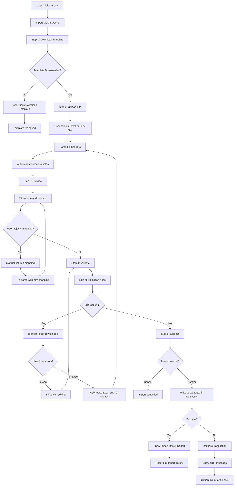

# Phase 08 — Import/Export Framework Specification

**Version:** 1.0.0  
**Date:** June 2026  
**Owner:** Senior C# Developer + Senior UI/UX Designer  

---

## 1. Overview

The Import/Export Framework is a reusable system used by every module in the application. It provides a consistent, safe, and auditable way to bulk load and extract data.

---

## 2. Architecture

### 2.1 Framework Components

```
Import/Export Framework
├── Template Engine
│   ├── ExcelTemplateGenerator
│   └── CsvTemplateGenerator
├── Import Pipeline
│   ├── IImportParser (Excel/CSV)
│   ├── IImportMapper (column → property)
│   ├── IImportValidator (row-level validation)
│   └── IImportCommitter (persistence)
├── Export Pipeline
│   ├── IExportDataProvider (queries)
│   ├── IExportFormatter (Excel/CSV/PDF)
│   └── IExportWriter (file output)
└── Import History
    └── ImportHistoryService
```

### 2.2 Interface Definitions

```
IImportable<TEntity>
    GetTemplateName() : string
    GetTemplateColumns() : IReadOnlyList<TemplateColumn>
    ParseRow(row) : ImportRow<TEntity>
    ValidateRow(ImportRow<TEntity>) : IReadOnlyList<ValidationError>
    CommitAsync(IReadOnlyList<TEntity>) : Task<ImportResult>
    RollbackAsync(Guid importId) : Task

IExportable<TEntity>
    GetExportName() : string
    GetExportColumns() : IReadOnlyList<ExportColumn>
    GetDataAsync(ExportFilter) : Task<IReadOnlyList<TEntity>>
    FormatRow(TEntity) : ExportRow

TemplateColumn
    Name : string
    HeaderText : string
    Required : bool
    DataType : ColumnDataType
    MaxLength : int?
    AllowedValues : IReadOnlyList<string>?
    Example : string
    Notes : string
```

---

## 3. Import Workflow

### 3.1 Full Import UX Flow



---

### 3.2 Import Dialog — Step Definitions

#### Step 1: Download Template

```
┌─ Import Employees ────────────────────────────────────────┐
│ Step 1 of 5: Get the Template                             │
│                                                           │
│ Download the Excel template and fill in your data.        │
│ Do not change column headers.                             │
│                                                           │
│   [📥 Download Excel Template]                            │
│   [📥 Download CSV Template]                              │
│                                                           │
│ Required fields are marked with * in the template.        │
│ See the Instructions sheet for field details.             │
│                                                           │
│                              [Cancel]    [I Have a File >]│
└───────────────────────────────────────────────────────────┘
```

#### Step 2: Upload File

```
┌─ Import Employees ────────────────────────────────────────┐
│ Step 2 of 5: Upload Your File                             │
│                                                           │
│   ┌─────────────────────────────────────────────────┐    │
│   │  Drag and drop your file here                   │    │
│   │         or                                      │    │
│   │        [Browse...]                              │    │
│   │  Supported: .xlsx, .xls, .csv                  │    │
│   │  Max size: 10MB                                 │    │
│   └─────────────────────────────────────────────────┘    │
│                                                           │
│  File detected: employees_import.xlsx  ✅                 │
│  Rows found: 147  Columns found: 18                       │
│                                                           │
│  [< Back]                          [Preview Data >]       │
└───────────────────────────────────────────────────────────┘
```

#### Step 3: Preview & Column Mapping

```
┌─ Import Employees ────────────────────────────────────────┐
│ Step 3 of 5: Preview & Map Columns                        │
│                                                           │
│ Column Mapping:                                           │
│  Your Column       →  System Field                        │
│  "Emp Code"        →  Employee Code    ✅ auto-matched    │
│  "First Name"      →  First Name       ✅ auto-matched    │
│  "Salary"          →  Annual Salary    ✅ auto-matched    │
│  "Start Dt"        →  Start Date       ⚠️ please confirm │
│                                                           │
│ Data Preview (first 5 rows):                              │
│ ┌──────┬────────┬────────┬──────────┐                    │
│ │ Code │ First  │ Last   │ Salary   │                    │
│ │ E001 │ John   │ Smith  │ 52000.00 │                    │
│ └──────┴────────┴────────┴──────────┘                    │
│                                                           │
│  [< Back]                          [Validate >]           │
└───────────────────────────────────────────────────────────┘
```

#### Step 4: Validation

```
┌─ Import Employees ────────────────────────────────────────┐
│ Step 4 of 5: Validation                                   │
│                                                           │
│  ✅ 132 rows valid                                        │
│  ❌ 15 rows have errors                                   │
│                                                           │
│ Error Summary:                                            │
│  • 8 rows: Missing required field "Pay Frequency"         │
│  • 4 rows: Invalid date format in "Start Date"            │
│  • 3 rows: Duplicate employee code                        │
│                                                           │
│ [Export Error Report]  [Edit Errors Inline]               │
│                                                           │
│  ☐ Import valid rows only (skip errors)                   │
│                                                           │
│  [< Back]           [Cancel]       [Commit Valid Rows >]  │
└───────────────────────────────────────────────────────────┘
```

#### Step 5: Commit & Result

```
┌─ Import Employees ────────────────────────────────────────┐
│ Step 5 of 5: Import Complete                              │
│                                                           │
│  ✅  132 records created successfully                     │
│  ❌  15 records skipped (errors)                          │
│  ⏭️   0 records skipped (duplicates)                     │
│                                                           │
│ [View Import History]  [Download Error Report]            │
│                                                           │
│                                             [Close]       │
└───────────────────────────────────────────────────────────┘
```

---

## 4. Validation Framework

### 4.1 Validation Layers

| Layer | Description | Example |
|-------|-------------|---------|
| **Type Validation** | Correct data type for column | "abc" in a date column |
| **Format Validation** | Correct format for data | Date as DD/MM/YYYY |
| **Required Validation** | Mandatory fields present | First Name cannot be blank |
| **Length Validation** | Within maximum length | Description max 500 chars |
| **Range Validation** | Within allowed range | Salary must be > 0 |
| **Referential Validation** | References valid master data | Department code must exist |
| **Business Rule Validation** | Complex business rules | FNPF exempt requires valid reason |
| **Duplicate Validation** | No duplicate unique keys | Employee code must be unique |

### 4.2 Error Report Format

The error report is downloadable as Excel with:
- Original row data
- Error column highlighted in red
- Error message in a "Errors" column appended to the right

---

## 5. Export Framework

### 5.1 Export Options Panel

Triggered by `[Export]` button on any list view:

```
┌─ Export Employees ────────────────────────────┐
│  Format:   ● Excel   ○ CSV   ○ PDF            │
│                                                │
│  Scope:    ● Visible rows (current filter)    │
│            ○ All records                       │
│            ○ Selected rows only                │
│                                                │
│  Columns:  [Select Columns...]                 │
│            ☑ Code  ☑ First Name  ☑ Last Name  │
│            ☑ Dept  ☑ Status  ☐ FNPF #         │
│                                                │
│  File Name: [employees_export_20260615   ]     │
│                                                │
│  [Cancel]              [Export]                │
└────────────────────────────────────────────────┘
```

### 5.2 Export Formats

#### Excel (.xlsx)
- Headers in first row (bold, blue background)
- Frozen header row
- Auto-sized columns
- Alternating row colours
- Company name and export date in footer
- All monetary values formatted as FJD currency

#### CSV (.csv)
- Header row
- Comma-delimited
- UTF-8 encoding
- All text fields quoted if they contain commas
- Date format: DD/MM/YYYY
- Decimal format: 2 places, no currency symbol

#### PDF
- Company letterhead (logo + name)
- Report title and generation date
- Data table with borders
- Page numbers: "Page X of Y"
- Footer: "Confidential — Fiji Enterprise Payroll System"
- Max rows per page: 40 (landscape) or 25 (portrait)

---

## 6. Template Generation

Each importable module generates a template with:

**Excel Template Structure:**
| Sheet | Purpose |
|-------|---------|
| `[Module] Import` | Data entry sheet |
| `Instructions` | Field-by-field documentation |
| `Valid Values` | Dropdown lists for constrained fields |
| `Example` | 3 example rows of valid data |

**Template Header Row Styling:**
- Required fields: Bold, red asterisk in header
- Optional fields: Regular, no asterisk
- First data row: Light grey shading (example data)

---

## 7. Import History

Every import is recorded in a database table:

| Column | Description |
|--------|-------------|
| Id | Primary key |
| ImportId | GUID for the import session |
| Module | e.g., "Employees" |
| FileName | Original file name |
| FileHash | SHA256 of uploaded file (tamper detection) |
| TotalRows | Total rows in file |
| ValidRows | Rows validated successfully |
| ImportedRows | Rows committed to database |
| ErrorRows | Rows skipped due to errors |
| ImportedBy | Username |
| ImportedAt | Timestamp |
| Status | Completed / PartialSuccess / Failed / RolledBack |
| ErrorFilePath | Path to error report (if any errors) |

### 7.1 Import Rollback

Within 24 hours of an import, the user can:
- View what was imported
- Rollback the entire import (delete all records from that ImportId)
- Rollback is only available if no subsequent activity has occurred on the imported records (e.g., no payroll run)

---

## 8. Performance Optimization

| Scenario | Approach |
|----------|---------|
| Large imports (> 1,000 rows) | Batch INSERT in chunks of 100 |
| Validation of large files | Parallel row validation (up to 4 threads) |
| Export of large datasets | Stream to file (no in-memory buffering) |
| Progress feedback | Background task + progress bar via IProgress<T> |
| Timeout handling | 5-minute timeout for imports > 5,000 rows |

---

## 9. Supported Modules

| Module | Import | Export | Template |
|--------|--------|--------|---------|
| Employees | ✅ | ✅ | ✅ |
| Employee Pay Rates | ✅ | ✅ | ✅ |
| Leave Balances | ✅ | ✅ | ✅ |
| Loans | ✅ | ✅ | ✅ |
| Payroll Components | ✅ | ✅ | ✅ |
| Departments | ✅ | ✅ | ✅ |
| Branches | ✅ | ✅ | ✅ |
| Holiday Calendar | ✅ | ✅ | ✅ |
| Tax Tables | ✅ (Admin only) | ✅ | ✅ |
| Bank Accounts | ✅ | ✅ | ✅ |
| Payroll Run Details | ❌ (read-only) | ✅ | ❌ |
| Audit Trail | ❌ (read-only) | ✅ | ❌ |

---

*Document maintained by: Senior C# Developer*  
*Last updated: June 2026*
